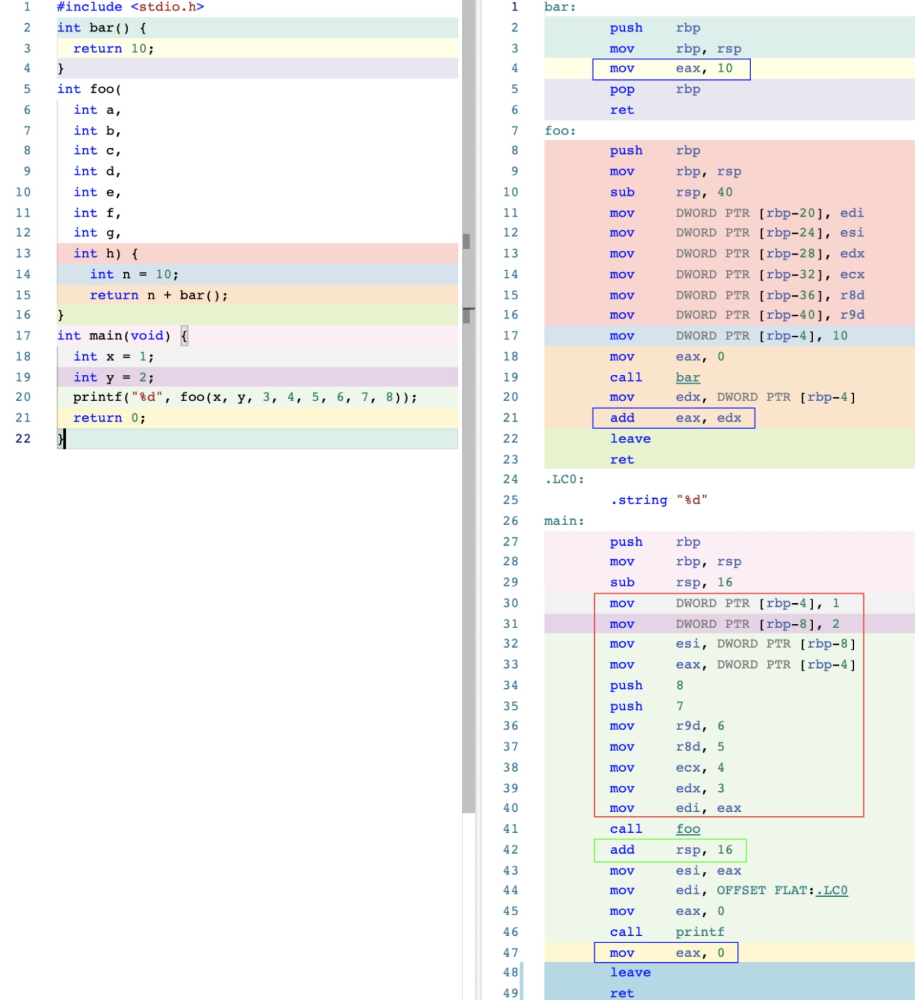
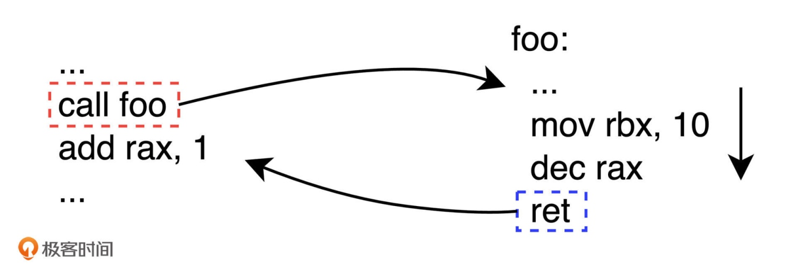
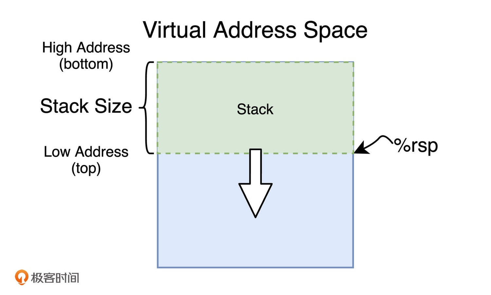
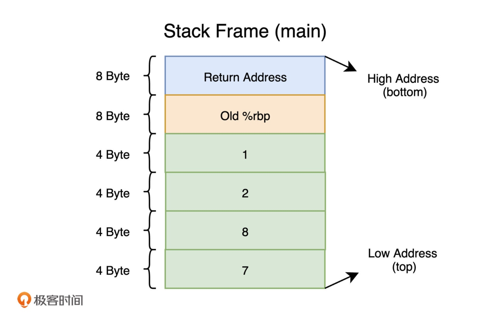

# 函数调用

对于 C 语言来说，运行在 x86-64 平台上的编译器基本都会根据所在操作系统的不同，选择使用几种常见的调用约定事实标准。比如，对于 Windows 来说，编译器会采用专有的 Microsoft x64 或 Vector 调用约定。而在 Unix 和类 Unix 系统上，则会使用名为 System V AMD64 ABI（简称 SysV）的调用约定

在 x86-64 的机器指令中，函数调用是通过 call 指令来完成。而每一个函数体在执行完毕后，都需要再通过 ret 指令来退出函数的执行，并转移代码执行流程到之前函数调用指令的下一条指令上

## 参数传递
在调用函数时，对于整型和指针类型的实参，需要分别使用寄存器 rdi、rsi、rdx、rcx、r8、r9，按函数定义时参数从左到右的顺序进行传值。而若一个函数接收的参数超过了 6 个，则余下参数将通过栈内存进行传送。此时，多出来的参 数将按照从右往左的顺序被逐个压入栈中

函数 foo 在调用前，分别用寄存器 edi、esi 存放局部变量 x 与 y 的值，并用寄存器 edx、ecx、r8d、r9d 存放字面量值 3、4、5、6。而多出来的另外两个字面量值参数 7 和 8，则直接通过 push 指令被放在了栈内存中

对于浮点参数，编译器将会使用另外的 xmm0 到 xmm7，共 8 个寄存器进行存储。对于更宽的值，也可能会使用 ymm 与 zmm 寄存器来替代 xmm 寄存器。而上面提到的 xmm、ymm、zmm 寄存器，都是由 x86 指令集架构中名为 AVX 的扩展指令集使用的。这些指令集一般专门用于浮点数计算以及 SIMD 相关的处理过程

## 返回值传递
对于函数调用产生的返回值，SysV 调用约定也有相应的规则：当函数调用产生整数类型的返回值，且小于等于 64 位时，通过寄存器 rax 进行传递；当大于 64 位，小于等于 128 位时，则使用寄存器 rax 与 rdx 分别存储返回值的低 64 位与高 64 位。需要注意的是，对于复合类型的返回值，编译器可能会直接使用栈内存进行中转

对于浮点数类型的返回值，同参数传递类似，编译器会默认使用 xmm0 与 xmm1 寄存器进行存储。而当返回值过大时，则会选择性使用 ymm 与 zmm 来替代 xmm 寄存器

## 寄存器使用
SysV 调用约定对寄存器的使用也作出了规定：对于寄存器 rbx、rbp、rsp，以及 r12 到 r15，若被调用函数需要使用它们，则需要该函数在使用之前将这些寄存器中的值进行暂存，并在函数退出之前恢复它们的值。而对于其他寄存器，则根据调用方的需要，自行保存和恢复它们的值

## 堆栈清理
每一个函数在调用结束前，都需要由它自身完成堆栈的清理工作。这个清理任务可以由 leave 指令来完成的。除此之外，对于 foo 函数被调用前所传入实参的清理工作，则是由调用函数，也就是这里的 main 函数来完成的。可以看到，当 foo 函数调用结束，程序执行流程返回到之前 call 指令的下一条指令时，程序通过 add 指令修改了 rsp 寄存器的值。通过这种方式，main 函数对之前放入栈中传递给函数 foo 的实参进行了清理

## 其他约定
除此之外，SysV 调用约定还有下面这几点规定：
1. 函数在被 call 指令调用前，需要保证栈顶于 16 字节对齐，也就是栈顶的所在地址值是 16 的倍数
2. 从栈顶向上保留 128 字节作为 Red Zone
3. 不同于用户函数的调用过程，系统调用函数需使用寄存器 rdi、rsi、 rdx、r10、r8、r9 传递参数

Red Zone 是位于栈顶向上的一段固定长度的内存段，这块区域通常可以被函数调用栈中的叶子函数（即不再调用其他函数的函数）使用。这样，在需要额外的栈内存时，就能在一定条件下省去先调整栈内存大小的过程

## 栈帧
每一个函数在调用时，都会在栈内存中呈现出基本相同的数据布局结构。而通过这种方式划分出来的，对应于每一次函数调用的栈内存数据块，一般称它为栈帧。栈帧中存放有与每个函数调用相关的返回地址、实参、局部变量、返回值，以及暂存的寄存器值等信息

在进程的 VAS 中，栈内存是从高地址向低地址逐渐增长的，即栈底位于高地址处，栈顶位于低地址处。而当一个函数在执行过程中需要使用更多的栈内存空间时，便需要首先通过某种方式来扩大进程的可用栈内存大小

rsp 寄存器又被称为 Stack Pointer，该寄存器中一直存放着当前栈内存顶部的地址。也就是说，rsp 寄存器的值决定了进程所能够使用的栈内存大小。因此，通过减小该寄存器的值，我们便能够扩大进程的可用栈内存空间

