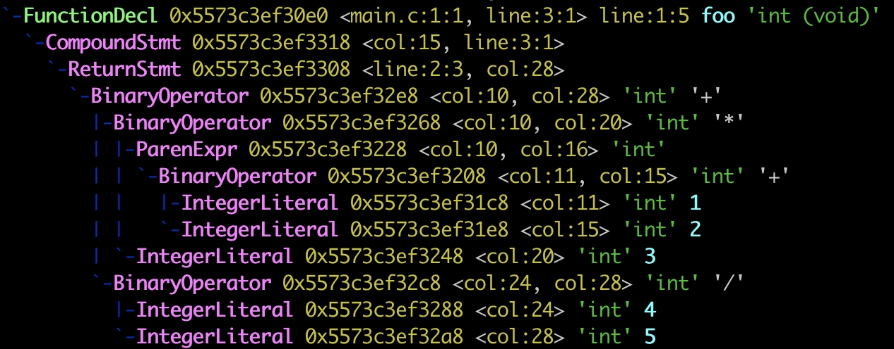
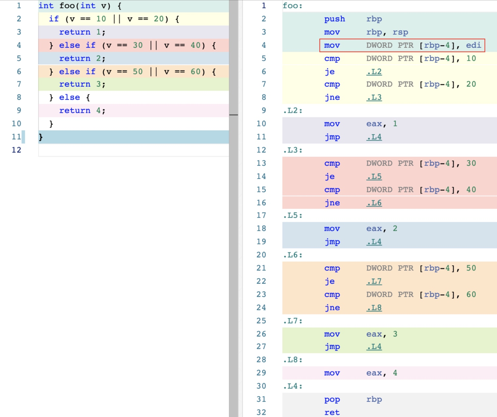
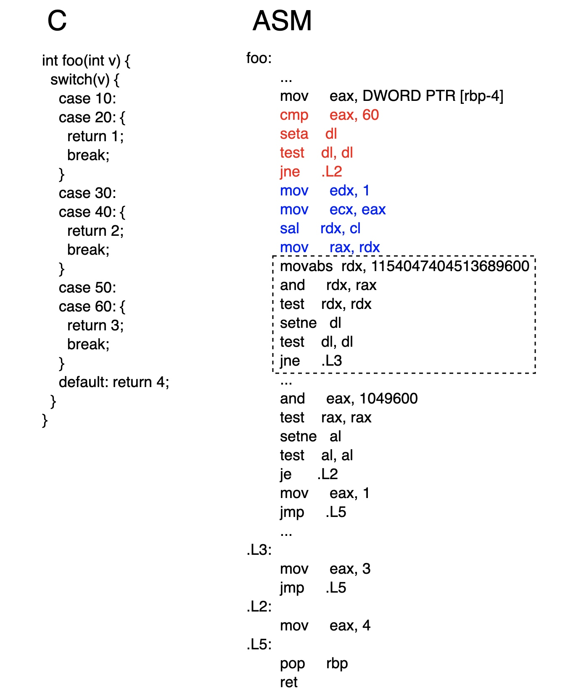
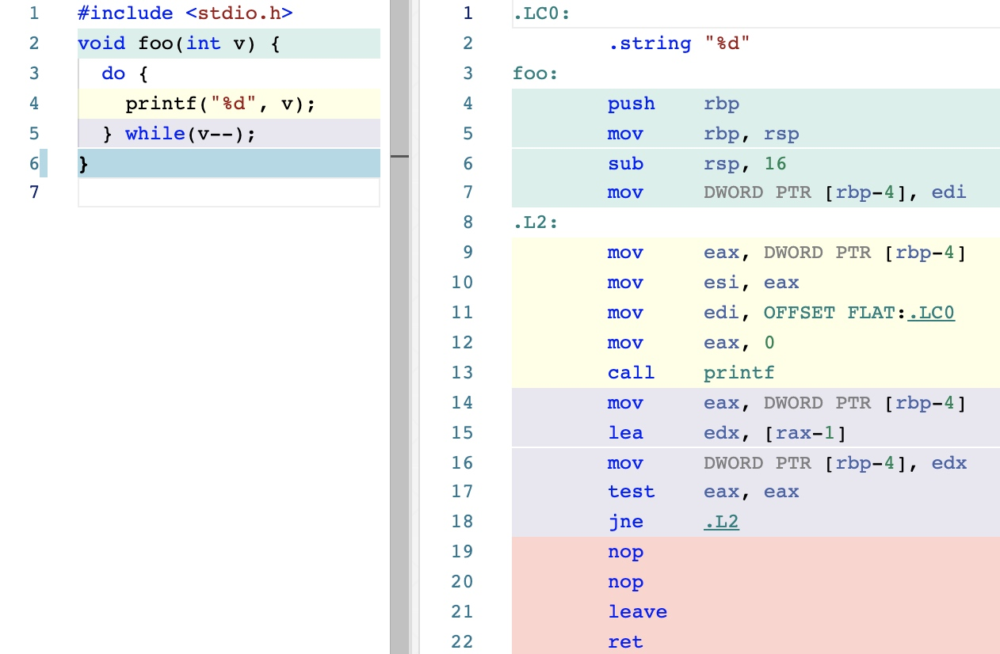

# 控制逻辑

## 表达式

```c
int foo(void) {
  return (1 + 2) * 3 + 4 / 5;
}
```

> 借助 Clang 编译器提供的 -ast-dump 选项，编译并打印出这段 C 代码对应的 AST 结构

```bash
clang -Xclang -ast-dump -fsyntax-only main.c
```

> AST 作为用于表示源代码语法结构的一种树形数据结构，语法分析器会将表达式中操作数的整体求值顺序映射到树的结构上。因此，当后序遍历这棵树时，便可以直接得到正确的表达式求值顺序



## 语句
> 语句是用来描述程序的基本构建块

### 选择语句


> 通过红框内的汇编代码可以看到，变量 v 的值被存放在栈内存中地址为 rbp 寄存器的值减去 4 的位置上。程序使用多个标签（如 .L2、.L3 等），分别划分不同分支对应的处理逻辑，而分支的判断过程则是由指令 cmp 与条件跳转指令 je 与 jne 共同完成的。汇编代码和 C 代码的整体逻辑基本是一一对应的关系。因此，为了尽量保持程序的执行性能，可以将命中几率较大的条件语句放在较前的位置上



> 标注为红色的汇编代码会通过 cmp 指令，判断寄存器 eax 中的值，即变量 v 的值是否大于 60。若判断成立，则直接将程序跳转到标签 .L2 处，并将数字 4 作为返回值；若条件不成立，程序将继续执行。接下来，蓝色部分的代码会基于变量 v 的值，来产生一个用于参与后续运算符的 token 值。这个值的生成步骤如下：
> 1. 将寄存器 edx 的值设为 1
> 2. 将寄存器 ecx 的值设为变量 v 的值
> 3. 将寄存器 rdx 中的值左移（值被扩展为 64 位）
> 4. 将此时寄存器 rdx 中的值移动到 rax 中留作待用

> 接下来，通过虚线框内的代码，程序完成了对变量 v 的值的第一次筛选过程。第一行指令 movabs 的立即数操作数 1154047404513689600 以 64 位二进制的形式展开，其中只有第 50 和 60 位被置位。第二行的 and 指令，会将这个超长的立即数与之前根据变量 v 的值进行移位而得来的 token 值进行与操作。若操作得到的结果不为 0，则表示 token 值的第 50 或 60 位肯定不为 0，即变量 v 的值为 50 或 60。否则，变量 v 的值则不符合该 case 语句的筛选条件

> 通过位映射的方式进行分支筛选，并不能完美地覆盖所有情况。比如，当 case 语句的筛选值过大，无法使用寄存器来进行映射时，默认优化条件下，编译器会将 switch...case 的实现回退到与 if...else 类似的方式。也就是说，使用 cmp 指令与条件跳转指令来进行分支的筛选与转移

### 迭代语句


> 在真正对变量 v 进行条件判断之前，程序已经执行了一次 printf 函数，而这便是 do...while 语句相较于其他迭代语句的特点。迭代过程以 .L2 标签作为每次的起始点，每次迭代都遵循着先执行循环体，再判断条件的规则。条件的判断和执行转移流程则分别由指令 test 与 jne 负责进行

### 跳转语句

> 在 C 代码中，用于控制程序执行逻辑的大部分语句，其背后都是通过条件跳转语句来实现的。编译器通过代码分析，可以找到程序中可能的跳入点与跳出点，并在机器指令层面通过 je 等条件跳转指令，来控制程序的执行流程在这些点之间进行转移