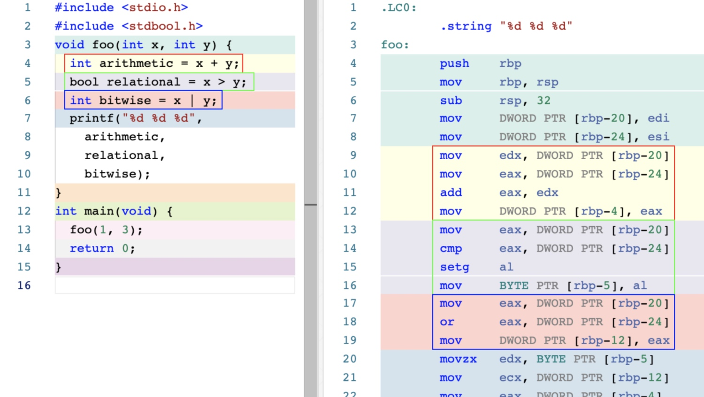
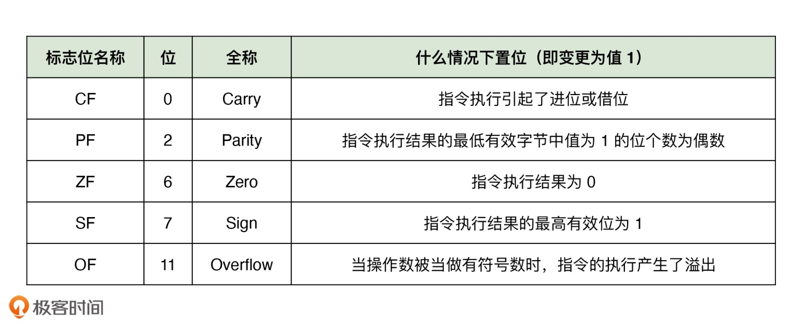
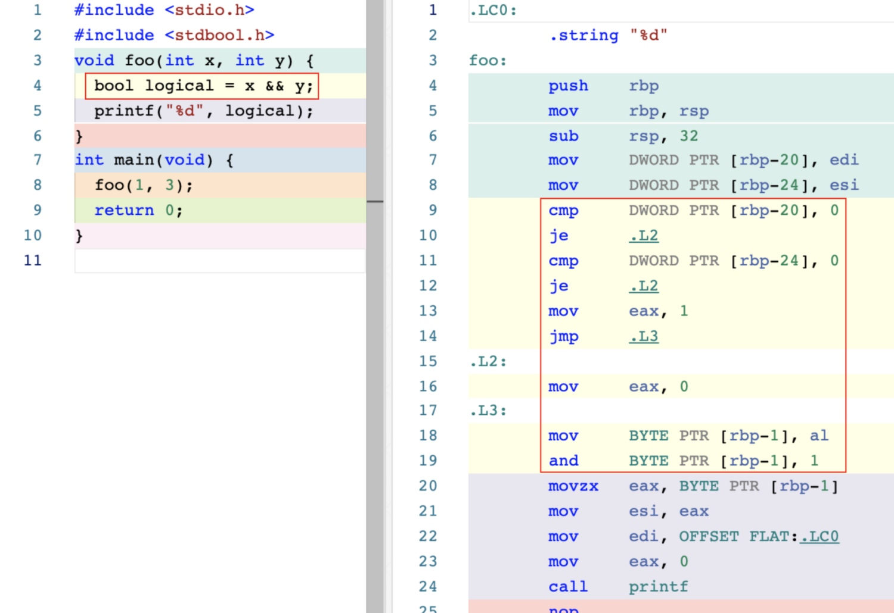
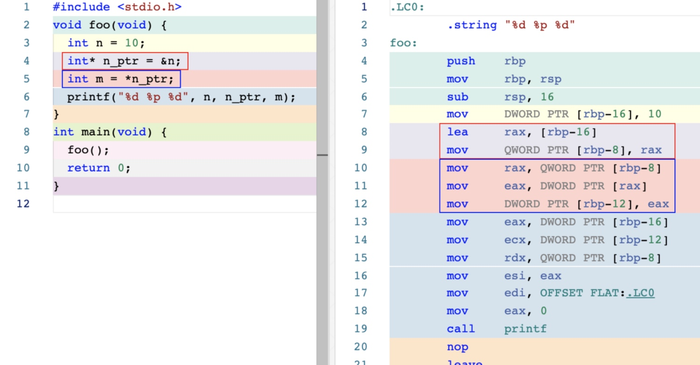
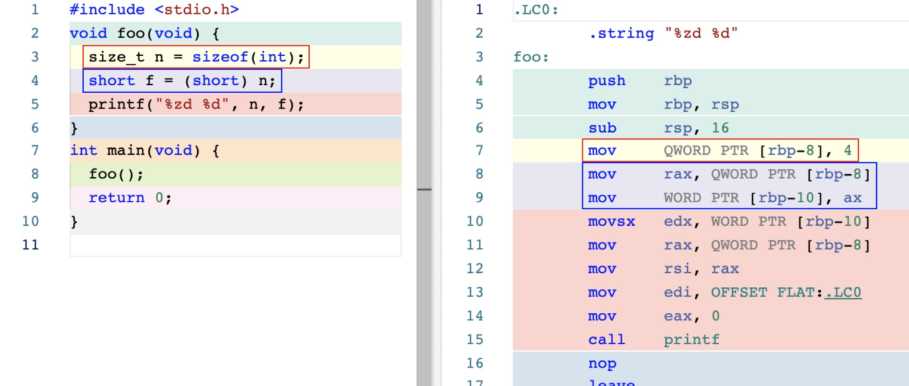

# 运算符

## 基础运算符

> 前两行代码分别从栈内存中将变量 x 与 y 的值放入到了寄存器 edx 与 eax 里。然后，通过 add 机器指令计算这两个寄存器中的数字之和。随后，通过 mov 指令，将计算得到的结果值从寄存器移动到了局部变量对应的栈内存中

> 汇编指令 add 直接对应于 C 代码中加法运算符的操作，mov 指令对应于等号赋值运算符的操作

> 这里采用的是 Intel 的汇编代码格式，当该指令的源或目的操作数中涉及到某个具体的内存位置时，汇编代码中会出现类似 DWORD PTR [rbp-8] 的参数形式。可以理解：将寄存器中的值减去 8 得到的结果作为一个地址，然后在这个地址上读取 / 写入大小为 DWORD 的值。在 Intel 体系中，一个 WORD 表示 16 位，一个 DWORD 为 32 位，而一个 QWORD 表示 64 位

> 关系运算符 > 对应汇编指令 cmp。这个指令在被执行时，会首先比较变量 x 与 y 值的大小，并根据比较结果，动态调整 CPU 上 FLAGS 寄存器中的相应位。FLAGS 寄存器是一组用于反映程序当前运行状态的标志寄存器。许多机器指令在执行完毕时，都会同时调整 FLAGS 寄存器中对应位的值，以响应程序状态的变化

> 比如，汇编指令 cmp 的下一条汇编指令 setg 便会通过查看 FLAGS 寄存器中的 ZF 位是否为 0，且 SF 与 OF 位的值是否相等，来决定将寄存器中的值置 1，还是置 0。而该寄存器中存放的数字值，便为变量 relational 的最终结果

> 当 cmp 指令执行时，它首先会在 CPU 内部对这两个操作数进行隐式的减法运算，运算后得到结果 1。而 ZF、SF、OF 在这里都将被复位，而复位则代表着标志位所表示的状态为假。因此，FLAGS 寄存器的状态满足指令 setg 的置位条件（ZF=0 且 SF=OF），寄存器的值将被置 1

## 逻辑运算符

> 逻辑与运算符并没有可与之直接对应的汇编指令。为了满足短路要求，编译器在非优化的实现中通常会使用条件跳转指令，比如 je。je 指令会判断当前 FLAGS 寄存器中的标志位 ZF 是否为 0。若为 0，则会将程序执行直接跳转到给定标签所在地址上的指令

> 在使用高编译优化等级时，编译器还可能会采用新的汇编指令：test 、setne 和 movzx

## 成员访问运算符

> 上面代码中的 lea 指令将寄存器中的值减去 16 后，直接存放到寄存器中，而此时该寄存器中的值就是局部变量 n 在栈上的地址

> 解引用运算符的行为与取地址运算符完全相反。在蓝色框的汇编代码里，第一条 mov 指令将变量 n_ptr 的值传送到了寄存器中。随后，第二条 mov 指令将寄存器中的值作为地址，并将该地址上的值以 DWORD，即 32 位值的形式传送到寄存器中。最后，第三条 mov 指令将此时寄存器中的结果值传送到了变量 m 在栈内存上的存储位置

## 其他运算符

> sizeof 运算符是一个编译期运算符，这意味着编译器仅通过静态分析就能够将给定参数的大小计算出来。因此，在最终生成的汇编代码中，没有看到 sizeof 运算符对应于任何汇编指令

> 将变量 n 的值类型由原来的 size_t 转换为了 short，可以从上图中蓝框内的汇编代码里看到，当 mov 指令将变量 n 的值移动到变量 f 所在的内存区域时，它仅移动了这个值从低位开始一个 WORD，即 16 位大小的部分