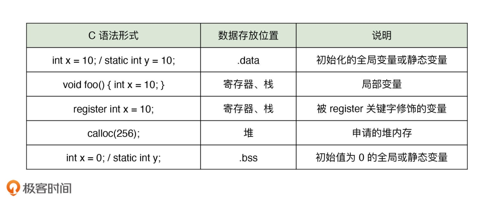
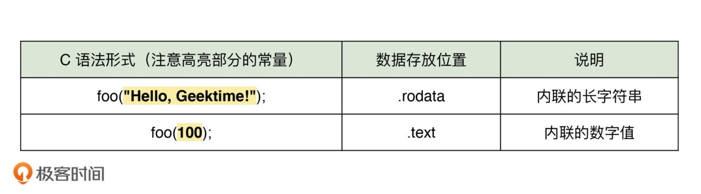

# 数值存储

## 隐式转换
> 程序逻辑在真正进入到条件语句之前，变量 x 的类型会首先被隐式转换为 unsigned int，即无符号整型。而根据数据类型的解释规则，原先存放有 -10 补码的位模式会被解释为一个十分庞大的正整数

```c
#include<stdio.h>

int main(void) {
  int x = -10;
  unsigned int y = 1;

  if (x < y) {
    printf("x < y\n");
  } else {
    printf("x > y\n");
  }

  return 0;
}
```

## 数据存储
> 在 C 语言中，可以定义具有不同数据类型的变量，这些变量按照其定义所在位置，可以被划分为局部变量、全局变量。通过添加 static 关键字，可以将变量标记为静态类型，以延长变量的生存期，并限定其可见范围为当前编译单元，即当前所在源文件；通过添加 register 关键字，可以建议编译器将变量值存放到寄存器中，以提升其读写性能



> 初始化的全局变量和静态变量，具有与应用程序同样长的生命周期，其值通常会被存放到进程 VAS（Virtual Address Space，虚拟地址空间）内的 .data 中

> 应用程序在被正常加载和运行前，需要首先将应用程序代码，及其相关依赖项的数据映射到内存中的某个位置，这段包含有应用程序正常运行所必备数据的内存段即进程的 VAS

> 局部变量是，一般来说，被存放在寄存器或应用程序 VAS 的栈内存中，具体使用哪种方式则依赖于编译器的选择

> 未初始化的全局变量和静态变量，以及直接通过 malloc、calloc 等标准库函数创建的内存块中所包含的数据，分别存放到进程 VAS 的 .bss 以及堆内存中

> 最后，不同类型常量数据的存储方式也会有所不同。由于常量本身的不可变特征，它们会按照数据的大小和类型被选择性存放到进程 VAS 的 .rodata 以及 .text 中。其中，.rodata 用于存放只读数据，而 .text 通常用于存放程序本身的代码



> 一般来说，内联的常量值较大，则会被单独存放到 .rodata 中保存，否则会直接内联到应用程序代码中，作为机器指令（比如最常见的 mov 指令）的字面量参数