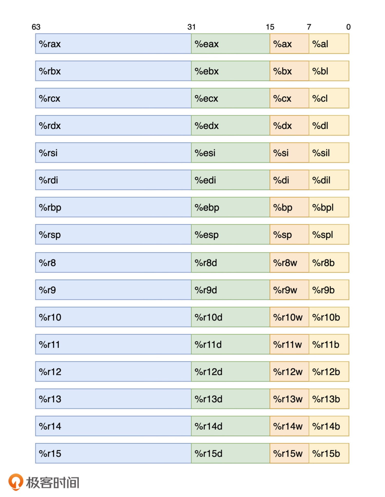

# 准备知识

## 寄存器
> 将立即数 1 存放到寄存器中

```
mov ebx, 1
```

> 在 x86-64 架构下，CPU 指令集架构中一共定义了 16 个通用目的寄存器。这些寄存器最大可以存放 4 个指令字，即 64 位长的数据

> 通过 ebx 可以访问大小为 32 位的数据，该数据为寄存器 rbx 的低 32 位。因此，直接使用 rbx 便可访问该寄存器的全部 64 位数据。而使用 bx 与 bl，便可相应访问该寄存器的低 16 位与低 8 位数据

> 当某个指令需要重写寄存器的低 16 位或低 8 位数据时，寄存器中其他位上的数据不会被修改。而当指令需要重写寄存器低 32 位的数据时，高 32 位的数据会被同时复位，即置零

```c
#include <stdio.h>

int main(void) {
  register long num asm("rax") = 0x100000000;
  printf("%lx\n", num);

  // 1
  // asm("movl $0x1, %eax");

  asm("movw $0x1, %ax");
  printf("%lx\n", num);
  return 0;
}
```


