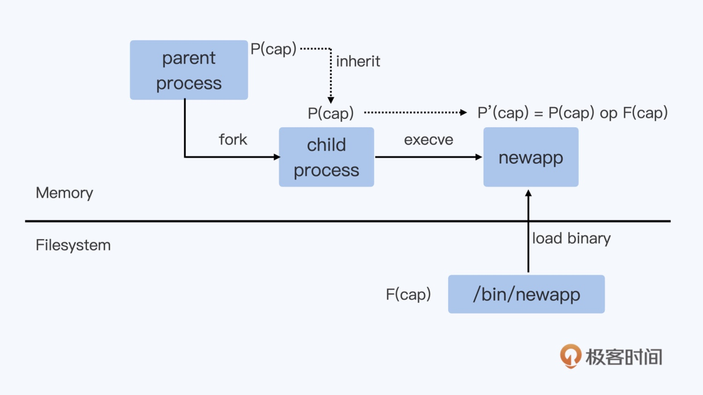
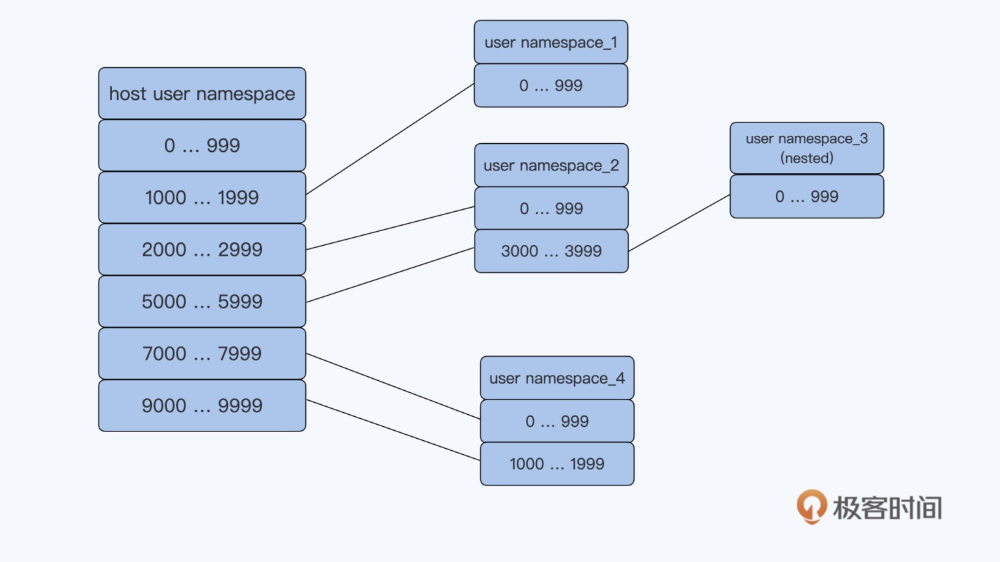

# 容器安全

> 使用缺省 docker run 的方式启动容器后，在容器里很多操作都是不允许的，即使是以 root 用户来运行程序也不行

> 启动容器有一个 privileged 的参数，如果配置了这个参数的话，就会获取所有的 capabilities

```bash
docker run --name lab --privileged -it registry/app:v1 bash
```

## Linux capabilities

> 在 Linux capabilities 出现前，进程的权限可以简单分为两类：一是特权用户的进程，进程的有效用户 ID 是 0，二是非特权用户的进程。特权用户进程可以执行 Linux 系统上的所有操作，而非特权用户在执行某些操作的时候就会被内核限制执行

> 从 kernel 2.2 开始，Linux 把特权用户所有的这些特权做了更详细的划分，被划分出来的每个单元就被称为 capability。对于任意一个进程，在做任意一个特权操作的时候，都需要有这个特权操作对应的 capability。比如，运行 iptables 命令，对应的进程需要有 CAP_NET_ADMIN 这个 capability。如果要 mount 一个文件系统，对应的进程需要有 CAP_SYS_ADMIN 这个 capability

> 在普通 Linux 节点上，非 root 用户启动的进程缺省没有任何 Linux capabilities，而 root 用户启动的进程缺省包含了所有的 Linux capabilities


> 在 Linux 中，通过 fork 创建一个子进程，然后调用 execve 系统调用读取文件系统里的程序文件，把程序文件加载到进程的代码段中开始运行。这个新运行的进程里的相关 capabilities 参数的值，是由它的父进程以及程序文件中的 capabilities 参数值计算得来的

```bash
sudo setcap cap_net_admin+ep ./iptables
getcap ./iptables
```

> 出于安全考虑，容器缺省启动的时候，即使是 root 用户的进程，系统也只允许了 15 个 capabilities。容器中的权限越高，对系统安全的威胁显然也越大。比如，容器中的进程有了 CAP_SYS_ADMIN 的特权之后，这些进程就可以在容器里直接访问磁盘设备，直接可以读取或者修改宿主机上的所有文件了

> 如果容器里需要使用 iptables，只需要设置 CAP_NET_ADMIN 这个 capability 就行

```bash
docker run --name lab --cap-add NET_ADMIN -it registry/app:v1 bash
cat /proc/1/status |grep Cap
```

## 用户隔离
```bash
# 把宿主机上 /etc 目录以 volume 的形式挂载到了容器中的 /mnt 目录下面
docker run -d --name app -v /etc:/mnt centos sleep 3600
```

> 可以看到容器中的进程 sleep 3600，在容器和宿主机上的用户都是 root，也就是说，容器中用户的 uid/gid 和宿主机上的完全一样

> 虽然容器里 root 用户的 capabilities 被限制了一些，但是在容器中，对于被挂载上来的 /etc 目录下的文件，比如说 shadow 文件，以这个 root 用户的权限还是可以做修改的

> 在云平台上，可以限制容器去挂载宿主机的目录。不过，由于容器和宿主机是共享 Linux 内核的，一旦软件有漏洞，那么容器中以 root 用户运行的进程就有机会去修改宿主机上的文件了

### 指定普通用户
> 给容器指定一个普通用户 uid：在 docker 启动容器的时候加上 -u 参数，在参数中指定 uid/gid

```bash
docker run -it --name app -u 6667:6667 -v /etc:/mnt centos bash
```

> 或者在创建容器镜像的时候，用 Dockerfile 为容器镜像里建立一个用户

```bash
FROM centos
RUN adduser -u 6667 nonroot
USER nonroot
```

> 由于用户 uid 是整个节点中共享的，那么在容器中定义的 uid，也就是宿主机上的 uid，这样就很容易引起 uid 的冲突。比如，多个客户在建立自己的容器镜像的时候都选择了同一个 uid 6667。那么当多个客户的容器在同一个节点上运行的时候，其实就都使用了宿主机上 uid 6667

> 在一台 Linux 系统上，每个用户下的资源是有限制的，比如打开文件数目、最大进程数目等。一旦有很多个容器共享一个 uid，这些容器就很可能很快消耗掉这个 uid 下的资源，这样很容易导致这些容器都不能再正常工作。要解决这个问题，必须要有一个云平台级别的 uid 管理和分配

### User Namespace
> User Namespace 隔离了一台 Linux 节点上的 uid 和 gid，它给 Namespace 中的 uid/gid 的值与宿主机上的 uid/gid 值建立了一个映射关系。经过 User Namespace 的隔离，在 Namespace 中看到的进程的 uid/gid，就和宿主机 Namespace 中看到的 uid 和 gid 不一样了

> User Namespace 是可以嵌套的，这个嵌套的特性是其他 Namespace 没有的



## 非 root 用户启动和管理容器
不仅以非 root 用户来运行进程，还以非 root 用户来创建容器，管理容器