# 网络

> 大部分网络参数都在 /proc 文件系统下的 /proc/sys/net/ 目录里。修改这些参数主要有两种方法：
> 1. 直接到 /proc/sys/net/ 目录里对参数做修改
> 2. 使用 sysctl 修改

> 在启动容器之前，根据需要在宿主机上修改参数。然后启动一个容器，再来查看容器里的参数值

```bash
echo bbr > /proc/sys/net/ipv4/tcp_congestion_control
echo 600 > /proc/sys/net/ipv4/tcp_keepalive_time
echo 10 > /proc/sys/net/ipv4/tcp_keepalive_intvl
echo 6 > /proc/sys/net/ipv4/tcp_keepalive_probes
```

> 可以看到，tcp_congestion_control 的值是 bbr，和宿主机 Network Namespace 里的值是一样的。其他三个 tcp keepalive 相关的值，都不是宿主机 Network Namespace 里设置的值，而是原来系统里的缺省值

## Network Namespace
### 隔离资源

1. 网络设备，lo，eth0 等网络设备。可以可以通过 ip link 命令查看
2. IPv4 和 IPv6 协议栈。IP 层以及上面的 TCP 和 UDP 协议栈也是每个 Namespace 独立工作的。所以 IP、TCP、UDP 的很多协议，它们的相关参数也是每个 Namespace 独立的
3. IP 路由表，可以通过 ip route 命令查看
4. 防火墙规则，也就是 iptables 规则
5. 网络的状态信息，可以从 /proc/net 和 /sys/class/net 里得到

### Namespace 操作
#### clone
> 在新的进程创建的时候，伴随新进程建立，同时也建立出新的 Network Namespace。其实就是通过 clone 系统调用带上 CLONE_NEWNET 来实现

> Clone 建立出来一个新的进程，这个新的进程所在的 Network Namespace 也是新的。然后执行 ip link 命令查看 Namespace 里的网络设备，就可以确认一个新的 Network Namespace 已经建立好了

```c
#ifndef _GNU_SOURCE
#define _GNU_SOURCE
#endif

#include <sched.h>
#include <stdio.h>
#include <stdlib.h>
#include <sys/wait.h>
#include <unistd.h>

#define errExit(msg)    do { perror(msg); exit(EXIT_FAILURE); \
} while (0)

#define STACK_SIZE (1024 * 1024)
static char stack[STACK_SIZE];

int new_netns(void *para)
{
    printf("New Namespace Devices:\n");
    system("ip link");
    printf("\n\n");
    
    sleep(100);
    return 0;
}

int main(void)
{
    pid_t pid;
    
    printf("Host Namespace Devices:\n");
    system("ip link");
    printf("\n\n");
    
    pid = clone(new_netns, stack + STACK_SIZE, CLONE_NEWNET | SIGCHLD, NULL);
    
    if (pid == -1)
        errExit("clone");
    
    if (waitpid(pid, NULL, 0) == -1)
        errExit("waitpid");
    
    return 0;
}
```

#### unshare
> 直接改变当前进程的 Network Namespace。创建容器的程序，比如 runC 也是用 unshare 给新建的容器建立 Namespace 的

```c
#ifndef _GNU_SOURCE
#define _GNU_SOURCE
#endif

#include <sched.h>
#include <stdio.h>
#include <stdlib.h>
#include <sys/wait.h>
#include <unistd.h>

#define errExit(msg)    do { perror(msg); exit(EXIT_FAILURE); \
} while (0)

int main(void)
{
    pid_t pid;
    
    printf("Host Namespace Devices:\n");
    system("ip link");
    printf("\n\n");
    
    if (unshare(CLONE_NEWNET) == -1)
        errExit("unshare");
    
    printf("New Namespace Devices:\n");
    system("ip link");
    printf("\n\n");
    
    return 0;
}
```

> Network Namespace 创建好了之后，可以在宿主机上运行 lsns -t net 来查看系统里已有的 Network Namespace。还可以用 nsenter 这个命令进入到某个 Network Namespace 里，具体去查看这个 Namespace 里的网络配置

```bash
nsenter -t <pid> -n ip addr
```

> 启动一个普通容器，会发现容器中 /proc/sys/ 是只读 mount 的，不能修改 /proc/sys/net/ 下面的任何参数。如果有宿主机上的 root 权限，可以使用 nsenter 工具修改容器里的网络参数。除此之外，runC 也在对 /proc/sys 目录做 read-only mount 之前，预留出了修改接口

```bash
docker run -d --name net --sysctl net.ipv4.tcp_keepalive_time=600 centos sleep 3600
```

## 网络转发
```bash
docker run -d --name if-test centos:8.1.1911 sleep 36000
docker exec -it if-test bash
```

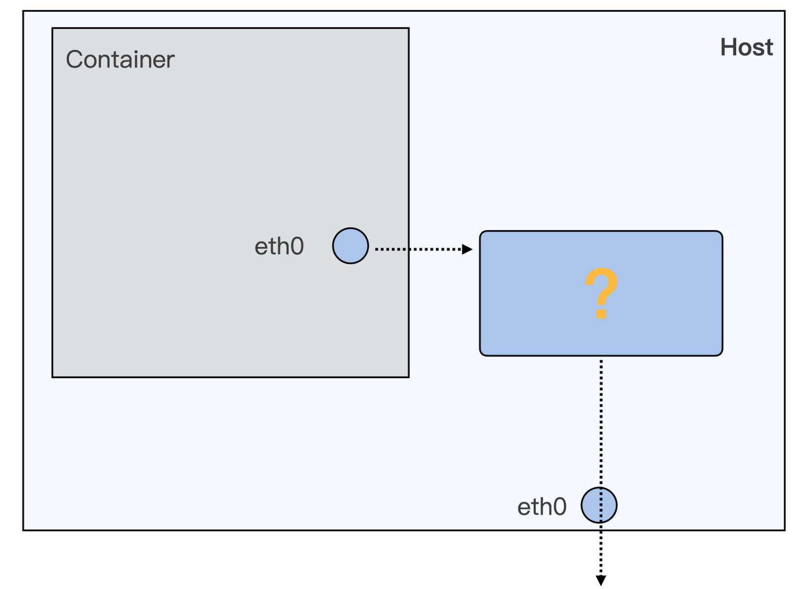


> eth0 是这个 Network Namespace 里的网络接口。而宿主机上也有自己的 eth0，宿主机上的 eth0 对应着真正的物理网卡，可以和外面通讯

> 容器从自己的 Network Namespace 连接到 Host Network Namespace 的方法，一般只有两类设备接口：一类是 veth，另一类是 macvlan/ipvlan。用 Docker 启动的容器缺省的网络接口用的是 veth

```bash
docker stop if-test;docker rm if-test

# 启动一个不带网络配置的容器，Network Namespace 里只有 loopback 一个网络设备
docker run -d --name if-test --network none centos:8 sleep 36000

# 建立符号链接，指向这个容器的 Network Namespace
ln -s /proc/$pid/ns/net /var/run/netns/$pid

# 建立一对 veth 的虚拟设备接口
# 分别是 veth_container 和 veth_host
ip link add name veth_host type veth peer name veth_container

# 把 veth_container 接口放入到容器的 Network Namespace 中
ip link set veth_container netns $pid

# 把 veth_container 重新命名为 eth0
ip netns exec $pid ip link set veth_container name eth0

# 网络 IP 和缺省路由配置
ip netns exec $pid ip addr add 172.17.1.2/16 dev eth0
ip netns exec $pid ip link set eth0 up
ip netns exec $pid ip route add default via 172.17.0.1

# 启动宿主机的 veth
ip link set veth_host up

# ip addr add 172.17.1.1/16 dev veth_host
# ip addr delete 172.17.1.1/16 dev veth_host
```

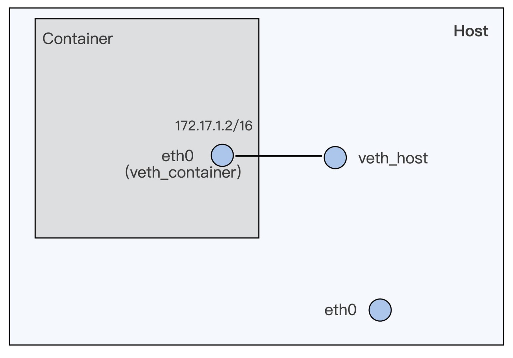


> Docker 程序在节点上安装完之后，就会自动建立了一个 docker0 的 bridge interface。因此，只需要把 veth_host 接入到 docker0 这个 bridge 上。容器和 docker0 组成了一个子网，docker0 上的 IP 就是这个子网的网关 IP

```bash
ip link set veth_host master docker0
```

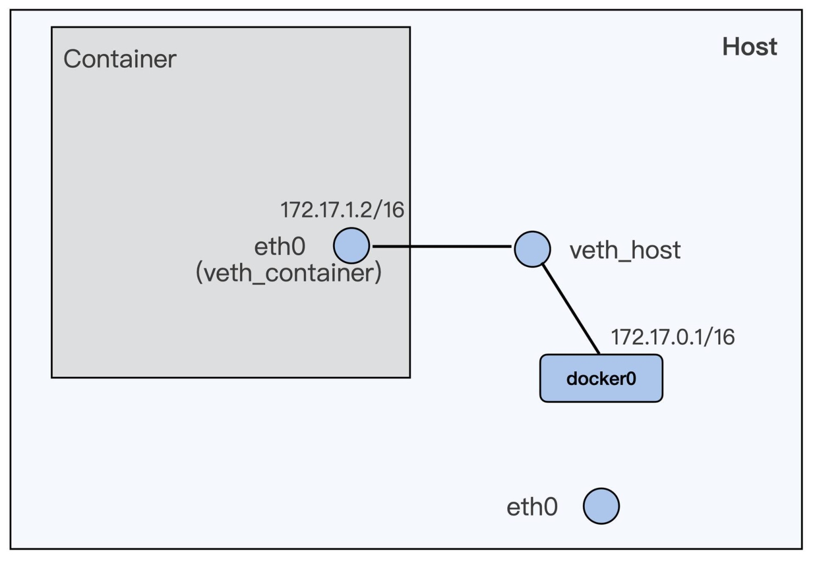


> 如果要让子网通过宿主机上 eth0 去访问外网的话，还需要加上 iptables 的规则

```bash
iptables -P FORWARD ACCEPT
```

> 在容器中继续 ping 外网 ip，在容器的 eth0，容器外的 veth_host，docker0，宿主机的 eth0 这一条数据包的路径上运行 tcpdump

```bash
# container eth0
ip netns exec $pid tcpdump -i eth0 host 39.106.233.176 -nn

# host veth
tcpdump -i veth_host host 39.106.233.176 -nn

# docker0
tcpdump -i docker0 host 39.106.233.176 -nn

# host eth0
tcpdump -i eth0 host 39.106.233.176 -nn
```

> 通过输出结果，发现 icmp 包到达了 docker0，但是没有到达宿主机上的 eth0。因为已经配置了 iptables nat 的转发，是没有问题的

```bash
# 查看 nat 转发
iptables -L -t nat
```

> 这里需要做两个网络设备接口之间的数据包转发，也就是从 docker0 把数据包转发到 eth0 上，涉及到一个参数：ip_forward

```bash
cat /proc/sys/net/ipv4/ip_forward

# 改成 1 之后，就可以从容器中 ping 通外网 IP 了
echo 1 > /proc/sys/net/ipv4/ip_forward
```

## 网络延时
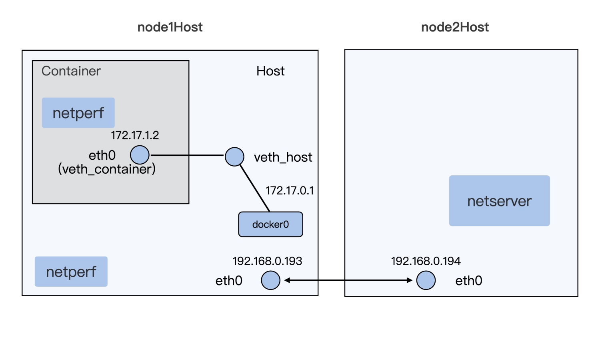

> 虽然 veth 是一个虚拟的网络接口，但是在接收数据包的操作上，这个虚拟接口和真实的网络接口并没有太大的区别。这里除了没有硬件中断的处理，其他操作都差不多，特别是软中断（softirq）的处理部分其实就和真实的网络接口是一样的

> 一般在硬件中断处理结束之后，网络 softirq 的函数才会再去执行没有完成的包的处理工 作。即使这里 softirq 的执行速度很快，还是会带来额外的开销。所以，veth 的实现方式必然会带来额外的开销，从而增加数据包的网络延时

> 除了 veth 之外，容器还可以选择其他的网络配置方式。比如 macvlan 和 ipvlan。无论是 macvlan 还是 ipvlan，都是在一个物理的网络接口上再配置几个虚拟的网络接口。在这些虚拟的网络接口上，配置独立的 IP，并且这些 IP 可以属于不同的 Namespace

> 对于 macvlan，每个虚拟网络接口都有自己独立的 mac 地址；而 ipvlan 的虚拟网络接口是和物理网络接口共享同一个 mac 地址

```bash
docker stop test-1;docker rm test-1
docker stop test-2;docker rm test-2

docker run --init --name test-1 --network none -d latency:v1 sleep 36000

ln -s /proc/$pid1/ns/net /var/run/netns/$pid1

# 增加 ipvlan 虚拟网络接口 ipvt1
ip link add link eth0 ipvt1 type ipvlan mode l2

# 加入到容器的 Network Namespace 里面
ip link set dev ipvt1 netns $pid1

ip netns exec $pid1 ip link set ipvt1 name eth0
ip netns exec $pid1 ip addr add 172.17.3.2/16 dev eth0
ip netns exec $pid1 ip link set eth0 up

docker run --init --name test-2 --network none -d latency:v1 sleep 36000

ln -s /proc/$pid2/ns/net /var/run/netns/$pid2

ip link add link eth0 ipvt2 type ipvlan mode l2
ip link set dev ipvt2 netns $pid2

ip netns exec $pid2 ip link set ipvt2 name eth0
ip netns exec $pid2 ip addr add 172.17.3.3/16 dev eth0
ip netns exec $pid2 ip link set eth0 up
```

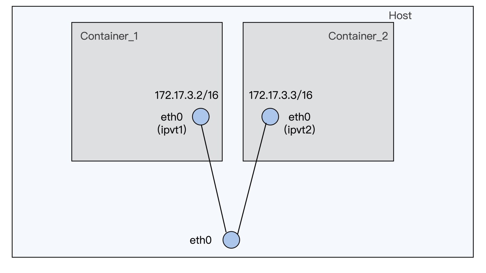


> 可以看出 macvlan/ipvlan 与 veth 网络配置的不同：容器的虚拟网络接口，直接连接在了宿主机的物理网络接口上了，形成了一个网络二层的连接。和 veth 接口相比，用 ipvlan 发送对外数据就要简单很多，因为这种方式没有内部额外的 softirq 处理开销。对于网络延时敏感的应用程序，可以考虑使用 ipvlan/macvlan 的容器网络配置方式来替换缺省的 veth 网络配置

## 网络乱序
> 网络中发生了数据包的重传，有可能是数据包在网络中丢了，也有可能是数据包乱序导致的。可以运行 netstat 命令来查看协议栈中的丢包和重传的情况

```bash
netstat -s | grep retran
```

### 快速重传
> 发送端向接受端发送一个数据包，接受端都回应 ACK。如果超过一个协议栈规定的时间，发送端没有收到 ACK 包，那么发送端就会重传数据包

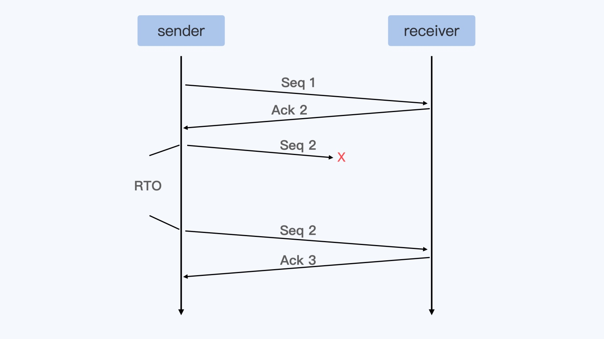

> 不过，等待一个超时之后再重传数据，对于实际应用来说太慢了，所以 TCP 协议又定义了快速重传：如果发送端收到 3 个重复的 ACK，那么发送端就可以立刻重新发送 ACK 对应的下一个数据包

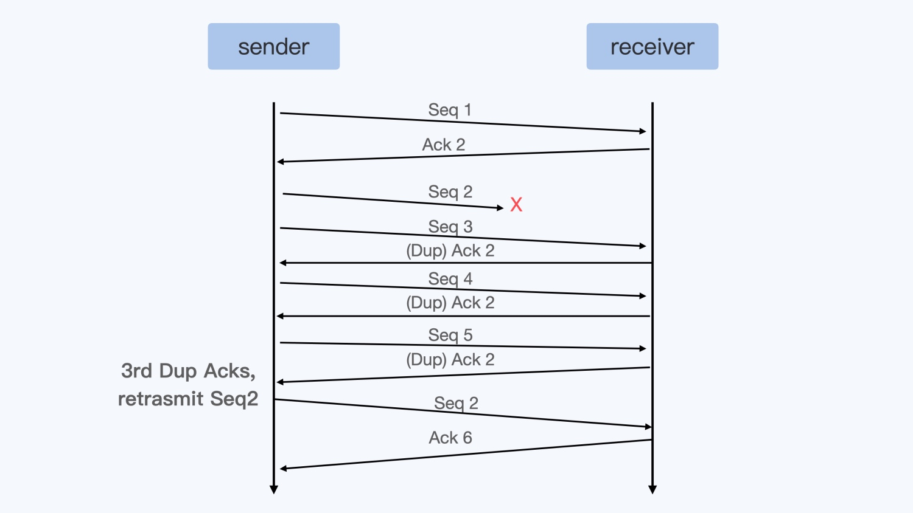

### SACK
> 虽然 TCP 快速重传的标准定义是需要收到 3 个重复的 Ack，但是 Linux 中常常收到一个 Dup Ac 后，就马上重传数据了

> SACK 也就是选择性确认，跟普通的 ACK 相比，SACK 会把接收端收到的所有包的序列信息，都反馈给发送端。发送端在收到 SACK 之后，就知道接收端收到了哪些数据，没有收到哪些数据。在 Linux 内核中会有个判断：如果在接收端收到的数据和还没有收到的数据之间，数据量差得太大，超过了 reordering * mss_cache，也可以马上重传数据。需要注意一下，这里的数据量差是根据 bytes 来计算的，而不是按照包的数目来计算的

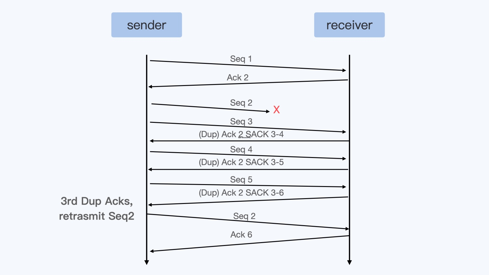

```bash
netstat -s | grep reordering
```

### RSS 和 RPS
> 通过 veth 接口从容器向外发送数据包，会触发 peer veth 设备去接收数据包，这个接收的过程就是一个网络的 softirq 的处理过程。在触发 softirq 之前，veth 接口会模拟硬件接收数据的过程，通过 enqueue_to_backlog 函数把数据包放到某个 CPU 对应的数据包队列里

> 在缺省的状况下（没有 RPS 的情况下）， enqueue_to_backlog 把数据包放到了当前运行的 CPU 对应的数据队 列中。如果是从容器里通过 veth 对外发送数据包，那么这个当前运行的 CPU 就是容器中发送数据的进程所在的 CPU

> 对于多核的系统，这个发送数据的进程可以在多个 CPU 上切换运行。进程在不同的 CPU 上把数据放入队列并且 raise softirq 之后，因为每个 CPU 上处理 softirq 是个异步操作， 所以两个 CPU network softirq handler 处理这个进程的数据包时，处理的先后顺序并不能保证。所以，veth 对的这种发送数据方式增加了容器向外发送数据出现乱序的几率

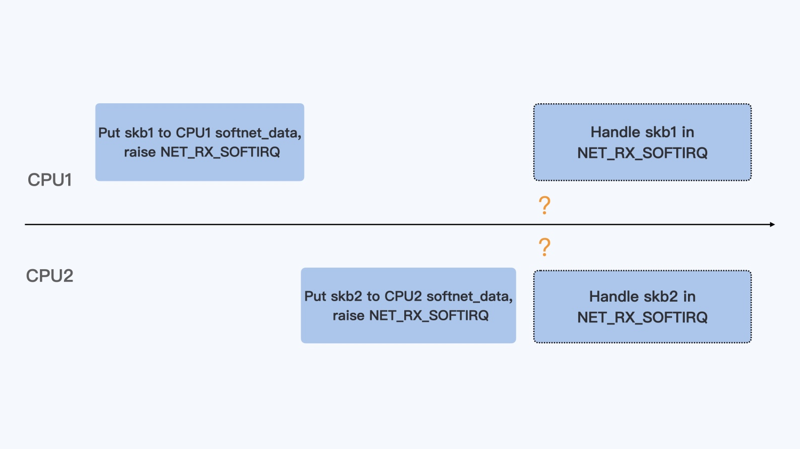


> RSS 是 Receive Side Scaling 的缩写，现在的网卡性能越来越强劲了，从原来一条 RX 队列扩展到了 N 条 RX 队列，而网卡的硬件中断也从一个硬件中断，变成了每条 RX 队列都会有一个硬件中断。每个硬件中断可以由一个 CPU 来处理，那么对于多核的系统，多个 CPU 可以并行的接收网络包，这样就大大地提高了系统的网络数据的处理能力

> 在网卡硬件中，可以根据数据包的 4 元组或者 5 元组信息来保证同一个数据流，比如一个 TCP 流的数据始终在一个 RX 队列中，这样也能保证同一流不会出现乱序的情况

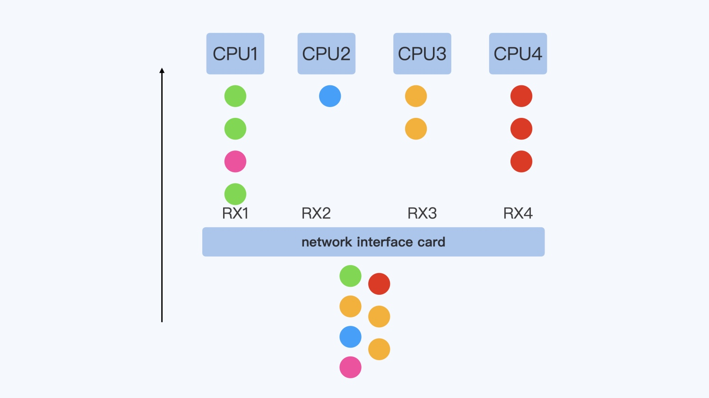


> RSS 的实现在网卡硬件和驱动里面，而 RPS（Receive Packet Steering）是在软件层面实现类似的功能：在硬件中断后，CPU2 收到了数据包，再一次对数据包计算一次四元组的 hash 值，得到这个数据包与 CPU1 的映射关系。接着会把这个数据包放到 CPU1 对应的 softnet_data 数据队列中，同时向 CPU1 发送一个 IPI 的中断信 号。这样一来，后面 CPU1 就会继续按照 Netowrk softirq 的方式来处理这个数据包了

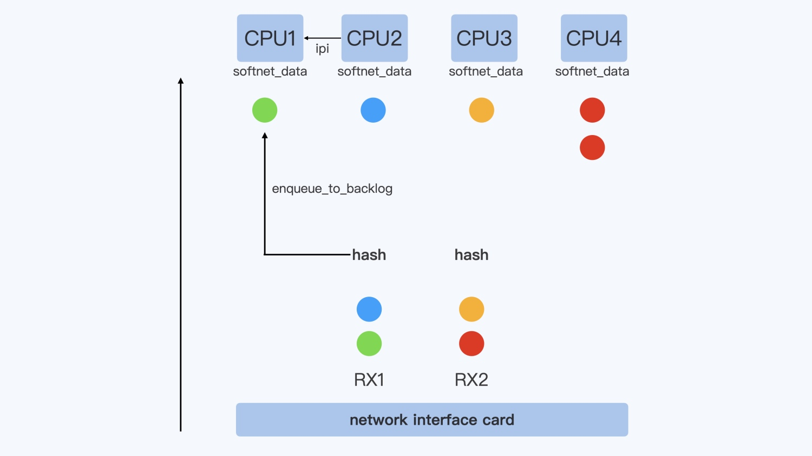

> RSS 和 RPS 的目的都是把数据包分散到更多的 CPU 上进行处理，使得系统有更强的网络包处理能力。在把数据包分散到各个 CPU 时，保证了同一个数据流在一个 CPU 上，这样就可以减少包的乱序。

在一个 12 CPU 的节点上，想让 host 上的 veth 接口在所有的 12 个 CPU 上，都可以通过 RPS 重新分配数据包：

```bash
# rps_cpus 是一个 16 进制的数，每个 bit 代表一个 CPU
cat /sys/devices/virtual/net/veth57703b6/queues/rx-0/rps_cpus
echo fff > /sys/devices/virtual/net/veth57703b6/queues/rx-0/rps_cpus
```