# 文件系统

> 在容器中测试读取文件的性能
> 1. 参数 -direct=1 代表采用非 buffered I/O 文件读写的方式，避免文件读写过程中内存缓冲对性能的影响
> 2. 参数 -iodepth=64 和 -ioengine=libaio 表示文件读写采用异步 I/O 的方式，也就是进程可以发起多个（64） I/O 请求，并且不用阻塞地等待 I/O 的完成
> 3. 参数 -rw=read，-bs=4k，-size=10G，分别表示这个测试是个读文件测试，每次读 4KB 大小数块，总共读 10GB 的数据
> 4. 参数 -numjobs=1，指只有一个进程 / 线程在运行

```bash
fio -direct=1 -iodepth=64 -rw=read -ioengine=libaio -bs=4k -size=10G -numjob=1
```

> 这个测试在 ubuntu 18.04，内核 4.15 上的容器 I/O 性能是 584MB/s 的带宽， IOPS 是 150K 左右。在 ubuntu 20.04，内核 5.4 上的的容器 I/O 性能是 70MB 带宽，IOPS 是 18K 左右

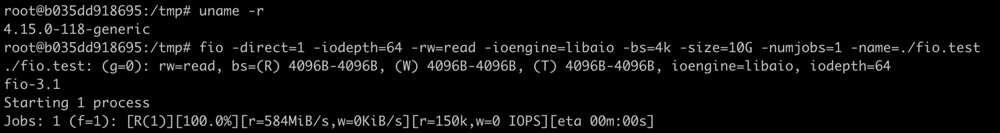
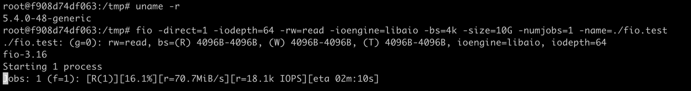

## UnionFS
> 在容器里，运行 df 命令，你可以看到在容器中根目录的文件系统类型是 overlay，不是普通 Linux 节点上看到的 Ext4 或者 XFS 之类常见的文件系统

> 在一个宿主机上需要运行 100 个容器。每个容器都需要一个镜像，这个镜像就把容器中程序需要运行的二进制文件，库文件，配置文件，其他的依赖文件等全部都打包成一个镜像文件。如果没有特别的容器文件系统，只是普通的 Ext4 或者 XFS 文件系统，那么每次启动一个容器，就需要把一个镜像文件下载并且存储在宿主机上。比如说，假设一个镜像文件的大小是 500MB，那么 100 个容器的话，就需要占用 50GB 的磁盘空间

> 在绝大部分的操作系统里，库文件都是差不多的。而且，在容器运行的时候，这类文件也不会被改动，基本上都是只读的。假如这 100 个容器镜像都是基于 ubuntu:18.04 的，每个容器镜像只是额外复制了 50MB 左右自己的应用程序到 ubuntu:18.04 里，那么就是说在总共 50GB 的数据里，有 90% 的数据是冗余的

> 为了有效地减少磁盘上冗余的镜像数据，同时减少冗余的镜像数据在网络上的传输， 选择一种针对于容器的文件系统是很有必要的，而这类的文件系统被称为 UnionFS。UnionFS 这类文件系统实现的主要功能是把多个目录一起挂载在一个目录下

> 比如，我们可以把 ubuntu18.04 这个基础镜像的文件放在一个目录 ubuntu18.04/ 下，容器自己额外的程序文件 app_1_bin 放在 app_1/ 目录下。然后，把这两个目录挂载到 container_1/ 这个目录下，作为容器 1 看到的文件系统；对于容器 2，就可以把 ubuntu18.04/ 和 app_2/ 两个目录一起挂载到 container_2 的目录下。这样在节点上我们只要保留一份 ubuntu18.04 的文件就可以了

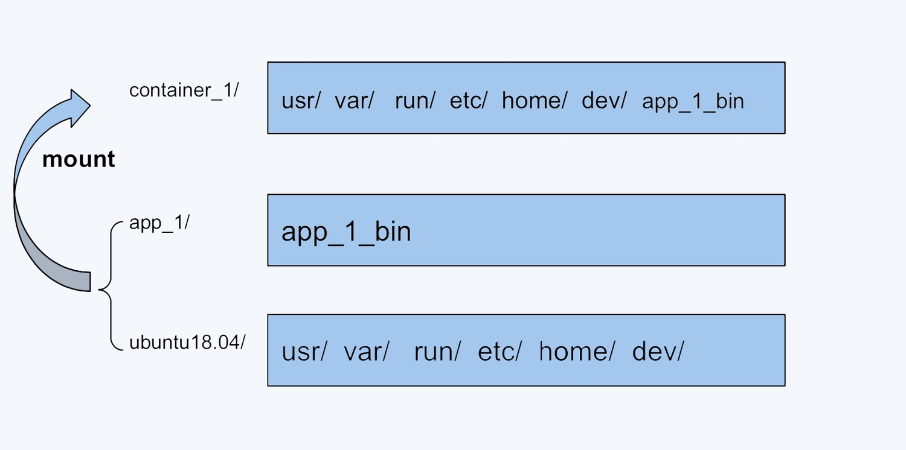

> UnionFS 类似的有很多种实现，包括在 Docker 里最早使用的 AUFS，还有目前我们使用的 OverlayFS。在 Linux 内核 3.18 版本中，OverlayFS 代码正式合入 Linux 内核的主分支。在这之后，OverlayFS 也就逐渐成为各个主流 Linux 发行版本里缺省使用的容器文件系统了

```bash
umount ./merged
rm upper lower merged work -r

mkdir upper lower merged work
echo "I'm from lower!" > lower/in_lower.txt
echo "I'm from upper!" > upper/in_upper.txt

echo "I'm from lower!" > lower/in_both.txt
echo "I'm from upper!" > upper/in_both.txt 

sudo mount -t overlay overlay \
 -o lowerdir=./lower,upperdir=./upper,workdir=./work \
 ./merged
```

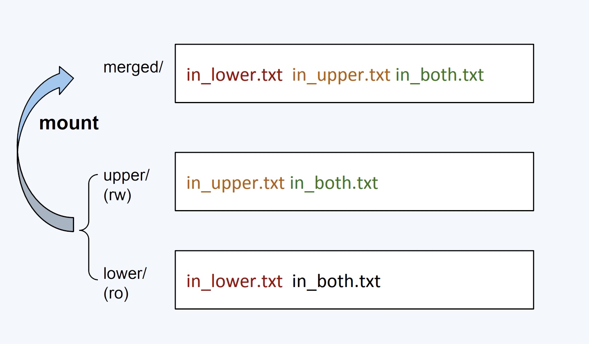

> 容器镜像文件可以分成多个层，每层可以对应 OverlayFS 里 lowerdir 的一个目录，lowerdir 支持多个目录，也就可以支持多层的镜像文件。在容器启动后，对镜像文件中修改就会被保存在 upperdir 里了

> 宿主机升级导致容器读写文件的性能降低问题，可以使用 Linux 下的 perf 工具来查看。通过 perf 工具，可以比较在容器中运行 fio 的时候，ubuntu 18.04 和 ubuntu 20.04 在内核函数调用上的不同

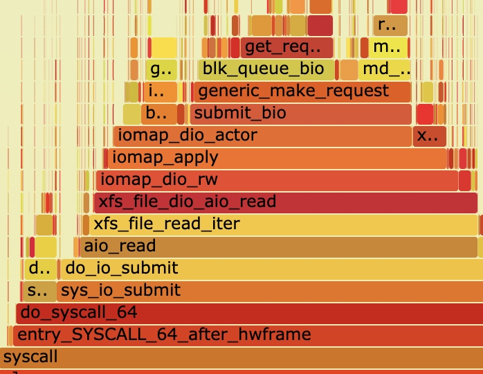

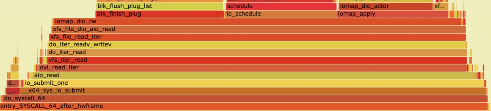

> 在内核 4.15 之后，Linux 为了完善 OverlayFS，增加了 OverlayFS 自己的 read/write 函数接口，从而不再直接调用 OverlayFS 后端文件系统（比如 XFS，Ext4）的读写接口。但是它只实现了同步 I/O，并没有实现异步 I/O。因此，在内核 5.4 上就无法对 OverlayFS 测出最高的性能指标了。在 Linux 内核 5.6 版本中，这个问题已经通过补丁解决了

## 文件 Quota
> 从宿主机的角度看，upperdir 就是一个目录，如果容器不断往容器文件系统中写入数据，实际上就是往宿主机的磁盘上写数据。对于容器来说，如果有大量的写操作是不建议写入容器文件系统的，一般是需要给容器挂载一个 volume，用来满足大量的文件读写

> 用 Docker 启动一个容器后，容器的根目录也就是容器文件系统 OverlayFS，它的大小是 160G，已经使用了 100G。其实这个大小也是宿主机上的磁盘空间和使用情况

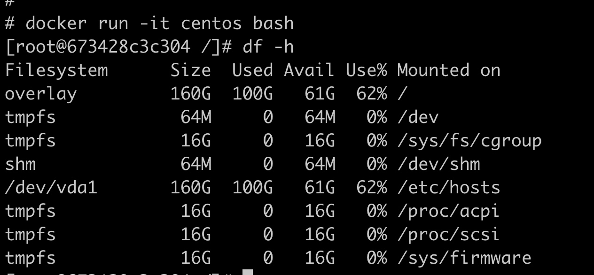

> 可以回到宿主机上验证一下，就会发现宿主机的根目录的大小也是 160G，同样是使用了 100G

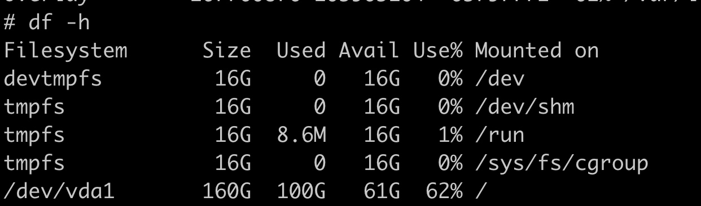

> 再往容器的根目录里写入 10GB 的数据

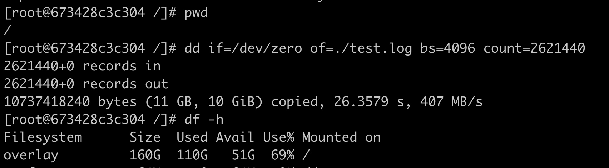

> 可以通过 /proc/mounts 这个路径，找到容器 OverlayFS 对应的 lowerdir 和 upperdir。因为写入的数据都在 upperdir 里，我们就只要看 upperdir 对应的那个目录就行了

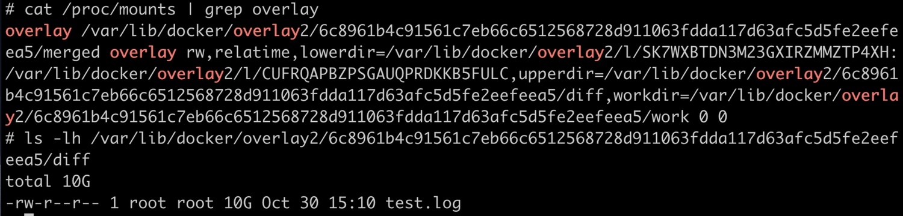

> 对于 Linux 上最常用的两个文件系统 XFS 和 ext4，它们有一个特性 Quota。XFS 文件系统缺省的 Quota 特性为 Linux 系统里的一个用户，一个用户组或者一个项目来限制它们使用文件系统的额度，也就是限制可以写入文件系统的文件总量

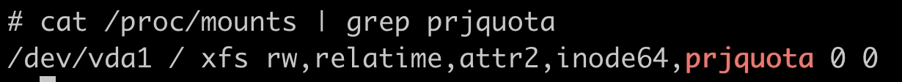

> 要使用 XFS Quota 特性，必须在文件系统挂载的时候加上对应的 Quota 选项，比如需要配置 Project Quota，那么这个挂载参数就是 pquota。对于根目录来说，这个参数必须作为一个内核启动的参数 rootflags=pquota，这样设置就可以保证根目录在启动挂载的时候，带上 XFS Quota 的特性并且支持 Project 模式

> 给一个指定的目录打上一个 Project ID，然后执行下面的命令

```bash
mkdir -p  /tmp/xfs

# 打上 Project ID
xfs_quota -x -c 'project -s -p /tmp/xfs 101' /

# 限制不能超过 10MB
xfs_quota -x -c 'limit -p bhard=10m 101' /
```

> 给目标目录打上的 Project ID，最终会写到目录对应的 inode 上。在这个目录下的新建的文件和目录也都会继承这个 ID。有了 ID 和限制值之后，文件系统就可以统计所有带这个 ID 文件的数据块大小总和，并且与限制值进行比较。一旦所有文件大小的总和达到限制值，文件系统就不再允许更多的数据写入了

> Docker 也已经实现了限流功能，也就是用 XFS Quota 来限制容器的 OverlayFS 大小

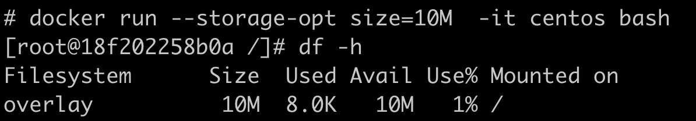

## 磁盘限速
```bash
FROM centos:8.1.1911

RUN yum install -y fio
```

```bash
mkdir -p /tmp/test
docker stop fio_test;docker rm fio_test

docker run --name fio_test --volume /tmp/test:/tmp fio:v1 fio -direct=1 -rw=write -ioengine=libaio -bs=4k -size=1G -numjobs=1  -name=/tmp/fio_test.log
```

> 容器文件系统并不适合频繁地读写。对于频繁读写的数据，容器需要把他们到放到 volume 中。这里，把磁盘上的 /tmp/test 目录作为 volume 挂载到容器的 /tmp 目录下。在启动容器之后，直接运行 fio 的命令

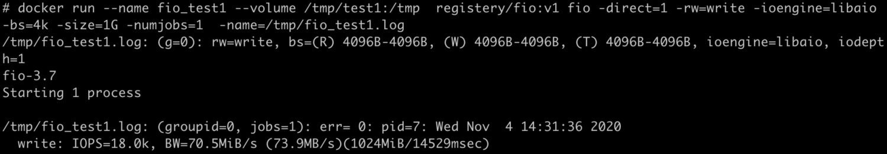

> 多个容器同时写一块磁盘的时候，会影响性能

```bash
mkdir -p /tmp/test1
mkdir -p /tmp/test2

docker stop fio_test1;docker rm fio_test1
docker stop fio_test2;docker rm fio_test2

docker run --name fio_test1 --volume /tmp/test1:/tmp  fio:v1 fio -direct=1 -rw=write -ioengine=libaio -bs=4k -size=1G -numjobs=1  -name=/tmp/fio_test1.log &
docker run --name fio_test2 --volume /tmp/test2:/tmp  fio:v1 fio -direct=1 -rw=write -ioengine=libaio -bs=4k -size=1G -numjobs=1  -name=/tmp/fio_test2.log &
```

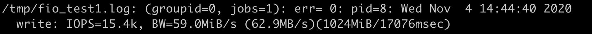

> IOPS 是 Input/Output Operations Per Second 的简称，也就是每秒钟磁盘读写的次数。吞吐量（Throughput）是指每秒钟磁盘中数据的读取量，一般以 MB/s 为单位。这个读取量可以叫作吞吐量，有时候也被称为带宽。在 IOPS 固定的情况下，如果读写的每一个数据块越大，那么吞吐量也越大

### Blkio Cgroup
> 在 Cgroup v1 中有 blkio 子系统，可以来限制磁盘的 I/O。不过 blkio 子系统对于磁盘 I/O 的限制，并不像 CPU，Memory 那么直接。blkio Cgroup 的虚拟文件系统挂载点一般在 /sys/fs/cgroup/blkio/。和 CPU，memory Cgroup 一样，在 /sys/fs/cgroup/blkio/ 目录下创建子目录作为控制组，再把需要做 I/O 限制的进程 pid 写到控制组的 cgroup.procs 参数中就可以了

> 在 blkio Cgroup 中，有四个最主要的参数，用来限制磁盘 I/O 性能

```bash
# 磁盘读取 IOPS 限制
blkio.throttle.read_iops_device

# 磁盘读取吞吐量限制
blkio.throttle.read_bps_device

# 磁盘写入 IOPS 限制
blkio.throttle.write_iops_device

#  磁盘写入吞吐量限制
blkio.throttle.write_bps_device
```

```bash
mkdir -p /tmp/test1
rm -f /tmp/test1/*
docker stop fio_test1;docker rm fio_test1

mkdir -p /tmp/test2
rm -f /tmp/test2/*
docker stop fio_test2;docker rm fio_test2

docker run -d --name fio_test1 --volume /tmp/test1:/tmp fio:v1 sleep 3600
docker run -d --name fio_test2 --volume /tmp/test2:/tmp fio:v1 sleep 3600

sleep 2

CONTAINER_ID1=$(sudo docker ps --format "{{.ID}}\t{{.Names}}" | grep -i fio_test1 | awk '{print $1}')
echo $CONTAINER_ID1
CGROUP_CONTAINER_PATH1=$(find /sys/fs/cgroup/blkio/ -name "*$CONTAINER_ID1*")
echo $CGROUP_CONTAINER_PATH1

# 主次设备号 253:0
# /tmp/test1 -> /dev
# 限速 10MB
echo "253:0 10485760" > $CGROUP_CONTAINER_PATH1/blkio.throttle.read_bps_device
echo "253:0 10485760" > $CGROUP_CONTAINER_PATH1/blkio.throttle.write_bps_device

CONTAINER_ID2=$(sudo docker ps --format "{{.ID}}\t{{.Names}}" | grep -i fio_test2 | awk '{print $1}')
echo $CONTAINER_ID2
CGROUP_CONTAINER_PATH2=$(find /sys/fs/cgroup/blkio/ -name "*$CONTAINER_ID2*")
echo $CGROUP_CONTAINER_PATH2

echo "253:0 10485760" > $CGROUP_CONTAINER_PATH2/blkio.throttle.read_bps_device
echo "253:0 10485760" > $CGROUP_CONTAINER_PATH2/blkio.throttle.write_bps_device

docker exec fio_test1 fio -direct=1 -rw=write -ioengine=libaio -bs=4k -size=100MB -numjobs=1 -name=/tmp/fio_test1.log &
docker exec fio_test2 fio -direct=1 -rw=write -ioengine=libaio -bs=4k -size=100MB -numjobs=1 -name=/tmp/fio_test2.log &
```

### Direct vs Buffered
> Direct I/O 模式，用户进程如果要写磁盘文件，就会通过 Linux 内核的文件系统层 -> 块设备层 -> 磁盘驱动 -> 磁盘硬件

> Buffered I/O 模式，用户进程只是把文件数据写到内存中就返回了，而 Linux 内核自己有线程会把内存中的数据再写入到磁盘中。考虑到性能问题，绝大多数的应用都会使用 Buffered I/O 模式

> 可以看出，Direct I/O 可以通过 blkio Cgroup 来限制磁盘 I/O，但是 Buffered I/O 不能被限制

> 进程 pid_y 可以分别属于 memory Cgroup 和 blkio Cgroup。在 blkio Cgroup 对进程 pid_y 做磁盘 I/O 做限制的时候，blkio 子系统不会去关心 pid_y 用了哪些内存，使用内存是不是属于 Page Cache，而这些 Page Cache 的页面在刷入磁盘的时候，产生的 I/O 也不会被计算到进程 pid_y 上面。这导致了 blkio 在 Cgroups v1 里不能限制 Buffered I/O

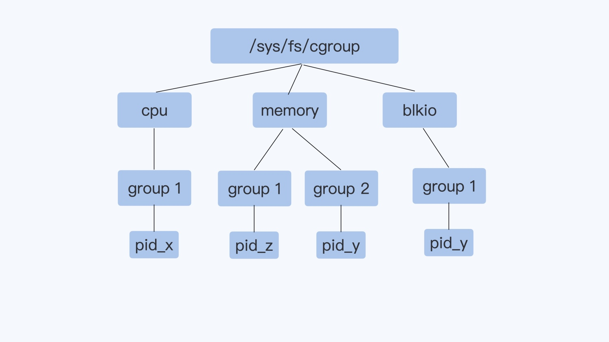

> Cgroup v2 相比 Cgroup v1 做的最大的变动就是一个进程属于一个控制组，每个控制组里可以定义自己需要的多个子系统。进程 pid_y 属于控制组 group2，而在 group2 里同时打开了 io 和 memory 子系统。Cgroup 对进程 pid_y 的磁盘 I/O 做限制的时候，就可以考虑到进程 pid_y 写入到 Page Cache 内存的页面了，这样 buffered I/O 的磁盘限速就实现了

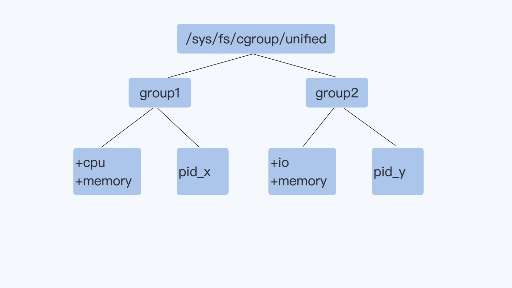

> 配置 kernel 参数 cgroup_no_v1=blkio,memory，把 Cgroup v1 的 blkio 和 Memory 两个子系统禁止，这样 v2 的 io 和 Memory 子系统就打开了。把这个参数配置到 grub 中，然后重启 Linux 机器。系统重启后，v2 的虚拟文件系统被挂载到了 /sys/fs/cgroup/unified 目录下

```bash
# 控制组
mkdir -p /sys/fs/cgroup/unified/iotest

# 加入 io 和 Memory 两个控制子系统
echo "+io +memory" > /sys/fs/cgroup/unified/cgroup.subtree_control

# Add current bash pid in iotest control group.
# Then all child processes of the bash will be in iotest group too,
# including the fio
echo $$ >/sys/fs/cgroup/unified/iotest/cgroup.procs

echo "252:16 wbps=10485760" > /sys/fs/cgroup/unified/iotest/io.max
cd /mnt

# buffered I/O 模式
fio -iodepth=1 -rw=write -ioengine=libaio -bs=4k -size=1G -numjobs=1  -name=./fio.test
```

> 因为系统上有足够的内存， fio 把数据写入内存就返回了。不过，再运行 iostat -xz 10 命令，可以看到磁盘 vdb 上稳定的写入速率是 10240wkB/s，也就是限制的 10MB/s

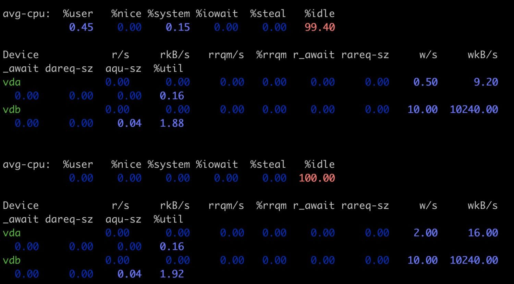

## Dirty Page
> 对于 Buffer I/O，用户的数据是先写入到 Page Cache 里的。这些写入了数据的内存页面，在它们没有被写入到磁盘文件之前，就叫作 dirty pages

### 内核参数
> A = dirty page 内存 / 可用内存

> /proc/sys/vm 里和 dirty page 相关的内核参数：
> 1. dirty_background_ratio，这个参数里的数值是一个百分比值，缺省是 10%。如果比值 A 大于 dirty_background_ratio，内核 flush 线程就会把 dirty pages 刷到磁盘里
> 2. dirty_background_bytes，它和 dirty_background_ratio 作用相同，不过用来定义 dirty pages 内存的临界值，而不是比例值。dirty_background_ratio 和 dirty_background_bytes 只有一个可以起作用
> 3. dirty_ratio，这个参数的数值也是一个百分比值，缺省是 20%。如果比值 A，大于参数 dirty_ratio 的值，这时候正在执行 Buffered I/O 写文件的进程就会被阻塞住，直到它写的数据页面都写到磁盘为止
> 4. dirty_bytes 与 dirty_ratio 相对应
> 5. dirty_writeback_centisecs，这个参数的值是个时间值，以百分之一秒为单位，缺省值是 500。表示每 5 秒钟会唤醒内核的 flush 线程来处理 dirty pages
> 6. dirty_expire_centisecs，这个参数的值也是一个时间值，以百分之一秒为单位， 缺省值是 3000。它定义了 dirty page 在内存中存放的最长时间，如果一个 dirty page 超过这里定义的时间，那么内核的 flush 线程也会把这个页面写入磁盘

> 进程写操作上的时间波动，只有可能是因为 dirty pages 的数量很多，已经达到了 dirty_ratio 的值。这时执行写文件功能的进程就会被暂停，直到写文件的操作将数据页面写入磁盘，写文件的进程才能继续运行，所以进程里一次写文件数据块的操作时间会增加

> 可以在容器中进程不断写入数据的时候，查看节点上 dirty pages 的实时数目

```bash
watch -n 1 "cat /proc/vmstat | grep dirty"
```

> 节点可用内存是 12GB，假设 dirty_ratio 是 20%，dirty_background_ratio 是 10%，那么在 1GB memory 容器中写 10GB 的数据，就会看到它实时的 dirty pages 数目，也就是 /proc/vmstat 里的 nr_dirty 的数值，这个数值对应的内存并不能达到 dirty_ratio 所占的内存值

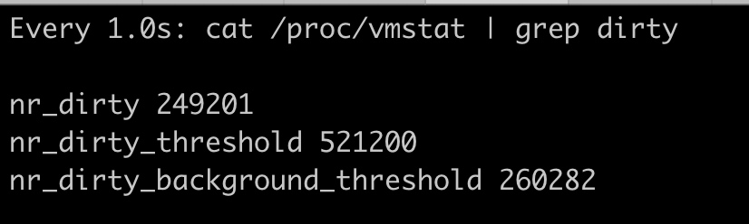

> 在 dirty_bytes 和 dirty_background_bytes 里写入一个很小的值。然后再查看容器程序里每写入 64KB 数据块的时间，会发现时不时 一次写入的时间就会达到 9ms

```bash
echo 8192 > /proc/sys/vm/dirty_bytes
echo 4096 > /proc/sys/vm/dirty_background_bytes
```

> 容器中的进程用到了 write 这个函数调用，然后写 64KB 数据块的时间增加了，而 write 是一个系统调用，需要进行以下操作
> 1. 找到内核中 write 这个系统调用函数下，又调用了哪些子函数。可以通过查看代码，或者用 perf 工具获知
> 2. 得到 write 的主要子函数之后，用 ftrace 这个工具来 trace 这些函数的执行时间，这样就找到了花费时间最长的函数

```bash
perf record -a -g -p <pid>

# 写磁盘进程退出后，查看结果
perf report
```

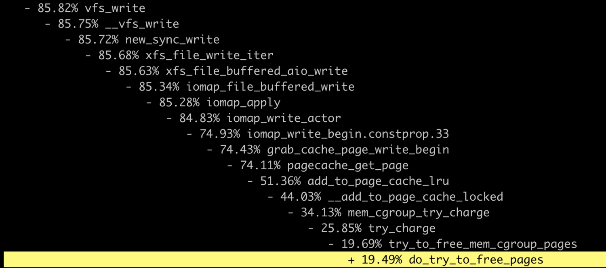

> 把主要的函数写入到 ftrace 的 set_ftrace_filter 里，然后把 ftrace 的 tracer 设置为 function_graph，并且打开 tracing_on 开启追踪。这些设置完成之后，再运行一下容器中的写磁盘程序，同时从 ftrace 的 trace_pipe 中读取出追踪到的这些函数

```bash
cd /sys/kernel/debug/tracing

echo vfs_write >> set_ftrace_filter
echo xfs_file_write_iter >> set_ftrace_filter
echo xfs_file_buffered_aio_write >> set_ftrace_filter
echo iomap_file_buffered_write
echo iomap_file_buffered_write >> set_ftrace_filter
echo pagecache_get_page >> set_ftrace_filter
echo try_to_free_mem_cgroup_pages >> set_ftrace_filter
echo try_charge >> set_ftrace_filter
echo mem_cgroup_try_charge >> set_ftrace_filter

echo function_graph > current_tracer
echo 1 > tracing_on
```

> 可以看到，当需要申请 Page Cache 页面的时候，write 系统调用会反复地调用 mem_cgroup_try_charge，并且在释放页面的时候，函数 do_try_to_free_pages 花费的时间特别长

> Linux 会把所有的空闲内存利用起来，一旦有 Buffered I/O，这些内存都会被用作 Page Cache。当容器加了 Memory Cgroup 限制了内存之后，对于容器里的 Buffered I/O，就只能使用容器中允许使用的最大内存来做 Page Cache。如果 Cgroup 中 memory.limit_in_bytes 设置得比较小，而容器中的进程又有很大量的 I/O，这样申请新的 Page Cache 内存的时候，又会不断释放老的内存页面，这些操作就会带来额外的系统开销

> 在对容器做 Memory Cgroup 限制内存大小的时候，不仅要考虑容器中进程实际使用的内存量，还要考虑容器中程序 I/O 的量，合理预留足够的内存作为 Buffered I/O 的 Page Cache