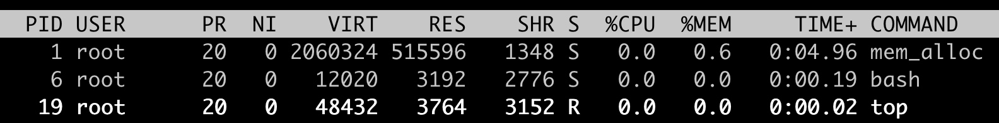

# Swap

> 当内存写满的时候，就可以把内存中不常用的数据暂时写到这个 Swap 空间上。这样，内存空间就可以释放出来。它的好处是可以应对一些瞬时突发的内存增大需求，不至于因为内存一时不够而触发 OOM Killer，导致进程被杀死

```bash
#!/bin/bash

# swap 为 20G
fallocate -l 20G ./swapfile
dd if=/dev/zero of=./swapfile bs=1024 count=20971520
chmod 600 ./swapfile
mkswap ./swapfile
swapon swapfile
```

> 设置容器的 Memory Cgroup 限制为 512MB，容器中的 mem_alloc 程序去申请 2GB 内存。这次并没有发生 OOM 导致容器退出的情况。mem_alloc 进程的 RSS 内存一直在 512MB（RES: 515596）左右



> Swap 空间，使用了 1.5GB（used 1542144KB）。1.5GB + 512MB，结果正好是 mem_alloc 这个程序申请的 2GB 内存


> 有了 Swap 空间，本来会被 OOM Kill 的容器，可以运行了。不过，Memory Cgroup 对内存的限制就失去了作用。如果一个容器中的程序发生了内存泄漏，本来 Memory Cgroup 可以及时杀死这个进程。结果现在这个内存泄漏的进程没被杀死，还会不断地读写 Swap 磁盘，反而影响了整个节点的性能

> 某一类程序就是需要 Swap 空间，才能防止因为偶尔的内存突然增加而被 OOM Killer 杀死。因为这类程序重新启动的初始化时间会很长，这样程序重启的代价就很大了。这一类程序一旦和需要 Swap 的容器在同一个宿主机上共同运行，就会发生冲突

> 在有磁盘文件访问的时候，Linux 会尽量把系统的空闲内存用作 Page Cache 来提高文件的读写性能。在没有打开 Swap 空间的情况下，一旦内存不够，这种情况下就只能把 Page Cache 释放了，而 RSS 内存是不能释放的。在 RSS 里的内存，大部分都是没有对应磁盘文件的内存，比如用 malloc 申请得到的内存，这种内存也被称为匿名内存。当 Swap 空间打开后，可以写入 Swap 空间的，就是这些匿名内存

> 在内存紧张时，可能会发生以下两种情况：
> 1. 系统先把 Page Cache 都释放了，一旦节点里有频繁的文件读写操作，系统的性能就会下降
> 2. 如果 Linux 系统先把匿名内存都释放并写入到 Swap，那么一旦这些被释放的匿名内存马上需要使用，又需要从 Swap 空间读回到内存中，这样又会让 Swap 的读写频繁，导致系统性能下降

> 因此，在释放内存的时候，需要平衡 Page Cache 的释放和匿名内存的释放，而 swappiness，就是用来定义这个平衡的参数（/proc/sys/vm/swappiness）。swappiness 可以决定系统将会有多频繁地使用交换分区。一个较高的值会使得内核更频繁地使用交换分区，而一个较低的取值，则代表着内核会尽量避免使用交换分区。swappiness 的取值范围是 0–100，缺省值 60

> 1. 当 swappiness 的值是 100 的时候，匿名内存和 Page Cache 内存的释放比例就是 100:100
> 2. 当 swappiness 缺省值是 60 的时候，匿名内存和 Page Cache 内存的释 放比例就是 60:140，Page Cache 内存的释放要优先于匿名内存
> 3. 当 swappiness 的值是 0 的时候，在内存紧张的时候，也会使用 Swap 来回收匿名内存

> Memory Cgroup 控制组下面有一个 memory.swappiness 参数。memory.swappiness 可以控制这个 Memroy Cgroup 控制组下面匿名内存和 page cache 的回收，取值的范围和工作方式和全局的 swappiness 差不多。在 Memory Cgorup 的控制组里，如果设置了 memory.swappiness 参数，它就会覆盖全局的 swappiness，让全局的 swappiness 在这个控制组里不起作用。但是，有一点不同的是，当 memory.swappiness = 0 的时候，对匿名页的回收是始终禁止的，也就是始终都不会使用 Swap 空间

> 在同一个宿主机上，假设同时存在容器 A 和其他容器，容器 A 上运行着需要使用 Swap 空间的应用，而别的容器不需要使用 Swap 空间。那么，可以在宿主机节点上打开 Swap 空间，同时在其他容器对应的 Memory Cgroups 控制组里，把 memory.swappiness 这个参数设置为 0