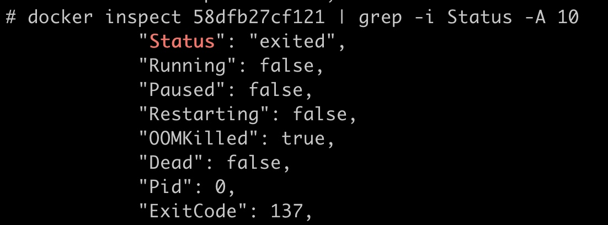
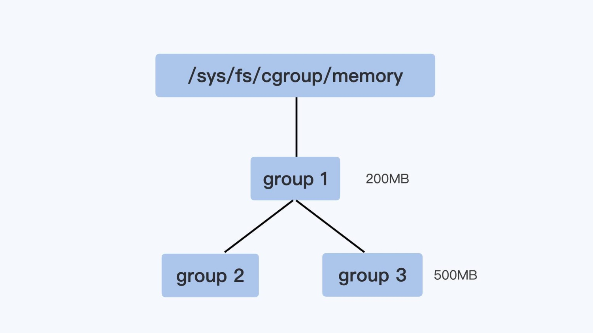
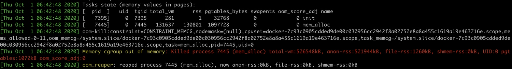
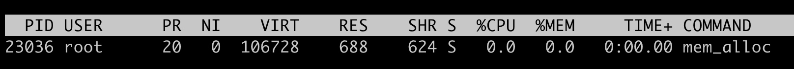
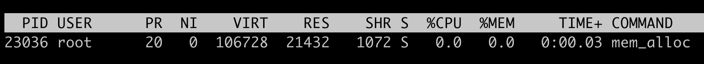
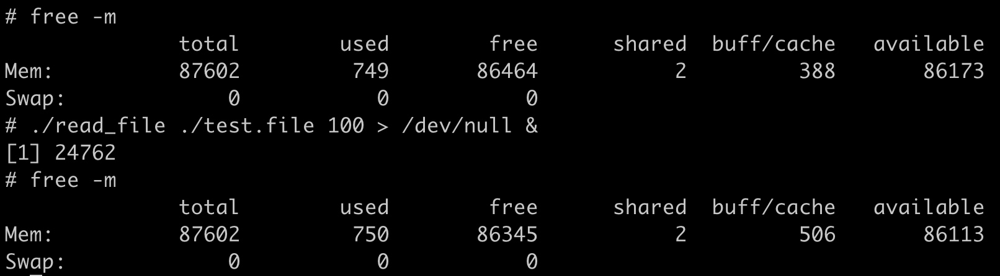
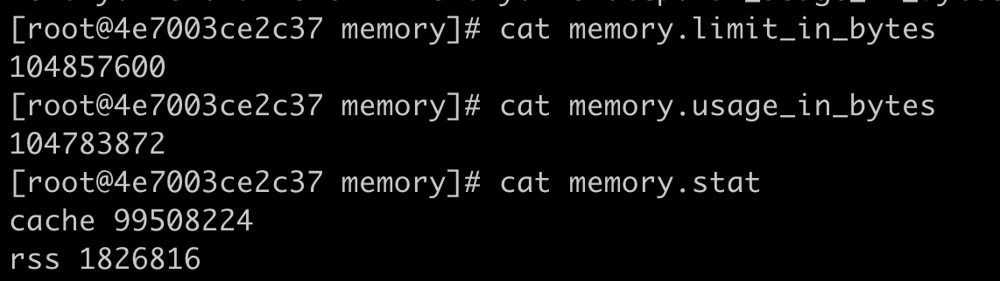

# 内存控制

## OOM
> 启动容器，把这个容器的 Cgroup 内存上限设置为 512MB

```bash
echo 536870912 > $CGROUP_CONTAINER_PATH/memory.limit_in_bytes
```

> 运行 docker inspect 命令查看容器退出的原因，会看到容器处于 exited 状态，并且 OOMKilled 是 true



> Linux 允许进程在申请内存的时候是 overcommit 的，这就是说允许进程申请超过实际物理内存上限的内存。比如说，节点上的空闲物理内存只有 512MB 了，但是如果一个进程调用 malloc 申请了 600MB，也是被允许的。这是因为 malloc 申请的是内存的虚拟地址，由于没有写入数据，所以程序并没有得到真正的物理内存

> overcommit 的内存申请模式可以有效提高系统的内存利用率。不过遇到内存不够的时候，Linux 采取的措施就是杀死某个正在运行的进程。Linux 内核里有一个 oom_badness 函数，函数中涉及两个条件：
> 1. 进程已经使用的物理内存页面数
> 2. 每个进程的 OOM 校准值 oom_score_adj。在 /proc 文件系统中，每个进程都有一个 /proc/oom_score_adj 的接口文件。可以在这个文件中输入 -1000 到 1000 之间的任意一个数值，调整进程被 OOM Kill 的几率

> 函数 oom_badness 里的最终计算方法是这样的：
> 用系统总的可用页面数，去乘以 OOM 校准值 oom_score_adj，再加上进程已经使用的物理页面数，计算出来的值越大，那么这个进程被 OOM Kill 的几率也就越大

## Memory Cgroup
> Memory Cgroup 是对一组进程的 Memory 使用做限制。Memory Cgroup 的虚拟文件系统的挂载点一般 在 /sys/fs/cgroup/memory 这个目录下，可以在这个目录下创建一个子目录作为控制组。控制组中跟 OOM 最相关有 3 个参数：
> 1. memory.limit_in_bytes：是一个控制组里所有进程可使用内存的最大值
> 2. memory.oom_control：当控制组中的进程内存使用达到上限值时，这个参数能够决定会不会触发 OOM Killer。如果没有设置，memory.oom_control 的缺省值就会触发 OOM Killer。如果要改变缺省值，不希望触发 OOM Killer，只要执行 echo 1 > memory.oom_control ，这时候即使控制组里所有进程使用的内存达到 memory.limit_in_bytes 设置的上限值，控制组也不会杀掉里面的进程。但是，这样操作以后，会影响到控制组中正在申请物理内存页面的进程，这些进程会处于一个停止状态，不能往下运行了
> 3. memory.usage_in_bytes：这个参数是只读的，里面的数值是当前控制组里所有进程实际使用的内存总和



> 控制组之间是树状的层级结构，父节点的控制组里的 memory.limit_in_bytes 值，就可以限制它的子节点中所有进程的内存使用。比如，group1 里的 memory.limit_in_bytes 设置的值是 200MB，它的子控制组 group3 里 memory.limit_in_bytes 值是 500MB。那么，在 group3 里所有进程使用的内存总值就不能超过 200MB，而不是 500MB

> 每个容器创建后，系统都会为它建立一个 Memory Cgroup 的控制组，容器的所有进程都在这个控制组里。一般的容器云平台，比如 Kubernetes 都会为容器设置一个内存使用的上限。这个内存的上限值会被写入 Cgroup 里。一旦容器中进程使用的内存达到了上限值，OOM Killer 会杀死进程使容器退出

> 通过查看内核的日志，使用 journal -k 命令，或者直接查看日志文件 /var/log/message，可以发现当容器发生 OOM Kill 的时候，内核会输出下面的这段信息，大致包含下面这三部分的信息：
> 1. 容器里每一个进程使用的内存页面数量。在 rss 列里（Resident Set Size）。比如下面的日志里，mem_alloc 进程有 130801 个页面，内存页面的大小一般是 4KB，大致等于 130801 * 4KB = 512MB
> 2. oom-kill 这行列出了发生 OOM 的 Memroy Cgroup 的控制组，可以从控制组的信息中知道 OOM 是在哪个容器发生的
> 3. Killed process 7445 (mem_alloc) 这行，显示了最终被 OOM Killer 杀死的进程



> 知道以上信息之后，就可以有针对性地对这个进程进行分析了，一般有这两种情况：
> 1. 这个进程本身的确需要很大的内存，这说明给 memory.limit_in_bytes 里的内存上限值设置小了，需要增大内存的上限值
> 2. 进程的代码中有 Bug，会导致内存泄漏

## Page Cache
> 设置容器 Memory Cgroup 里的内存上限值是 100MB

```bash
echo 104857600 > $CGROUP_CONTAINER_PATH/memory.limit_in_bytes
```

> 把容器启动起来后，查看容器 Memory Cgroup 下的 memory.limit_in_bytes 和 memory.usage_in_bytes 这两个值。可以看到容器内存的上限与已使用内存非常接近。但是，如果这时候继续启动程序申请并使用 50MB 的物理内存，还是可以运行成功，并没有发生 OOM 的情况。这时再去查看参数 memory.usage_in_bytes，就会发现它的值比之前还少了一些

### 内存类型
> Linux 的各个模块都需要内存，比如内核需要分配内存给页表，内核栈，还有 slab；用户态进程里的堆内存和栈的内存，共享库的内存，还有文件读写的 Page Cache。Memory Cgroup 不会对内核的内存做限制（比如页表， slab 等）

### RSS
> RSS 是 Resident Set Size 的缩写，它是进程真正申请到物理页面的内存大小。应用程序在申请内存的时候，比如说，调用 malloc 来申请 100MB 的内存大小，malloc 返回成功了，这只代表系统把 100MB 的虚拟地址空间分配给了进程，并没有把实际的物理内存页面分配给进程

> 当进程对这块内存地址开始做真正读写操作的时候，系统才会把实际需要的物理内存分配给进程。而这个过程中，进程真正得到的物理内存，就是 RSS

```c
p = malloc(100 * MB);

if (p == NULL)
    return 0;

sleep(30);
memset(p, 0x00, 20 * MB);
```

> 运行了 malloc 之后，运行 top 命令，可以看到这个程序的虚拟地址空间（VIRT）已经有了大约 100MB，但实际的物理内存 RSS（top 命令里显示的是 RES）只有 688KB



> 等待 30 秒之后，对这块申请的空间里写入 20MB 的数据。再用 top 查看，这时候可以看到虚拟地址空间（VIRT）没有变化，不过物理内存 RSS 的值变成了 20MB 左右



> RSS 内存包含了进程的代码段内存，栈内存，堆内存，共享库的内存，这些内存是进程运行所必须的。通过 malloc/memset 得到的内存，属于堆内存。具体的每一部分的 RSS 内存的大小，可以查看 /proc/<pid>/smaps 文件

### Page Cache
> 每个进程除了各自独立分配到的 RSS 内存外，如果进程对磁盘上的文件做了读写操作，Linux 还会分配内存，把磁盘上读写到的页面存放在内存中，这部分的内存就是 Page Cache

> Page Cache 的主要作用是提高磁盘文件的读写性能，因为系统调用 read 和 write 的缺省行为都会把读过或者写过的页面存放在 Page Cache 里

> 代码程序去读取 100MB 的文件，在读取文件前，系统中 Page Cache 的大小是 388MB，读取后 Page Cache 的大小是 506MB，增长了大约 100MB 左右



> 只要有空闲的内存，系统就会自动地把读写过的磁盘文件页面放入到 Page Cache 里。那么这些内存都被 Page Cache 占用，一旦进程需要用到更多的物理内存，执行 malloc 调用做申请时，发现剩余的物理内存不够了。这时，就需要进行内存回收

> Linux 的内存页面回收机制，会根据系统里空闲物理内存是否低于某个阈值，来决定是否启动内存的回收。内存回收的算法会根据不同类型的内存以及内存的最近最少用原则，就是 LRU 算法决定哪些内存页面先被释放。因为 Page Cache 的内存页面只是起到 Cache 作用，是会被优先释放的

> Memory Cgroup 只是统计了 RSS 和 Page Cache 这两部分的内存。当控制组里的进程需要申请新的物理内存，而且 memory.usage_in_bytes 里的值超过控制组里的内存上限值 memory.limit_in_bytes，这时内存回收就会被调用起来。那么在这个控制组里的 page cache 的内存会根据新申请的内存大小释放一部分，还是能成功申请到新的物理内存，整个控制组里总的物理内存开销还是不会超过上限值

> 在 Memory Cgroup 中有一个参数 memory.stat，可以显示在当前控制组里各种内存类型的实际的开销。可以看到，容器启动后，cache，也就是 Page Cache 占的内存是 99508224bytes，大概是 99MB，而 RSS 占的内存只有 1826816bytes，也就是 1MB 多一点。这就意味着，在这个容器的 Memory Cgroup 里大部分的内存都是可以被回收的


