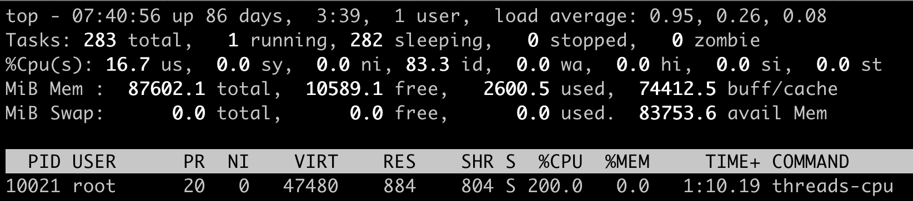

# CPU 控制

## CPU 使用分类


### us
> us 代表 Linux 的用户态 CPU Usage。普通用户程序代码中，只要不是调用系统调用，这些代码的指令消耗的 CPU 就都属于 us

### sy
> 当用户程序代码中调用了系统调用，比如说 read 去读取一个文件，用户进程就会从用户态切换到内核态。内核态 read 系统调用在读到真正 disk 上的文件前，就会进行一些文件系统层的操作。那么这些代码指令的消耗就属于 sy

### wa
> read 系统调用向 Linux 的 Block Layer 发出一个 I/O Request，触发一个真正的磁盘读取操作。这时候，这个进程一般会被置为 TASK_UNINTERRUPTIBLE。而 Linux 会把这段时间标示成 wa，代表 iowait，表示等待 I/O 的时间

> 当磁盘返回数据时，进程在内核态拿到数据，这里仍旧是内核态的 CPU 使用中的 sy

### id
> id 代表 idle，表示系统处于空闲状态

### hi
> 机器收到网络数据包，网卡就会发出一个中断，CPU 会响应中断，进入中断服务程序。此时，CPU 处于 hi 状态，代表 hardware irq，表示 CPU 处理硬中断的开销

### si
> 由于中断服务处理需要关闭中断，所以硬中断的时间不能太长。但是，发生中断后的工作是必须要完成的，如果这些工作比较耗时，Linux 提供一个软中断的概念（soft irq），它可以完成这些耗时比较长的工作

> 从网卡收到数据包的大部分工作，都是通过软中断来处理的。无论是 hi 还是 si，它们的 CPU 时间都不会计入进程的 CPU 时间。这是因为本身它们在处理的时候就不属于任何一个进程

### ni
> nice 的缩写，这里表示如果进程的 nice 值是正值（1 - 19），代表优先级比较低的进程运行时所占用的 CPU

### st
> steal 的缩写，是在虚拟机里用的一个 CPU 使用类型，表示有多少时间是被同一个宿主机上的其他虚拟机抢走的

## CPU Cgroup
> wa、hi、si，这些 I/O 或者中断相关的 CPU 使用，CPU Cgroup 不会去做限制

> 每个 Cgroups 子系统都是通过一个虚拟文件系统挂载点的方式，挂到一个缺省的目录下，CPU Cgroup 一般在 Linux 发行版里会放在 /sys/fs/cgroup/cpu 这个目录下。在这个子系统的目录下，每个控制组都是一个子目录，各个控制组之间的关系就是一个树状的层级关系


```bash
cd /sys/fs/cgroup/cpu

mkdir group1 group2
cd group2
mkdir group3 group4
cd group3

ls cpu.*
```

```c
// gcc -o app cpu.c -lpthread --static

#include <stdio.h>
#include <stdlib.h>
#include <sys/types.h>
#include <sys/wait.h>
#include <unistd.h>
#include <pthread.h>
#include <string.h>

void *doSomeThing(void *arg)
{
	static unsigned long i = 0;
	pthread_t pid = pthread_self();

	printf("Thread%d, %x\n", i++, pid);
	while (1) {
		int sum;
		sum += 1;
	}

	return NULL;
}

int main(int argc, char *argv[])
{
	int i;
	int total;
	pthread_attr_t tattr;
	int err;
	int stack_size = (20 * 1024 * 1024);

	if (argc < 2) {
		total = 1;
	} else {
		total = atoi(argv[1]);
	}

	err = pthread_attr_init(&tattr);
	if (err != 0) {
		printf("pthread_attr_init err\n");
	}

	err = pthread_attr_setstacksize(&tattr, stack_size);
	if (err != 0) {
		printf("Set stack to %d\n", stack_size);
	}

	printf("To create %d threads\n", total);

	for (i = 0; i < total; i++) {
		pthread_t tid;
		err = pthread_create(&tid, &tattr, &doSomeThing, NULL);
		if (err != 0)
			printf("\ncan't create thread :[%s]", strerror(err));
		else
			printf("\nThread %d created successfully\n", i);

	}

	usleep(1000000);
	printf("All threads are created\n");
	usleep(1000000000);

	return EXIT_SUCCESS;
}
```

> 在云平台里，大部分程序都不是实时调度的进程，而是普通调度类型进程。因为普通调度的算法在 Linux 中目前是 CFS（Completely Fair Scheduler，即完全公平调度器）。CPU Cgroup 和 CFS 相关的参数，一共有三个：
> 1. cpu.cfs_period_us，CFS 算法的一个调度周期，一般为 100000，以 microseconds 为单位，也就 100ms
> 2. cpu.cfs_quota_us，在一个调度周期里控制组被允许的运行时间，比如这个值为 50000 时，就是 50ms。如果这个值是 200000，也就是 200ms，那么它除以 period，也就是 200ms / 100ms = 2。超过了 1 个 CPU，这就意味着需要 2 个 CPU 的资源配额
> 3. cpu.shares，CPU Cgroup 对于控制组之间的 CPU 分配比例，缺省值是 1024。假设 group3 中的 cpu.shares 是 1024，group4 中的 cpu.shares 是 3072，那么 group3 : group4 = 1 : 3。在一台 4 个 CPU 的机器上，当 group3 和 group4 都需要 4 个 CPU 的时候，它们实际分配到的 CPU 是这样的：group3 是 1 个，group4 是 3 个

> 启动一个消耗 2 个 CPU 的程序，然后把这个程序的 pid 加入到 group3 的控制组里。用 top 命令可以看到这个进程的 CPU 使用近似 2 个 CPU。更新这个控制组里的 cpu.cfs_quota_us 的值为为 150000，也就是 1.5 个 CPU，同时我们也把 cpu.shares 设置为 1024。这时候再运行 top，就会发现进程的 CPU 使用减小到了 150%

```bash
./app 2 &
echo $! > /sys/fs/cgroup/cpu/group2/group3/cgroup.procs

echo 150000 > /sys/fs/cgroup/cpu/group2/group3/cpu.cfs_quota_us
echo 1024 > /sys/fs/cgroup/cpu/group2/group3/cpu.shares
```

> 此时，cpu.shares 的作用还没有发挥出来，因为 cpu.shares 是几个控制组之间的 CPU 分配比例，而且一定要到整个节点中所有的 CPU 都跑满的时候，它才能发挥作用

> 现在节点上总共有 4 个 CPU，而 group3 的程序需要消耗 2 个 CPU，group4 里的程序要消耗 4 个 CPU。即使 cpu.cfs_quota_us 已经限制了进程 CPU 使用的绝对值，group3 的限制是 1.5CPU，group4 是 3.5CPU，1.5 + 3.5 = 5，这个结果还是超过了节点上的 4 个 CPU

```bash
./app 2 &
echo $! > /sys/fs/cgroup/cpu/group2/group3/cgroup.procs
echo 150000 > /sys/fs/cgroup/cpu/group2/group3/cpu.cfs_quota_us
echo 1024 > /sys/fs/cgroup/cpu/group2/group3/cpu.shares

./app 4 &
echo $! > /sys/fs/cgroup/cpu/group2/group4/cgroup.procs
echo 350000 > /sys/fs/cgroup/cpu/group2/group4/cpu.cfs_quota_us
echo 3072 > /sys/fs/cgroup/cpu/group2/group3/cpu.shares
```

> 此时，cpu.shares 已经开始起作用了。shares 比例是 3 : 1，在总共 4 个 CPU 的节点上，按照比例， group4 里的进程应该分配到 3 个 CPU，而 group3 里的进程会分配到 1 个 CPU

> 通过以上分析，可以得到如下结论：
> 1. cpu.cfs_quota_us 和 cpu.cfs_period_us 这两个值决定了每个控制组中所有进程的可使用 CPU 资源的最大值
> 2. cpu.shares 这个值决定了 CPU Cgroup 子系统下控制组可用 CPU 的相对比例。不过只有当系统上 CPU 完全被占满的时候，这个比例才会在各个控制组间起作用

> Kubernetes 会为每个容器都在 CPU Cgroup 的子系统中建立一个控制组，然后把容器中进程写入到这个控制组里

> Limit CPU 为容器设置可用 CPU 的上限。容器 CPU 的上限由 cpu.cfs_quota_us 除以 cpu.cfs_period_us 得出的值来决定的。在操作系统里，cpu.cfs_period_us 的值一般是个固定值，只需要修改 cpu.cfs_quota_us

> Request CPU 就是无论其他容器申请多少 CPU 资源，即使运行时整个节点的 CPU 都被占满的情况下，还是可以保证获得需要的 CPU 数目。需要设置 cpu.shares 这个参数：在 CPU Cgroup 中 cpu.shares == 1024 表示 1 个 CPU 的比例，如果 Request CPU 的值是 n，给 cpu.shares 的赋值就是 n * 1024

## CPU 使用率
> 在容器中运行 top 命令，虽然可以看到容器中每个进程的 CPU 使用率，但是 top 中 "%Cpu(s)" 那一行中显示的数值，并不是这个容器的 CPU 整体使用率，而是容器宿主机的 CPU 使用率


> 每个进程在 top 命令输出中都有对应的一 行，"%CPU" 的那一列就是这个进程的实时 CPU 使用率。比如，100% 就表示这个进程在这个瞬时使用了 1 个 CPU，200% 就是使用了 2 个 CPU

### utime 与 stime
> top 命令会从 proc 文件系统中每个进程对应的 stat 文件中读取 2 个数值。这个 stat 文件就是 /proc/[pid]/stat，[pid] 就是进程的 PID 值。stat 文件实时输出进程的状态信息，比如进程的运行态、父进程 PID、进程优先级、进程使用的内存等等总共 50 多项

> 重点关注 stat 文件中的第 14 项 utime 和第 15 项 stime。utime 是表示进程的用户态部分在 Linux 调度中获得 CPU 的 ticks，stime 是表示进程的内核态部分在 Linux 调度中获得 CPU 的 ticks。ticks 是 Linux 操作系统中的一个时间单位。Linux 有自己的时钟，它会周期性地产生中断。每次中断都会触发 Linux 内核去做一次进程调度，而这一次中断就是一个 tick。因为是周期性的中断，比如 1 秒钟 100 次中断，那么一个 tick 作为一个时间单位看的话，也就是 1/100 秒。假如进程的 utime 是 130ticks，就相当于 1.3 秒，也就是进程从启动开始在用户态总共运行了 1.3 秒钟

### 进程 CPU 使用率
> 需要注意的是，utime 和 stime 都是一个累计值，也就是说从进程启动开始，这两个值就是一直在累积增长的

> 首先，T1 时刻到 T2 时刻之间有 1 秒，这样就能获得 T1 时刻的 utime_1 和 stime_1，同时获得 T2 时刻的 utime_2 和 stime_2。在这 1 秒的瞬时，进程用户态获得的 CPU ticks 就是 (utime_2 – utime_1)，进程内核态获得的 CPU ticks 就是 (stime_2 – stime_1)。进程 CPU 总的开销就是用户态加上内核态，也就是在 1 秒瞬时进程总的 CPU ticks 等于 (utime_2 – utime_1) + (stime_2 – stime_1)

```
进程的 CPU 使用率 =
	((utime_2 – utime_1) + (stime_2 – stime_1)) * 100.0 / (HZ * et * 1)
```

> ● ((utime_2 – utime_1) + (stime_2 – stime_1)) 是瞬时进程总的 CPU ticks
> ● HZ 就是 1 秒钟里 ticks 的次数，这里值是 100
> ● et 就是瞬时时间
> ● 1 就是 1 个 CPU

> 启动一个消耗 200% 的小程序，它的 PID 是 10021，CPU 使用率是 200%



> 然后查看这个进程对应的 stat 文件 /proc/10021/stat，间隔 1 秒钟输出第二次，因为 stat 文件内容很多。CPU 利用率公式就是，((600 – 399) + (0 – 0)) * 100.0 / (100 * 1 * 1) = 201


### 系统 CPU 使用率
> 在 /proc/stat 文件的 cpu 这行有 10 列数据，而前 8 列数据正好对应 top 输出中 "%Cpu(s)" 那一行里的 8 项数据


> 在 /proc/stat 里的每一项的数值，就是系统自启动开始的 ticks。那么要计算出瞬时的 CPU 使用率，首先就要算出这个瞬时的 ticks，比如 1 秒钟的瞬时，可以记录开始时刻 T1 的 ticks, 然后再记录 1 秒钟后 T2 时刻的 ticks，再把这两者相减， 就可以得到这 1 秒钟的 ticks 了


> 对于系统的 CPU 使用率，需要读取 /proc/stat 文件，得到瞬时各项 CPU 使用率的 ticks 值，相加得到一个总值，单项值除以总值就是各项 CPU 的使用率


### 容器 CPU 使用率
> 对于系统总的 CPU 使用率，需要读取 /proc/stat 文件。但是这个文件中的各项 CPU ticks 是反映整个节点的，并且这个 /proc/stat 文件也不包含在任意一个 Namespace 里

> 每个容器都会有一个 CPU Cgroup 的控制组。在这个控制组目录下面有很多参数文件，其中有一个可读项 cpuacct.stat。这里面包含了两个统计值，这两个值分别是这个控制组里所有进程的内核态 ticks 和用户态的 ticks，可以用公式，去计算整个容器的 CPU 使用率。整个容器的 CPU 使用率的百分比就是

```bash
((174021 - 173820) + (4 – 4)) * 100.0 / (100 * 1 * 1) = 201
```


> 得到单个容器的 CPU 的使用率，那么当宿主机上负载变高的时候，就可以很快知道是哪个容器引起的。同时，用户在管理自己成百上千的容器的时候，也可以很快发现 CPU 使用率异常的容器，这样就能及早地介入去解决问题

## Load Average
> 下面的 top 输出，第三行中显示 id 为 99.9%，这说明 CPU 是处于空闲状态的。但是 1 分钟的 load average 的值却高达 9.09，意味着使用了 9 个 CPU，与 CPU Usage 的数值很矛盾


> load average 后面的三个数值分别代表过去 1 分钟，5 分钟，15 分钟在这个节点上的 Load Average。比如，对于单 CPU 的系统，如果在 1 分钟的时间里，处理器上始终有一个进程在运行，同时操作系统的进程可运行队列中始终都有 9 个进程在等待获取 CPU 资源。那么对于这 1 分钟的时间来说，系统的 load average 就是 10

> 对于单 CPU 的系统，CPU Usage 最大只是有 100%，也就 1 个 CPU。而 load average 的值可以远远大于 1，因为 load average 看的是操作系统中可运行队列中进程的个数

> 开发者 Matthias 发现，把快速的磁盘换成了慢速的磁盘，运行同样的负载，系统的性能是下降的，但是 Load Average 却没有反映出来。这是因为 Load Average 只考虑运行态的进程数目，而没有考虑等待 I/O 的进程。因此，只考虑进程运行队列中需要被调度的进程是不够的，因为对于处于 I/O 资源等待的进程都是处于 TASK_UNINTERRUPTIBLE 状态的

> Matthias 给内核加一个 patch，把处于 TASK_UNINTERRUPTIBLE 状态的进程数目也计入了 Load Average 中。TASK_UNINTERRUPTIBLE 是 Linux 进程状态的一种，是进程为等待某个系统资源而进入了睡眠的状态，并且这种睡眠的状态是不能被信号打断的。对于 Linux 的 Load Average 来说，除了可运行队列中的进程数目，UNINTERRUPTIBLE 进程数目也会增加 Load Average

> 如果 Load Average 值升高，应用的性能已经下降了，问题就出在 TASK_UNINTERRUPTIBLE 状态的进程上了。这时候只要运行 ps aux | grep D，就可以看到容器中有多少 TASK_UNINTERRUPTIBLE 状态的进程

> 在 Linux 内核中有数百处调用点，它们会把进程设置为 D 状态，主要集中在 disk I/O 的访问和信号量锁的访问上，因此 D 状态的进程在 Linux 里是很常见的

> 无论是对 disk I/O 的访问还是对信号量的访问，都是对 Linux 系统里的资源的一种竞争。当进程处于 D 状态时，就说明进程还没获得资源，这会在应用程序的最终性能上体现出来，也就是说用户会发觉应用的性能下降了

> 目前 D 状态进程引起的容器中进程性能下降问题，Cgroups 还不能解决。因为 Cgroups 更多的是以进程为单位进行隔离，而 D 状态进程是内核中系统全局资源引入的，所以 Cgroups 影响不了它。可以在生产环境中监控容器的宿主机节点里 D 状态的进程数量，然后对 D 状态进程数目异常的节点进行分析，比如磁盘硬件出现问题引起 D 状态进程数目增加，就需要更换硬盘