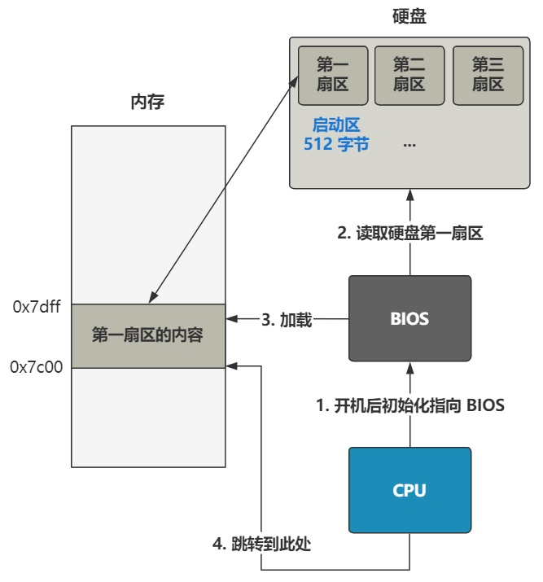
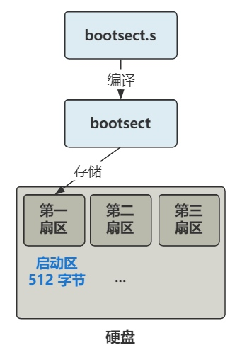
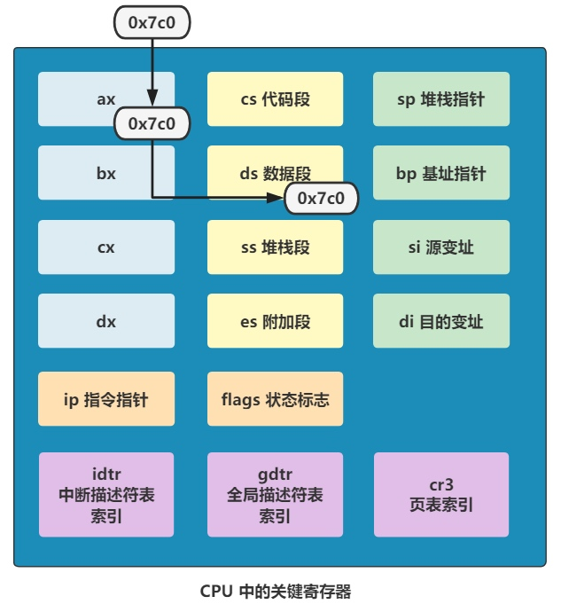
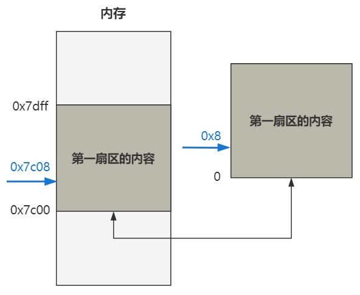
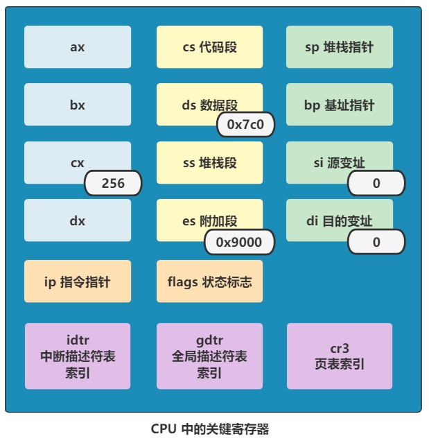
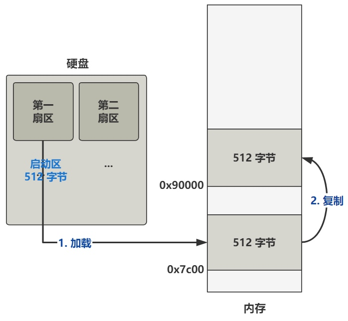
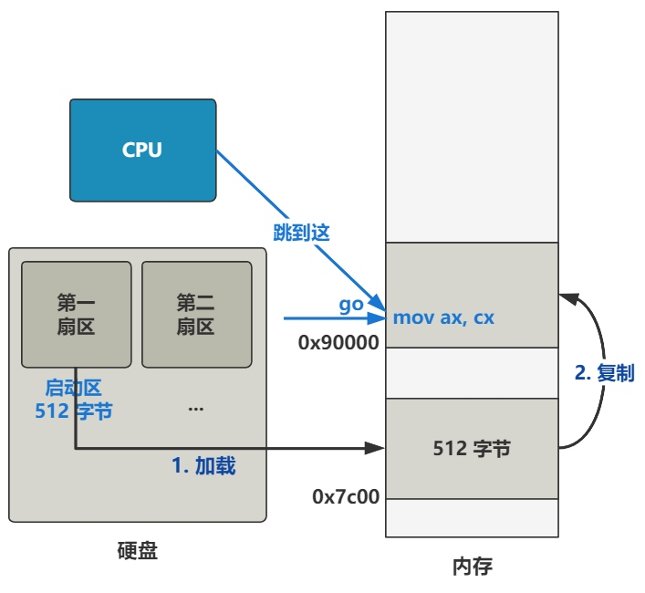
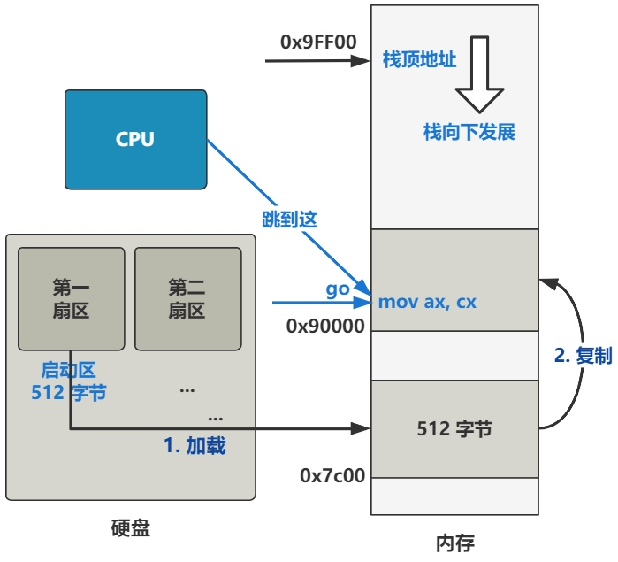

# 启动

> 开机启动时，在主板上提前写死的固件程序 BIOS 会将硬盘中启动区的 512 字节的数据，原封不动复制到内存中的 0x7c00 这个位置，并跳转到那个位置进行执行

> 启动区的定义非常简单，只要硬盘中的 0 盘 0 道 1 扇区的 512 个字节的最后两个字节分别是 0x55 和 0xaa，那么 BIOS 就会认为它是个启动区



> Linux-0.11 的最开始的代码，是用汇编语言写的 bootsect.s，位于 boot 文件夹下。通过编译，bootsect.s 会被编译成二进制文件，存放在启动区的第一扇区



```
mov ax,0x07c0
mov ds,ax
```

> 这段代码的含义是把 0x07c0 这个值复制到 ax 寄存器里，再将 ax 寄存器里的值复制到 ds 寄存器里。ds 是一个 16 位的段寄存器，具体表示数据段寄存器，在内存寻址时充当段基址的作用。之后用汇编语言写一个内存地址时，实际上仅仅是写了偏移地址

```
mov ax, [0x0001]

# 实际上相当于
# 表示在 ds 这个段基址处，往后再偏移 0x0001 单位
mov ax, [ds:0x0001]
```



> 由于 x86 为了让自己在 16 位这个实模式下能访问到 20 位的地址线这个历史因素，所以段基址要先左移四位。那 0x07c0 左移四位就是 0x7c00



```
mov ax,0x9000
mov es,ax
mov cx,#256
sub si,si
sub di,di
rep movw
```

> 此时 ds 寄存器的值已经是 0x07c0，然后通过同样的方式将 es 寄存器的值变成 0x9000，接着又把 cx 寄存器的值变成 256

> sub a,b 就表示 a = a - b。如果 sub 后面的两个寄存器一模一样，就相当于把这个寄存器里的值清零



> rep 表示重复执行后面的指令。rep 后面的指令 movw 表示复制一个字（word 16位），rep movw 就是不断重复地复制一个字。重复执行的次数就是 cx 寄存器中的值，就是 256 次。从 ds:si 处复制到 es:di 处

> 总结起来，就是将内存地址 0x7c00 处开始往后的 512 字节的数据，原封不动复制到 0x90000 处



```
jmpi go,0x9000
go: 
  mov ax,cs
  mov ds,ax
```

> jmpi 是一个段间跳转指令，表示跳转到 0x9000:go 处执行。段基址仍然要先左移四位，因此就是跳转到 0x90000 + go 这个内存地址处执行。go 是一个标签，最终编译成机器码的时候会被翻译成一个值，这个值就是 go 这个标签在文件内的偏移地址。这个偏移地址再加上 0x90000，就是 go 标签后面那段代码所在的内存地址



> 假如 mov ax,cx 这行代码位于最终编译好后的二进制文件的 0x08 处，那 go 就等于 0x08，而最终 CPU 跳转到的地址就是 0x90008 处


```
go: mov ax,cs
    mov ds,ax
    mov es,ax
    mov ss,ax
    mov sp,#0xFF00
```

> 这段代码的直接意思就是把 cs 寄存器的值分别复制给 ds、es 和 ss 寄存器，然后又把 0xFF00 给了 sp 寄存器

> cs 寄存器表示代码段寄存器，CPU 当前正在执行的代码在内存中的位置，就是由 cs:ip 这组寄存器配合指向的，其中 cs 是基址，ip 是偏移地址

> 由于之前执行过一个段间跳转指令，所以现在 cs 寄存器里的值就是 0x9000，ip 寄存器里的值是 go 这个标签的偏移地址。这三个 mov 指令就分别给 ds、es 和 ss 寄存器赋值为了 0x9000

> ds 为数据段寄存器，之前被复制为 0x07c0，是因为之前的代码在 0x7c00 处，现在代码已经被挪到了 0x90000 处，所以现在又改赋值为 0x9000 了

> ss 为栈段寄存器，后面要配合栈基址寄存器 sp 来表示此时的栈顶地址。而此时 sp 寄存器被赋值为了 0xFF00 了，所以目前的栈顶地址就是 ss:sp 所指向的地址 0x9FF00 处


