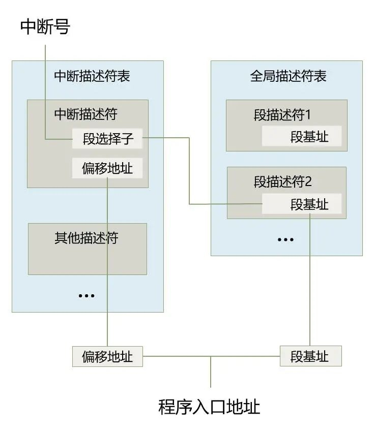
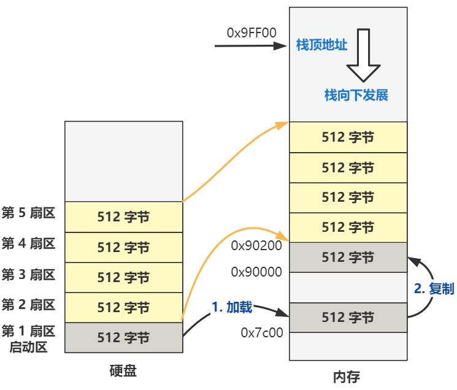
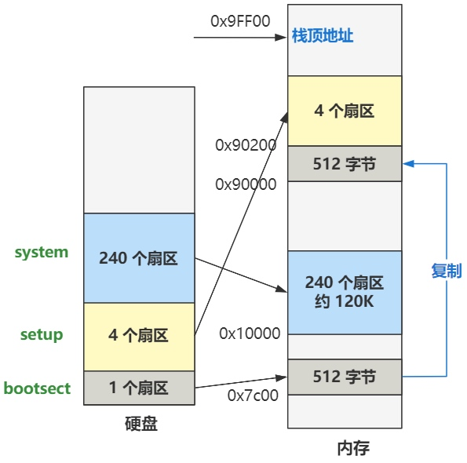
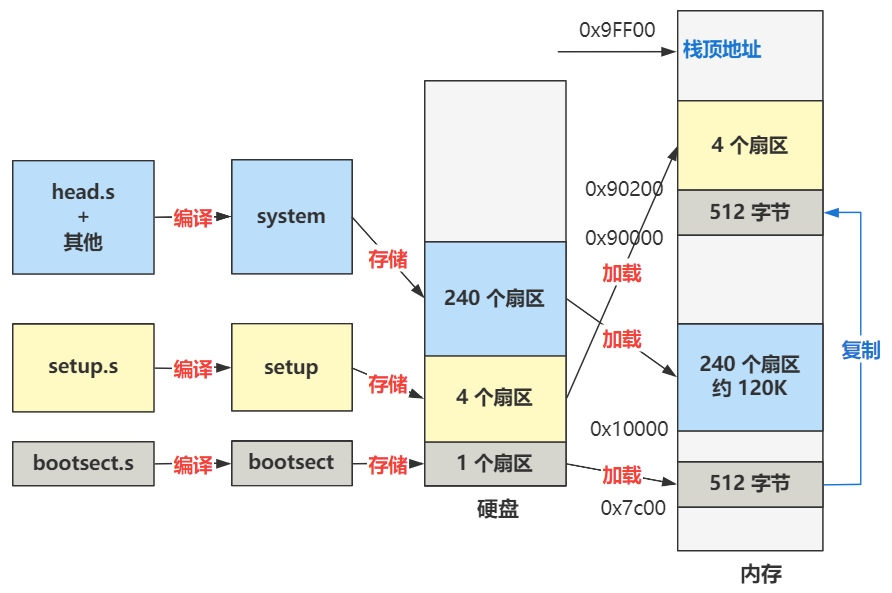

# 启动流程

> 开机启动时，在主板上提前写死的固件程序 BIOS 会将硬盘中启动区的 512 字节的数据，原封不动复制到内存中的 0x7c00 这个位置，并跳转到那个位置进行执行

> 启动区的定义非常简单，只要硬盘中的 0 盘 0 道 1 扇区的 512 个字节的最后两个字节分别是 0x55 和 0xaa，那么 BIOS 就会认为它是个启动区


> Linux-0.11 的最开始的代码，是用汇编语言写的 bootsect.s，位于 boot 文件夹下。通过编译，bootsect.s 会被编译成二进制文件，存放在启动区的第一扇区


```
mov ax,0x07c0
mov ds,ax
```

> 这段代码的含义是把 0x07c0 这个值复制到 ax 寄存器里，再将 ax 寄存器里的值复制到 ds 寄存器里。ds 是一个 16 位的段寄存器，具体表示数据段寄存器，在内存寻址时充当段基址的作用。之后用汇编语言写一个内存地址时，实际上仅仅是写了偏移地址

```
mov ax, [0x0001]

# 实际上相当于
# 表示在 ds 这个段基址处，往后再偏移 0x0001 单位
mov ax, [ds:0x0001]
```


> 由于 x86 为了让自己在 16 位这个实模式下能访问到 20 位的地址线这个历史因素，所以段基址要先左移四位。那 0x07c0 左移四位就是 0x7c00


```
mov ax,0x9000
mov es,ax
mov cx,#256
sub si,si
sub di,di
rep movw
```

> 此时 ds 寄存器的值已经是 0x07c0，然后通过同样的方式将 es 寄存器的值变成 0x9000，接着又把 cx 寄存器的值变成 256

> sub a,b 就表示 a = a - b。如果 sub 后面的两个寄存器一模一样，就相当于把这个寄存器里的值清零


> rep 表示重复执行后面的指令。rep 后面的指令 movw 表示复制一个字（word 16位），rep movw 就是不断重复地复制一个字。重复执行的次数就是 cx 寄存器中的值，就是 256 次。从 ds:si 处复制到 es:di 处

> 总结起来，就是将内存地址 0x7c00 处开始往后的 512 字节的数据，原封不动复制到 0x90000 处


```
jmpi go,0x9000
go: 
  mov ax,cs
  mov ds,ax
```

> jmpi 是一个段间跳转指令，表示跳转到 0x9000:go 处执行。段基址仍然要先左移四位，因此就是跳转到 0x90000 + go 这个内存地址处执行。go 是一个标签，最终编译成机器码的时候会被翻译成一个值，这个值就是 go 这个标签在文件内的偏移地址。这个偏移地址再加上 0x90000，就是 go 标签后面那段代码所在的内存地址


> 假如 mov ax,cx 这行代码位于最终编译好后的二进制文件的 0x08 处，那 go 就等于 0x08，而最终 CPU 跳转到的地址就是 0x90008 处


```
go: mov ax,cs
    mov ds,ax
    mov es,ax
    mov ss,ax
    mov sp,#0xFF00
```

> 这段代码的直接意思就是把 cs 寄存器的值分别复制给 ds、es 和 ss 寄存器，然后又把 0xFF00 给了 sp 寄存器

> cs 寄存器表示代码段寄存器，CPU 当前正在执行的代码在内存中的位置，就是由 cs:ip 这组寄存器配合指向的，其中 cs 是基址，ip 是偏移地址

> 由于之前执行过一个段间跳转指令，所以现在 cs 寄存器里的值就是 0x9000，ip 寄存器里的值是 go 这个标签的偏移地址。这三个 mov 指令就分别给 ds、es 和 ss 寄存器赋值为了 0x9000

> ds 为数据段寄存器，之前被复制为 0x07c0，是因为之前的代码在 0x7c00 处，现在代码已经被挪到了 0x90000 处，所以现在又改赋值为 0x9000 了

> ss 为栈段寄存器，后面要配合栈基址寄存器 sp 来表示此时的栈顶地址。而此时 sp 寄存器被赋值为了 0xFF00 了，所以目前的栈顶地址就是 ss:sp 所指向的地址 0x9FF00 处


```
load_setup:
    mov dx,#0x0000      ; drive 0, head 0
    mov cx,#0x0002      ; sector 2, track 0
    mov bx,#0x0200      ; address = 512, in 0x9000
    mov ax,#0x0200+4    ; service 2, nr of sectors
    int 0x13            ; read it
    jnc ok_load_setup       ; ok - continue
    mov dx,#0x0000
    mov ax,#0x0000      ; reset the diskette
    int 0x13
    jmp load_setup

ok_load_setup:
```

> int 0x13 表示发起 0x13 号中断，这条指令上面给 dx、cx、bx、ax 赋值都是作为这个中断程序的参数。这个中断发起后，CPU 会通过这个中断号，去寻找对应的中断处理程序的入口地址，并跳转过去执行，逻辑上就相当于执行了一个函数



> 0x13 号中断的处理程序是 BIOS 提前给写好的，是读取磁盘的相关功能的函数。最终的作用就是从硬盘的第 2 个扇区开始，把数据加载到内存 0x90200 处，共加载 4 个扇区



> 如果复制成功，就跳转到 ok_load_setup 这个标签，如果失败，则会不断重复执行这段代码

```
ok_load_setup:
    ...
    mov ax,#0x1000
    mov es,ax       ; segment of 0x10000
    call read_it
    ...
    jmpi 0,0x9020
```

> 复制成功后的主要逻辑是把从硬盘第 6 个扇区开始往后的 240 个扇区，加载到内存 0x10000 处。至此，整个操作系统的全部代码，就已经全部从硬盘中，被搬迁到内存来了



> 然后通过段间跳转指令，跳转到 0x90200 处，就是硬盘第二个扇区开始处的内容

> 整个操作系统的编译过程，就是通过 Makefile 和 build.c 配合完成的，最终会：
> 1. 把 bootsect.s 编译成 bootsect 放在硬盘的 1 扇区
> 2. 把 setup.s 编译成 setup 放在硬盘的 2~5 扇区
> 3. 把剩下的全部代码（head.s 作为开头）编译成 system 放在硬盘的随后 240 个扇区


