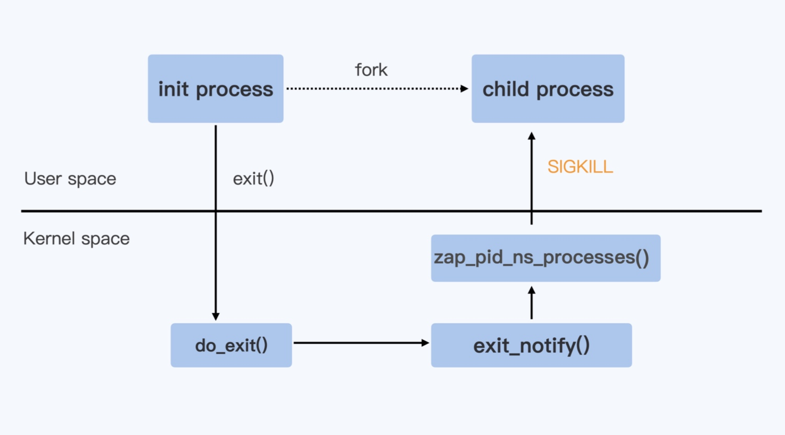

# 容器退出

## 退出信号
> 无论是在 Kubernetes 中去删除一个 pod，或者用 Docker 停止一个容器，最后都会用到 Containerd 这个服务。而 Containerd 在停止容器的时候，就会向容器的 init 进程发送一个 SIGTERM 信号

> 在 init 进程退出之后，容器内的其他进程也都立刻退出了。不过不同的是，init 进程收到的是 SIGTERM 信号，而其他进程收到的是 SIGKILL 信号

> SIGKILL 信号是不能被捕获的的，也就是用户不能注册自己的 handler，而 SIGTERM 信号允许用户注册自己的 handler

```c
#include <stdio.h>
#include <stdlib.h>
#include <sys/types.h>
#include <sys/wait.h>
#include <unistd.h>

void sig_handler(int signo)
{
	if (signo == SIGTERM) {
		printf("received SIGTERM\n");
		exit(0);
	}
}

int main(int argc, char *argv[])
{
	int i;
	int total;

	if (argc < 2) {
		total = 1;
	} else {
		total = atoi(argv[1]);
	}

	signal(SIGTERM, sig_handler);

	printf("To create %d processes\n", total);

	for (i = 0; i < total; i++) {
		pid_t pid = fork();

		if (pid == 0) {
			pid_t m_pid, p_pid;
			m_pid = getpid();
			p_pid = getppid();
			printf("Child => PPID: %d PID: %d\n", p_pid, m_pid);
			while (1) {
				sleep(100);
			}
			printf("Child process eixts\n");
			exit(EXIT_SUCCESS);
		} else if (pid > 0) {
			printf("Parent created child %d\n", i);
		} else {
			printf("Unable to create child process. %d\n", i);
			break;
		}
	}

	printf("Paraent is sleeping\n");
	while (1) {
		sleep(100);
	}

	return EXIT_SUCCESS;
}
```

> 用 docker stop 停止这个容器的时候，用 strace 工具来监控，查看容器里的 init 进程和另外一个进程收到的信号情况

```bash
docker container stop <containerId>

sudo strace -p <parentPid>
sudo strace -p <pid>
```

## 信号处理
### 缺省处理
> 不做任何 signal 相关的系统调用。对于 SIGTERM 这个信号来说，它的缺省行为就是进程退出。内核中对不同的信号有不同的缺省行为，一般会采用退出，暂停，忽略这三种行为中的一种

### 捕获
> 调用 signal 注册自己的 handler。进程在运行的时候，一旦接收到信号，就不会再去执行内核中的缺省代码，而是会执行通过 signal 注册的 handler

### 忽略
> 通过 signal 这个系统调用，为这个信号注册一个特殊的 handler，也就是 SIG_IGN。在程序运行的时候，如果收到 SIGTERM 信号，就会忽略

## 优雅退出
> 当 Linux 进程收到 SIGTERM 信号并且使进程退出，这时 Linux 内核对处理进程退出的入口点就是 do_exit 函数，do_exit 函数中会释放进程的相关资源，比如内存，文件句柄，信号量等等

> 在做完这些工作之后，它会调用一个 exit_notify 函数，用来通知和这个进程相关的父子进程等。对于容器来说，还要考虑 Pid Namespace 里的其他进程。这里调用的就是 zap_pid_ns_processes 这个函数，如果是处于退出状态的 init 进程，它会向 Namespace 中的其他进程都发送一个 SIGKILL 信号



> 为了防止停止容器的时候，容器内应用程序被强制杀死。需要在容器的 init 进程中对收到的信号做个转发，发送到容器中的其他子进程，这样容器中的所有进程在停止时，都会收到 SIGTERM，而不是 SIGKILL 信号了

> 为了保证子进程先收到转发的 SIGTERM，类似 tini 的做法是，在收到 SIGTERM 的时候不退出，转发 SIGTERM 给子进程，子进程收到 SIGTERM 退出之后会给父进程发送 SIGCHILD，tini 是收到 SIGCHILD 之后主动整个程序退出
