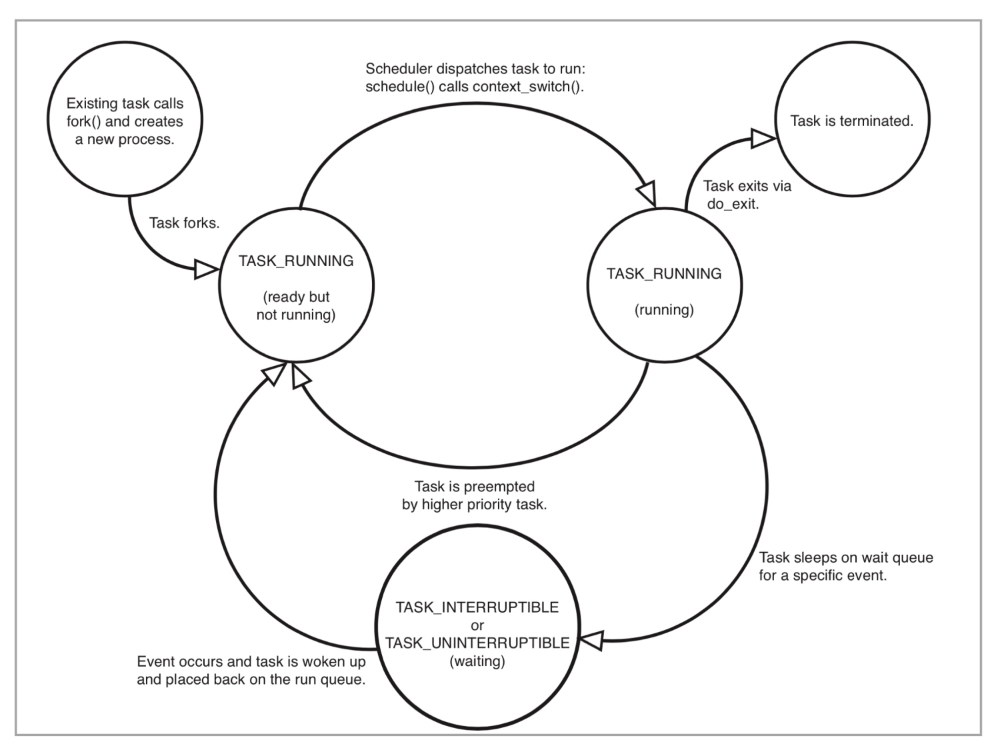

# 僵尸进程

## 进程状态
> 无论进程还是线程，在 Linux 内核里都是用 task_struct 这个结构来表示的，也就是 Linux 里基本的调度单位



> 从图中可以看出来，在进程活着的时候就只有两个状态：运行态（TASK_RUNNING）和睡眠态（TASK_INTERRUPTIBLE、 TASK_UNINTERRUPTIBLE）

> 运行态：进程是正在运行中（获得了 CPU 资源），或者还是进程在 run queue 队列里，随时可以运行，显示为 R stat
睡眠态：进程需要等待某个资源而进入的状态，要等待的资源可以是一个信号量, 或者是磁盘 I/O，这个状态的进程会被放入到 wait queue 队列里

> 睡眠态还包括两个子状态：一个是可以被打断的（TASK_INTERRUPTIBLE），显示为 S stat；另一个是不可被打断的（TASK_UNINTERRUPTIBLE），显示为 D stat

> 进程在调用 do_exit 退出的时候，还有两个状态。一个是 EXIT_DEAD，就是进程在真正结束退出的那一瞬间的状态；第二个是 EXIT_ZOMBIE 状态，这是进程在 EXIT_DEAD 前的一个状态。而僵尸进程，也就是处于这个状态中

## 进程数约束
> 一台 Linux 机器上的进程总数目是有限制的。如果超过这个最大值，那么系统就无法创建出新的进程了。这个最大值可以在 /proc/sys/kernel/pid_max 这个参数中看到

> Linux 内核在初始化系统的时候，会根据机器 CPU 的数目来设置 pid_max 的值。比如，如果机器中 CPU 数目小于等于 32，那么 pid_max 就会被设置为 32768；如果机器中的 CPU 数目大于 32，那么 pid_max 就被设置为 N * 1204（N 就是 CPU 数目）

> 容器通过 pids Cgroup 来限制它的最大进程数目，pids Cgroup 通过 Cgroup 文件系统的方式向用户提供操作接口，一般它的 Cgroup 文件系统挂载点在 /sys/fs/cgroup/pids。在一个容器建立之后，创建容器的服务会在 /sys/fs/cgroup/pids 下建立一个子目录，就是一个控制组，控制组里最关键的一个文件就是 pids.max。可以向这个文件写入数值，而这个值就是这个容器中允许的最大进程数目。只需要对这个值做好限制，容器就不会因为创建出过多进程而影响到其他容器和宿主机了

```bash
echo 1002 > pids.max

# 查看当前进程数
cat pids.current
```

## 僵尸进程
> 调用 do_exit 函数之后，进程 task_struct 里的 mm/shm/sem/files 等文件资源都已经释放了，只留下了一个 stask_struct 空壳。从进程对应的 /proc/<pid> 文件目录下，可以看出来，对应的资源都已经没有了。并且，这个进程也已经不响应任何的信号了，无论是 SIGTERM 还是 SIGKILL

> 进程号资源在宿主机上是有限的，当残留的僵尸进程多了以后，就会占用大量的进程号，很有可能会导致新的进程不能运转

> 父进程在创建完子进程之后就不管了，就可能造成子进程变成僵尸进程

```bash
# 查看进程状态
ps aux
```

```c
#include <stdio.h>
#include <stdlib.h>
#include <sys/types.h>
#include <sys/wait.h>
#include <unistd.h>

int main(int argc, char *argv[])
{
        int i;
        int total;

        if (argc < 2) {
                total = 1;
        } else {
                total = atoi(argv[1]);
        }

        printf("To create %d processes\n", total);

        for (i = 0; i < total; i++) {
                pid_t pid = fork();

                if (pid == 0) {
                        printf("Child => PPID: %d, PID: %d\n", getppid(), getpid());
                        sleep(60);
                        printf("Child process eixts\n");
                        exit(EXIT_SUCCESS);
                } else if (pid > 0) {
                        printf("Parent created child %d\n", i);
                } else {
                        printf("Unable to create child process %d\n", i);
                        break;
                }
        }

        printf("Parent is sleeping\n");
        while (1) {
                sleep(100);
        }

        return EXIT_SUCCESS;
}
```

> 在 Linux 中的进程退出之后，如果进入僵尸状态，需要父进程调用 wait 这个系统调用，去回收僵尸进程的最后的那些系统资源，比如进程号资源。容器中所有进程的最终父进程，就是 init 进程，由它负责生成容器中的所有其他进程。因此，容器的 init 进程有责任回收容器中的所有僵尸进程

```c
for (i = 0; i < total; i++) {
	int status;
  wait(&status);
}
```

> wait 系统调用可以回收僵尸进程，但是这个系统调用是一个阻塞的调用，也就是说，如果没有子进程是僵尸进程的话，这个调用就一直不会返回，那么整个进程就会被阻塞住了。此时，有另一个系统调用 waitpid，其中就有一个参数 WNOHANG，表示如果在调用的时候没有僵尸进程，那么函数就马上返回了，而不会阻塞
