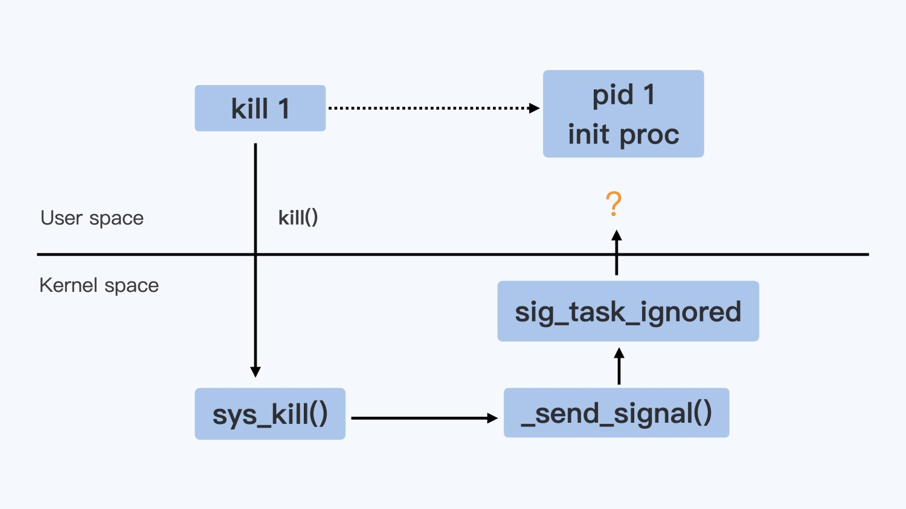

# 1 号进程

## Init 进程
> 一个 Linux 操作系统，在系统打开电源，执行 BIOS/boot-loader 之后，就会由 boot-loader 负责加载 Linux 内核。Linux 内核执行文件一般会放在 /boot 目录下，文件名类似 vmlinuz*。在内核完成了操作系统的各种初始化之后，这个程序需要执行的第一个用户态程就是 init 进程

> 内核代码启动 1 号进程的时候，在没有参数指定程序路径的情况下，一般会从几个缺省路径尝试执行 1 号进程的代码。这几个路径通常是：
/sbin/init
/etc/init
/bin/init
/bin/sh

> 系统启动的时候先是执行内核态的代码，然后在内核中调用 1 号进程的代码，从内核态切换到用户态。目前主流的 Linux 发行版，无论是 RedHat 系的还是 Debian 系的，都会把 /sbin/init 作为符号链接指向 Systemd。Systemd 是目前最流行的 Linux init 进程，在它之前还有 SysVinit、UpStart 等 Linux init 进程

## 信号
> 按下键盘 Ctrl + C，当前运行的进程就会收到一个信号 SIGINT（2）而退出；如果代码有问题，导致内存访问出错了，当前的进程就会收到另一个信号 SIGSEGV（11）。也可以通过命令 kill <pid>，直接向一个进程发送一个信号，缺省情况下不指定信号的类型，那么这个信号就是 SIGTERM（15）

> 对于每一个信号，进程对它的处理都有下面三个选择：
> 1. 忽略，对这个信号不做任何处理。但是对于 SIGKILL 和 SIGSTOP 这个两个信号，进程是不能忽略的。这是因为它们的主要作用是为 Linux kernel 和超级用户提供删除任意进程的特权
> 2. 捕获，让用户进程可以注册自己针对这个信号的 handler。对于捕获，SIGKILL 和 SIGSTOP 这两个信号也同样例外，这两个信号不能有用户自己的处理代码，只能执行系统的缺省行为
> 3. 缺省行为，Linux 为每个信号都定义了一个缺省的行为，可以在 Linux 系统中运行 man 7 signal来查看每个信号的缺省行为。对于每个信号，用户进程如果不注册一个自己的 handler，就会有一个系统缺省的 handler，这个缺省的 handler 就叫作 SIG_DFL。SIGKILL 是特权信号，不允许被捕获，所以它的 handler 就一直是 SIG_DFL



> Linux 内核针对每个 Namespace 里的 init 进程，把只有 default handler 的信号都给忽略了。如果注册了信号的 handler，那么这个信号 handler 就不再是 SIG_DFL 。即使是 init 进程在接收到 SIGTERM 之后也是可以退出的。不过，由于 SIGKILL 是一个特例，因为 SIGKILL 是不允许被注册用户 handler 的，它只有 SIG_DFL handler，所以 init 进程是永远不能被 SIGKILL 所杀，但是可以被 SIGTERM 杀死

> 查看 1 号进程状态中 SigCgt Bitmap
> ```bash
> cat /proc/1/status | grep -i SigCgt
> ```

> 综上所述：
> 1. kill -9 1 在容器中是不能工作，内核阻止了 1 号进程对 SIGKILL 特权信号的响应
> 2. kill 1 分两种情况：如果 1 号进程没有注册 SIGTERM 的 handler，那么对 SIGTERM 信号也不响应；如果注册了 handler，那么就可以响应 SIGTERM 信号
