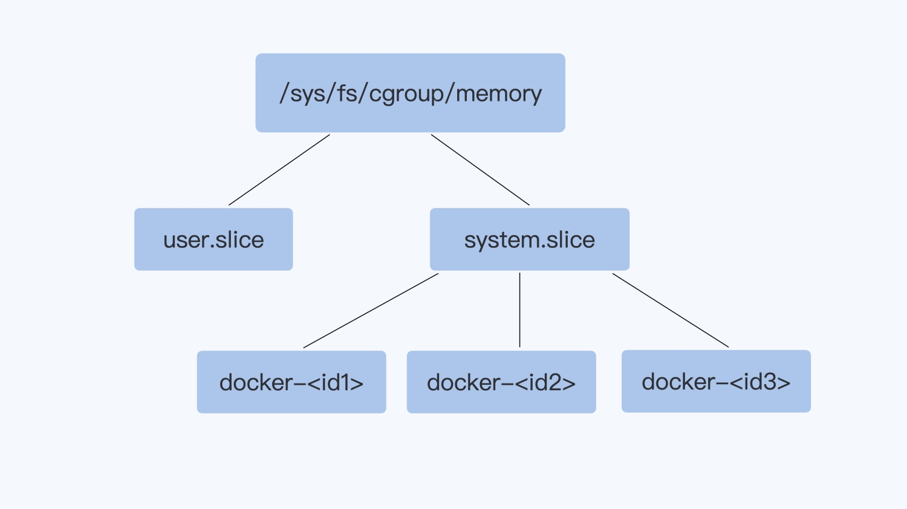

# Cgroups

> 在 Cgroups 出现之前，任意一个进程都可以创建出成百上千个线程，可以轻易地消耗完一台计算机的所有 CPU 资源和内存资源。但是有了 Cgroups 之后，就可以对一个进程或者一组进程的计算机资源的消耗进行限制了

> Cgroups 通过不同的子系统限制了不同的资源，每个子系统限制一种资源。每个子系统限制资源的方式都是类似的，就是把相关的一组进程分配到一个控制组里，然后通过树结构进行管理，每个控制组都设有自己的资源控制参数

> Cgroups 资源控制和监控的机制：
> 1. 对诸如 CPU 使用时间、内存、磁盘 I/O 等进程所需的资源进行限制
> 2. 不同资源的具体管理工作由相应的 Cgroup 子系统来实现
> 3. 针对不同类型的资源限制，只要将限制策略在不同的的子系统上进行关联即可
> 4. Cgroups 在不同的系统资源管理子系统中以层级树的方式来组织管理：每个 Cgroup 都可以包含其他的子 Cgroup，因此子 Cgroup 能使用的资源除了受本 Cgroup 配置的资源参数限制，还受到父 Cgroup 设置的资源限制

## 版本
> Cgroups v1 在 Linux 中很早就实现了，各种子系统比较独立，每个进程在各个 Cgroups 子系统中独立配置，可以属于不同的 group。虽然这样比较灵活，但是会导致对同一进程的资源协调比较困难。虽然 v1 有缺陷，但是在主流的生产环境中，大部分使用的还是 v1

> Cgroups v2 做了设计改进，使各个子系统可以协调统一地管理资源。不过 Cgroups v2 在生产环境的应用还很少，因为该版本很多子系统的实现需要较新版本的 Linux 内核，还有无论是主流的 Linux 发行版本还是容器云平台，对 v2 的支持也刚刚起步

## 子系统
### CPU
> 限制一个控制组（一个容器里所有的进程）可使用的最大 CPU

### memory
> 限制一个控制组最大的内存使用量

> 对于启动的每个容器，都会在 Cgroups 子系统下建立一个目录，在 Cgroups 中这个目录也被称作控制组，比如下图里的 docker-<id1>，docker-<id2> 等。然后我们设置这个控制组的参数，通过这个方式，来限制这个容器的内存资源



> 在每个 Cgroups 子系统下，对应这个容器就会有一个目录 docker-<id>。容器中所有的进程都会储存在这个控制组中 cgroup.procs 这个参数里

```bash
docker container run --memory=200m -d nginx

cd /sys/fs/cgroup/memory/docker/<id>

cat cgroup.procs
```

> 将这个控制组 Memory 的最大用量设置为 2GB。这样设置后，cgroup.procs 里面所有进程 Memory 使用量之和，最大也不会超过 2GB

```bash
echo 2147483648 > memory.limit_in_bytes
```

### pids
> 限制一个控制组里最多可以运行多少个进程

### cpuset
> 限制一个控制组里的进程可以在哪几个物理 CPU 上运行