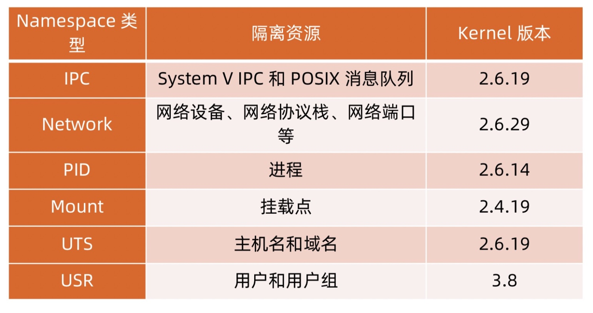
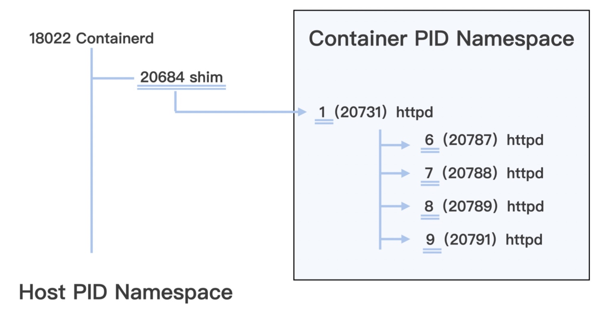

# Namespace

> Namespace 是一种 Linux Kernel 提供的资源隔离方案：
> 1. 系统可以为进程分配不同的 Namespace
> 2. 并保证不同的 Namespace 资源独立分配、进程彼此隔离，即不同的 Namespace 下的进程互不干扰

## Namespace API
> clone，在创建新进程的系统调用时，通过 flags 参数指定需要新建的 Namespace 类型：
> ● CLONE_NEWCGROUP
> ● CLONE_NEWIPC
> ● CLONE_NEWNET
> ● CLONE_NEWNS
> ● CLONE_NEWPID
> ● CLONE_NEWUSER
> ● CLONE_NEWUTS

> setns，可以让调用进程加入某个已经存在的 Namespace 中
unshare，可以将调用进程移动到新的 Namespace 下

### 常用操作
```bash
# 查看当前系统的 namespace
lsns –t <type>

# 查看某进程的 namespace
ls -la /proc/<pid>/ns/

# 进入某 namespace 运行命令
nsenter -t <pid> -n ip addr
```

### 操作示例
```bash
# 在新 network namespace 执行 sleep 指令
unshare -fn sleep 60

# 查看网络 Namespace
lsns -t net

# 进入该进程所在 Namespace 查看网络配置，与主机不一致
nsenter -t <pid> -n ip a
```

## 隔离性


## Namespace 分类
### PID 空间

> Linux 在创建容器的时候，就会建出一个 PID Namespace，单独对进程进行 PID 编号，每个 Namespace 的 PID 编号都从 1 开始。同时在这个 PID Namespace 中也只能看到 Namespace 中的进程，而且看不到其他 Namespace 里的进程，起到了相互隔离的作用

> 这种隔离有两个作用：
> 1. 充分地利用系统的资源，也就是说在同一台宿主机上可以运行多个用户的容器
> 2. 保证安全性，因为不同用户之间不能访问对方的资源

> 宿主机上的 Host PID Namespace，是其他 Namespace 的父 Namespace，可以在宿主机上看到所有的进程，不过进程 PID 编号不是 Container PID Namespace 里的编号了，而是把所有在宿主机运行的进程放在一起，再进行编号



## Network 空间
> 在 Network Namespace 中有一套独立的网络接口，比如 lo，eth0，还有独立的 TCP/IP 的协议栈配置

## Mount 空间
> Mount Namespace 保证每个容器都有自己独立的文件目录结构