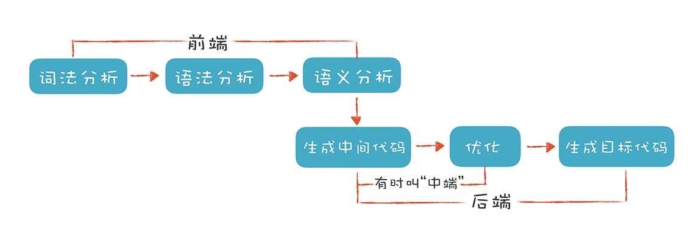
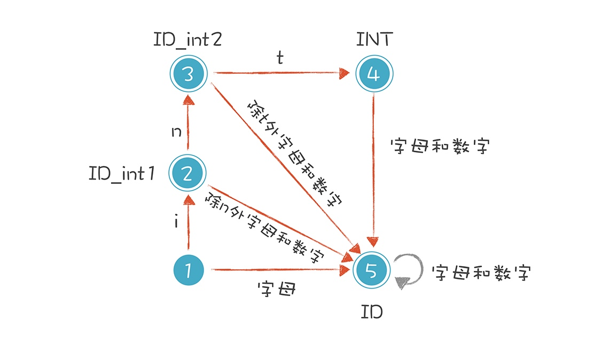
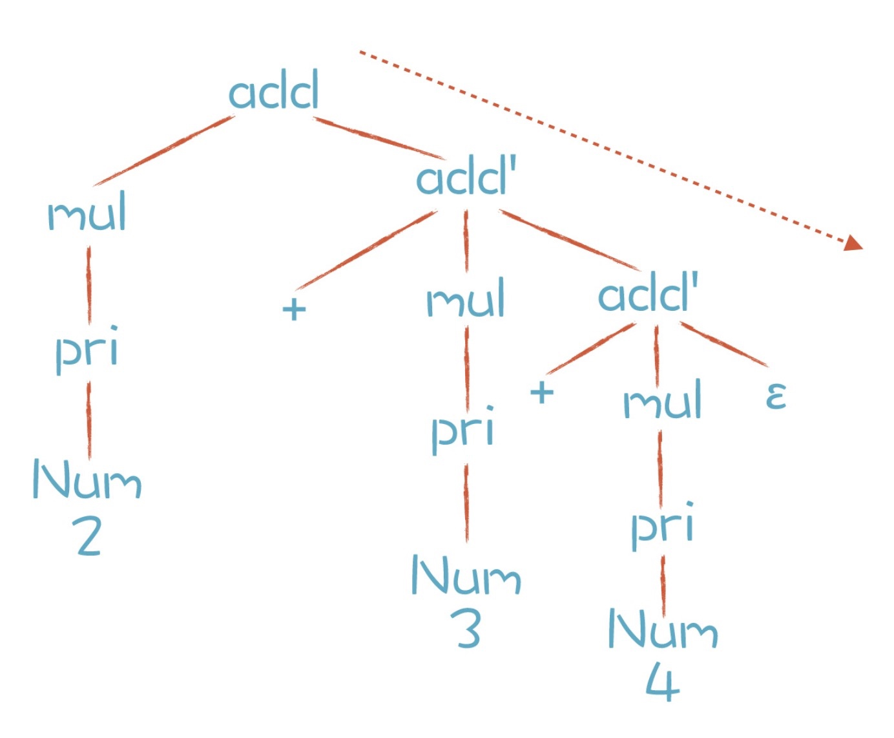

# 概览

> 前端指的是编译器对程序代码的分析和理解过程。通常只跟语言的语法有关，跟目标机器无关。后端是生成目标代码的过程，跟目标机器有关



## 前端
### 词法分析
> 通常，编译器的第一项工作是做词法分析

```c
int age = 40;
```

> 有限自动机



### 语法分析
> 词法分析是识别一个个的单词，而语法分析就是在词法分析的基础上识别出程序的语法结构。这个结构是一个树状结构，是计算机容易理解和执行的

```bash
clang -cc1 -ast-dump hello.c
```

> 表达式文法规则

```
add -> mul | add + mul
mul -> pri | mul * pri
pri -> Id | Num | (add)
```

> 终结符都是词法分析中产生的 Token。而那些非叶子节点，就是非终结符。文法的推导过程，就是把非终结符不断替换的过程，让最后的结果没有非终结符，只有终结符

> 优先级保证：由加法规则推导到乘法规则，这种方式保证了 AST 中的乘法节点一定会在加法节点的下层，也就保证了乘法计算优先于加法计算

> 结合性保证：对于左结合的运算符，递归项要放在左边；右结合的运算符，递归项放在右边

> 消除左递归，ε 是空集的意思。由于 add' 是右递归的，又会出现运算符结合性的错误

```
add -> mul add'
add' -> + mul add' | ε
```



> 用 EBNF 方式表达，也就是允许用 * 号和 + 号表示重复，上面两条规则可以合并成一条。对于 (+ mul)* 这部分，可以写成一个循环，而不是一次次的递归调用

```
add -> mul (+ mul)*
```

### 语义分析