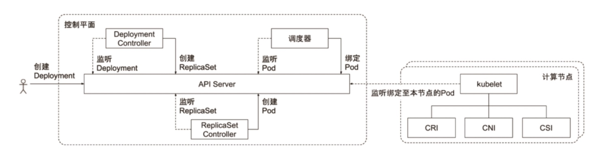

# 概览

## Master
### API Server
> 1. 提供集群管理的 REST API 接口，包括认证、授权、准入
> 2. 提供其他模块之间的数据交互和通信的枢纽
> 3. 提供 etcd 数据缓存以减少集群对 etcd 的访问

### etcd
> 数据存储

### Controller Manager
> 控制管理器，运行所有处理集群日常任务的控制器。包括了节点控制器、副本控制器、端点控制器及服务账户等

### Scheduler
> 调度器，属于特殊的 controller。职责在于监控当前集群所有未调度的 pod，并且获取当前集群所有节点的健康状态和资源使用情况，为待调度 pod 选择最佳计算节点，完成调度

> 调度阶段分为：
> Predict，过滤不能满足业务需求的节点，如资源不足，端口冲突等
> Priority，按既定要素将满足调度需求的节点评分，选择最佳节点
> Bind，将计算节点与 pod 绑定，完成调度

## Worker
### kubelet
> 1. 从不同源获取 pod 清单，并按需求启动停止 pod 的核心组件
> 2. 负责汇报当前节点的资源信息和健康状态
> 3. 负责 pod 的健康检查和状态汇报

### kube-proxy
> 1. 监控集群中用户发布的服务，并完成负载均衡配置
> 2. 每个节点的 kube-proxy 都会配置相同的负载均衡策略，使得整个集群的服务发现建立在分布式负载均衡器之上，服务调用无需经过额外的网络跳转
> 3. 负责均衡配置基于不同插件实现
  > a. userspace
  > b. iptables 与 ipvs

## Kubectl
> kubectl 允许 Kubernetes 用户以命令行的方式与 Kubernetes 交互，其默认读取配置文件 ~/.kube/config
kubectl 会将接收到的用户请求转化为 REST 调用以 REST client 的形式与 api server 通讯

> api server 的地址，用户信息等配置在 kubeconfig