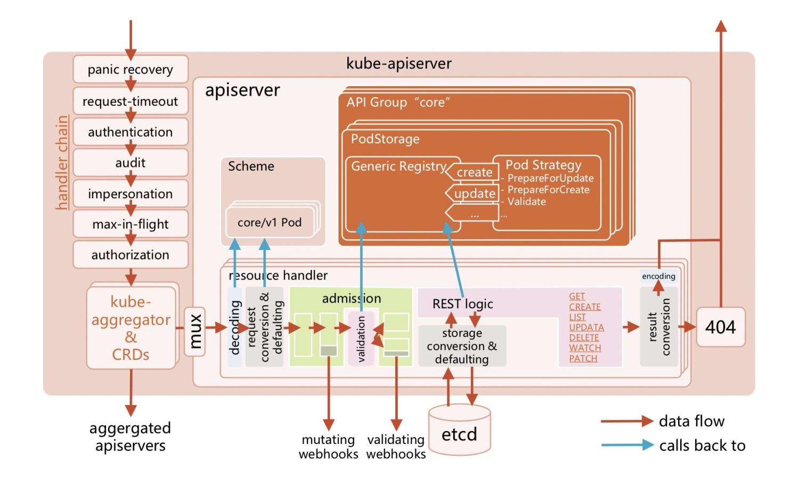
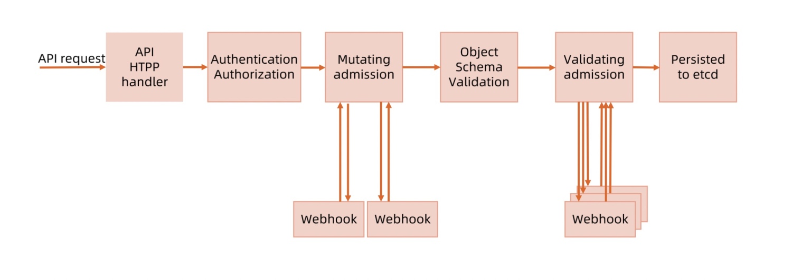
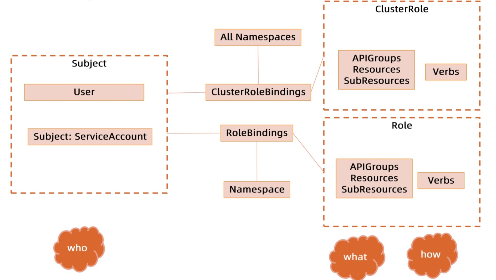
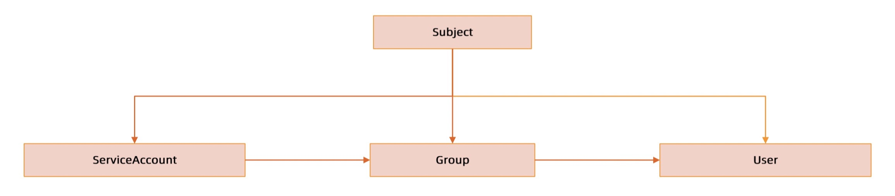
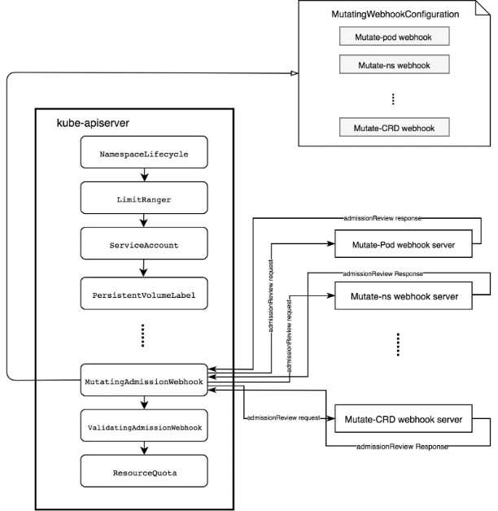
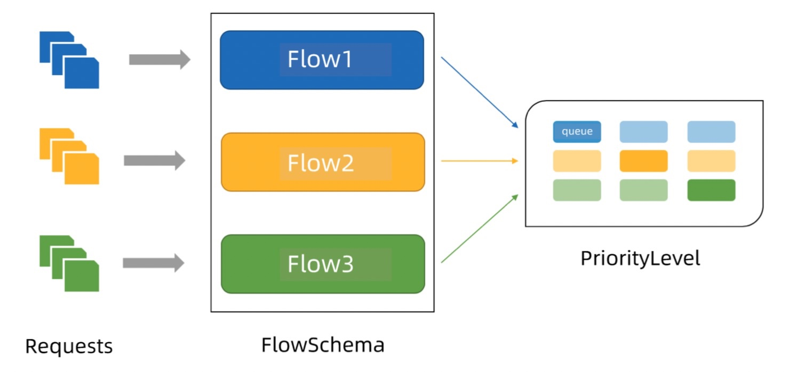
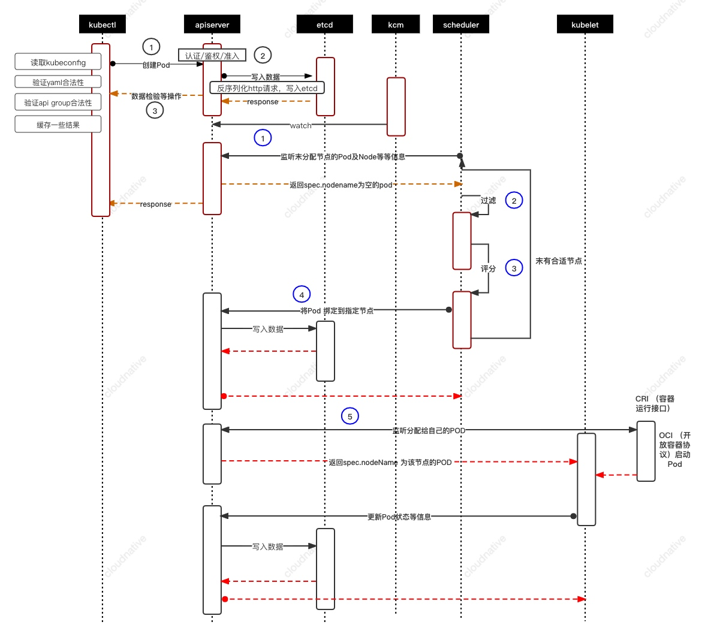

# api-server

> [代码阅读](https://cncamp.notion.site/kube-apiserver-10d5695cbbb14387b60c6d622005583d)

> api-server 提供以下功能：
> 1. 集群管理的 REST API 接口，包括认证授权、数据校验以及集群状态变更等
> 2. 提供其他模块之间的数据交互和通信的枢纽



## 访问控制


### 认证
kubernetes 支持多种认证机制，并支持同时开启多个认证插件

#### 认证插件
> - x509 证书：需要 api server 启动时配置 --client-ca-file=FILE。在证书认证时，其 CN 域作为用户名，组织机构域作为 group 名
> - 静态 Token 文件：需要 api server 启动时配置 --token-auth-file=FILE。该文件为 csv 格式
> - 引导 Token：以 Secret 的形式保存在 kube-system 名字空间中，可以被动态管理和创建。控制器管理器包含的 TokenCleaner 控制器能够在引导 Token 过期的时候将其删除。可以使用 kubeadm token list 查询
> - 静态密码文件：需要 api server 启动时配置 --basic-auth-file=FILE，文件为 csv 格式
> - ServiceAccount：kubernetes 自动生成，自动挂载到容器的 /run/secrets/kubernetes.io/serviceaccount 目录中
> - OpenID：OAuth2.0 的认证机制
> - Webhook 令牌身份认证
>    - --authentication-token-webhook-config-file 指向一个配置文件，描述如何访问远程 Webhook 服务
>    - --authentication-token-webhook-cache-ttl 设定身份认证决定的缓存时间。默认时长为 2 分钟
> - 匿名请求：如果使用 AlwaysAllow 以外的认证模式，则匿名请求默认开启。可以用 --anonymous-auth=false 禁止匿名请求

> static token

```bash
pain-token,pain,1000,"group1,group2,group3"

curl https://192.168.20.11:6443/api/v1/namespaces/default -H "Authorization: Bearer pain" -k
```

> private key and csr

```bash
openssl genrsa -out pain.key 2048

# Common Name 为 pain
openssl req -new -key pain.key -out pain.csr
# openssl req -new -x509 -days 10000 -key pain.key -out pain.crt

cat pain.csr | base64 | tr -d "\n"
```

```bash
cat <<EOF | kubectl apply -f -
apiVersion: certificates.k8s.io/v1
kind: CertificateSigningRequest
metadata:
  name: pain
spec:
  request: LS0tLS1CRUdJTiBDRVJUSUZJQ0FURSBSRVFVRVNULS0tLS0KTUlJQ3VqQ0NBYUlDQVFBd2RURUxNQWtHQTFVRUJoTUNRMDR4RVRBUEJnTlZCQWdNQ0ZOb1lXNW5TR0ZwTVJFdwpEd1lEVlFRSERBaFRhR0Z1WjBoaGFURU5NQXNHQTFVRUNnd0VjR0ZwYmpFTk1Bc0dBMVVFQ3d3RWNHRnBiakVOCk1Bc0dBMVVFQXd3RWNHRnBiakVUTUJFR0NTcUdTSWIzRFFFSkFSWUVjR0ZwYmpDQ0FTSXdEUVlKS29aSWh2Y04KQVFFQkJRQURnZ0VQQURDQ0FRb0NnZ0VCQU1JcGtHd3VjcHhkYmZRZnoyMnZobHQvLzNsWmhnRkZsMHR6RjNkVAoxWVRnUUJLTHoxWUhUTitSZCtYUnRyeUgyL3NOVTVER0F6aTdSOG03R1NpbVhlaG1VZXB3M2RTenE4aVhQUU5yClZTSlJ2bFlpVVU0S3RZUlZOMGh1Y0szZlNqaHpIejJSVEg4bXFqMllvQzJlNndiMGF5QkI1VEtvK0dIN01JSFcKZk9iUCtQcXIrUmJPczVwUER5TW40Wkl3VlZpQmE5NEViYVFHUmRlTmNQN3Q2Q1ROaWVmQ1BvTTR0SDRjNzk4Ywp4MVpoQUx0Mm5qdGQzeERmYlhVMnM3SzNtMmRuTXV2VGFUVklEb1NiR0dsazdLNVJkRWxuaWpQd3VCLzFjbldHCi9LN0JuVm9nbkdORWppVElydUNqQXgyUms0TXlzemVKbmw1bjN2N3B3Uno5dmdzQ0F3RUFBYUFBTUEwR0NTcUcKU0liM0RRRUJDd1VBQTRJQkFRQ1BpYVJjbVdCaDIwdkVJcGtuMG1PdEVRSXZIN05oUFZDWDZSWk5Wb0RHRU5XZwo2TmZkRU8vZzgzcVFzTUpEVmEyaXdJbDlsS3NCSjN0cWQra3k3MXQ1UjQ2VWlyTU5lNDIvMFhPdzJRL01HdFRmCkptbzM3eFo0VzRMa3VtbVJwYlhlSHBHLzM5MXFCbVNObnZ1QU1KcEI4RkdRTTVpKzlQbS9pSDdrcE1WWWJVa0cKQjk1Q3UvbGlJbjVRbjhNb0ptcm9Udk9pTVFUWElIOERxLzIxQU1yZ3lmMU9BbDFOYUxlZ0JNMk84SU5uM0h2Zgo0Wk9GQngzWnpjZ0tDcmNnQS9nY05rR3pwM28vVTZRQlJCVlV0dmpNbGVPTXZZNjlscWRGcC8vQlE4c0l1bXNwCnNMYjZicFFZajhPMXdhc0duY0wwNUFzM3BuMUNUMUlTUEJUZnZ5SlcKLS0tLS1FTkQgQ0VSVElGSUNBVEUgUkVRVUVTVC0tLS0tCg==
  signerName: kubernetes.io/kube-apiserver-client
  expirationSeconds: 86400  # one day
  usages:
  - client auth
EOF
```

> ServiceAccount

```bash
kubectl certificate approve pain
kubectl get csr/pain -o yaml
kubectl get csr pain -o jsonpath='{.status.certificate}'| base64 -d > pain.crt

kubectl config set-credentials pain --client-key=pain.key --client-certificate=pain.crt --embed-certs=true

kubectl create role developer --verb=create --verb=get --verb=list --verb=update --verb=delete --resource=pods
kubectl create rolebinding developer-binding-pain --role=developer --user=pain
```

```bash
kubectl get sa default -o yaml
kubectl get secret default-token-sgtpf -o yaml
echo ZGVmYXVsdA== | base64 -d
```

> Webhook

```json
{
  "kind": "Config",
  "apiVersion": "v1",
  "preferences": {},
  "clusters": [
    {
      "name": "github-authn",
      "cluster": {
        "server": "http://192.168.34.2:3000/authenticate"
      }
    }
  ],
  "users": [
    {
      "name": "authn-apiserver",
      "user": {
        "token": "secret"
      }
    }
  ],
  "contexts": [
    {
      "name": "webhook",
      "context": {
        "cluster": "github-authn",
        "user": "authn-apiserver"
      }
    }
  ],
  "current-context": "webhook"
}
```

### 授权
> 授权主要是用于对集群资源的访问控制，通过检查请求包含的相关属性值，与相对应的访问策略相比较，API 请求必须满足某些策略才能被处理

#### RBAC


> Role 是一系列权限的集合，只能用来给某个特定 namespace 中的资源做鉴权。对多个 namespace 和集群级的资源或者非资源类的 API 使用 ClustrerRole

> 角色绑定是将角色中定义的权限赋予一个或者一组用户

```yaml
kind: Role
apiVersion: rbac.authorization.k8s.io/v1
metadata:
  namespace: default # ClusterRole 忽略
  name: pod-reader
rules:
- apiGroups: [""] # "" 表示 core API group
  resources: ["pods", "secrets"]
  verbs: ["get", "watch", "list"]

kind: RoleBinding
apiVersion: rbac.authorization.k8s.io/v1
metadata:
  namespace: default
  name: pod-reader
subjects:
- kind: User
  name: pain
  apiGroup: rbac.authorization.k8s.io
roleRef:
  kind: Role
  name: pod-reader
  apiGroup: rbac.authorization.k8s.io
```

> 当与外部认证系统对接时，用户信息可包含 Group 信息，针对用户组授权；对 ServiceAccount 授权时，Group 代表某个 namespace 下的所有 ServiceAccount



```yaml
kind: ClusterRoleBinding
apiVersion: rbac.authorization.k8s.io/v1
metadata:
  namespace: default
  name: secret-reader
subjects:
- kind: Group
  name: manager # ServiceAccount 组 system:serviceaccounts:qa
  apiGroup: rbac.authorization.k8s.io
roleRef:
  kind: ClusterRole
  name: secret-reader
  apiGroup: rbac.authorization.k8s.io
```

```bash
kubectl auth can-i --list
```

#### 角色规划
> 在 cluster 创建时，创建自定义 role，定义用户可以操作的对象和对应的读写操作

> 自定义 namespace admission controller：当 namespace 创建请求被处理时，获取当前用户信息 annotate 到 namespace

> 创建 RBAC controller：
> - watch namespace 的创建事件
> - 获取当前 namespace 的创建者信息
> - 在当前 namespace 创建 rolebinding 对象，并将 namespace-creator 角色和用户绑定

### 准入
> 准入控制在授权后对请求做进一步的验证或添加默认参数。不同于授权和认证只关心请求的用户和操作，准入控制还处理请求的内容，并且仅对创建、更新、删除或连接等有效，而对读操作无效

> 准入控制支持同时开启多个插件，依次调用，只有全部插件都通过的请求才能进到系统

#### 准入插件
> - AlwaysAdmit: 接受所有请求
> - AlwaysPullImages: 总是拉取最新镜像。多租户时经常会开启这个，强制拉取镜像需要 image pull secret，防止别的租户知道镜像名后进行拉取
> - DenyEscalatingExec: 禁止特权容器的 exec 和 attach 操作
> - ImagePolicyWebhook: 通过 Webhook 决定 image 策略，需要同时配置 --admission-control-config-file
> - ServiceAccount: 自动创建默认 ServiceAccount，并确保 Pod 引用的 ServiceAccount 已经存在
> - SecurityContextDeny: 拒绝包含非法 SecurityContext 配置的容器
> - ResourceQuota: 限制 Pod  的请求不会超过配额，需要在 namespace 中创建一个 ResourceQuota 对象
> - LimitRanger: 为 Pod 设置默认资源请求和限制，需要在 namespace 中创建一个 LimitRanger 对象
> - InitialResources: 根据镜像的历史使用记录，为容器设置默认资源请求和限制
> - NamespaceLifecycle: 确保处于 termination 状态的 namespace 不再接受新的对象创建请求，并拒绝请求不存在的 namespace
> - DefaultStorageClass: 为 PVC 设置默认 StorageClass
> - DefaultTolerationSeconds: 设置 Pod 的默认 forgiveness toleration 5 分钟
> - PodSecurityPolicy: 使用 Pod Security Policies 时必须开启
> - NodeRestriction: 限制 kubelet 仅可访问  node、endpoint、pod、service 以及 secret、configmap、pv 和 pvc 等相关资源

> 除了默认的准入插件以外，还预留了准入控制插件的扩展点
MutatingWebhookConfiguration: 变形插件，支持对准入对象的修改

> ValidatingWebhookConfiguration: 校验插件，只能对准入对象合法性进行校验，不能修改



```yaml
apiVersion: apps/v1
kind: Deployment
metadata:
  name: webhook-server
  namespace: webhook-demo
  labels:
    app: webhook-server
spec:
  replicas: 1
  selector:
    matchLabels:
      app: webhook-server
  template:
    metadata:
      labels:
        app: webhook-server
    spec:
      securityContext:
        runAsNonRoot: true
        runAsUser: 1234
      containers:
      - name: server
        image: admission-controller-webhook-demo:latest
        imagePullPolicy: Always
        ports:
        - containerPort: 8443
          name: webhook-api
        volumeMounts:
        - name: webhook-tls-certs
          mountPath: /run/secrets/tls
          readOnly: true
      volumes:
      - name: webhook-tls-certs
        secret:
          secretName: webhook-server-tls
---
apiVersion: v1
kind: Service
metadata:
  name: webhook-server
  namespace: webhook-demo
spec:
  selector:
    app: webhook-server
  ports:
    - port: 443
      targetPort: webhook-api
---
apiVersion: admissionregistration.k8s.io/v1
kind: MutatingWebhookConfiguration
metadata:
  name: demo-webhook
webhooks:
  - name: webhook-server.webhook-demo.svc
    sideEffects: None
    admissionReviewVersions: ["v1", "v1beta1"]
    clientConfig:
      service:
        name: webhook-server
        namespace: webhook-demo
        path: "/mutate"
      caBundle: ${CA_PEM_B64}
    rules:
      - operations: [ "CREATE" ]
        apiGroups: [""]
        apiVersions: ["v1"]
        resources: ["pods"]
```

#### 应用
> 为资源添加自定义属性：在 namespace 准入控制中，获取用户信息，并将用户信息更新到 namespace 的 annotation
配额管理：
> - 预定义每个 namespace 的 ResourceQuota
> - 创建 ResourceQuotaController，监控 namespace 创建事件，当 namespace 时，在该 namespace 创建对应的 ResourceQuota 对象
> - apiserver 中开启 ResourceQuota 的 admission plugin

## 限流
> - max-requests-inflight: 在给定的时间内的最大 non-mutating 请求数
> - max-mutating-requests-inflight: 在给定的时间内的最大 mutating 请求数，调整 apiserver 的流控 qos

### APF（API Priority and Fairness）
> -  以更细粒度的方式对请求进行分类和隔离
>    - APF 对请求进行细粒度分类，每一个请求分类对应一个 FlowSchema
>    - FS 内的请求又会根据 distinguisher 进一步划分为不同的 Flow
>    - FS 内会设置一个优先级（Priority Level, PL），不同优先级的并发资源是隔离的。所以不同优先级的资源不会相互排挤，特定优先级的请求可以被高优先处理
>    - 一个 PL 可以对应多个 FS，PL 中维护了一个 QueueSet，用于缓存不能及时处理的请求
>    - FS 中的每个 flow 通过 shuffle sharding 算法从 QueueSet 选取特定的 queues 缓存请求
>    - 每次从 QueueSet 中取请求时，会先应用 fair queuing 算法从 QueueSet 中选中一个 queue，然后从这个 queue 中取出 oldest 请求执行
> - 引入空间有限的排队机制
> - 通过使用公平排队技术从队列中分发请求



## 高可用
> - 速率限制
> - 设置合适的缓存
> - 客户端尽量使用长连接，监听对象变更，避免全量获取

## 总流程
> kubectl create -f 之后


