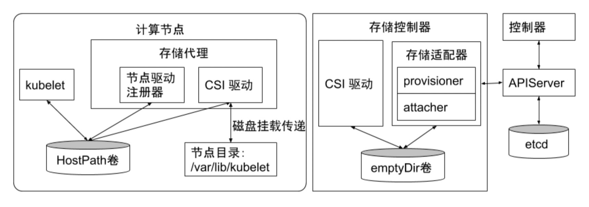
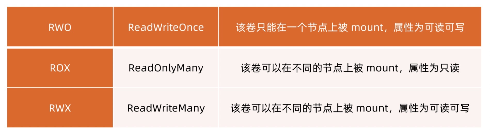
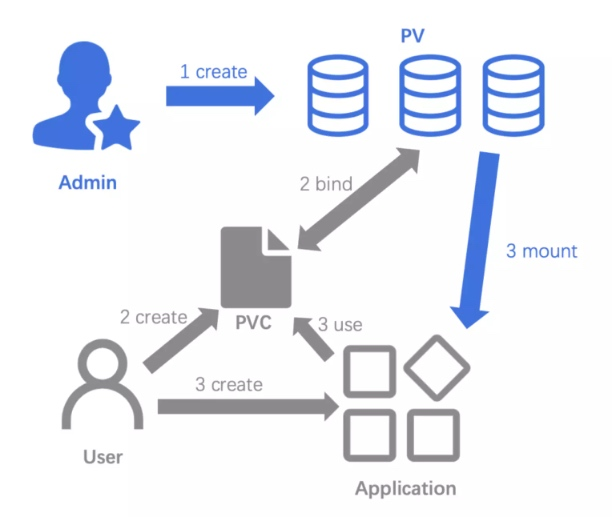
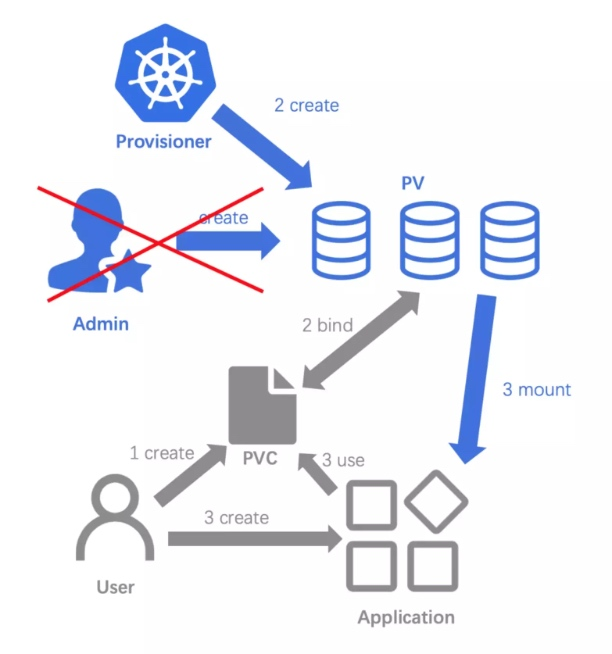
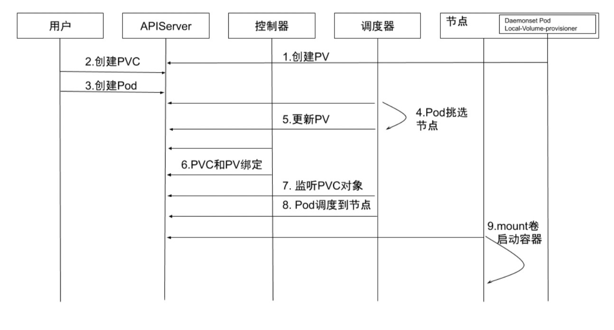
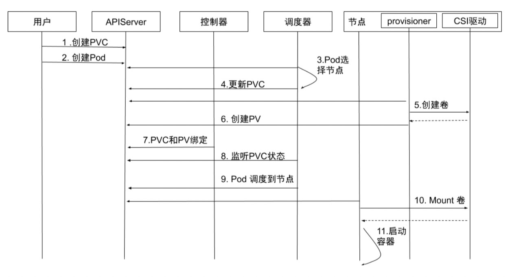
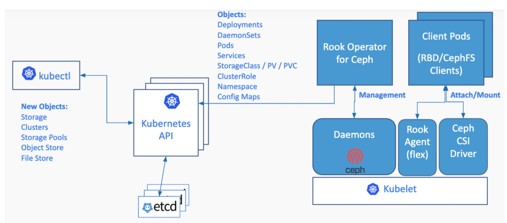

# CSI

## 存储驱动
> - 除外挂存储卷外，容器启动后，运行时所需文件系统性能直接影响容器性能
> - 早期的 Docker 采用 Device Mapper 作为容器运行时存储驱动，因为 OverlayFS 尚未合并经 kernel
> - 目前 Docker 和 containerd 都默认以 OverlayFS 作为容器运行时存储驱动
> - OverlayFS 目前已经有非常好的性能，与 DeviceMapper 相比提升 20%，与操作系统主机文件性能几乎一致

> kubernetes 支持以插件的形式来实现对不同存储的支持和扩展，这些扩展基于以下三种方式：
> 1. in-tree 插件。社区不再接受新的 in-tree 存储插件
> 2. out-of-tree FlexVolume 插件
> 3. out-of-tree CSI 插件

> CSI 的驱动一般包括 external-attacher、external-provisioner、external-resizer、external-snapshotter、node-driver-register、CSI driver 等模块



## 存储分类
> Kubernetes 默认支持很多种存储，有些是内部原生支持，nfs 是内部原生支持；有些是通过接口支持，通过接口支持的好处是可以对接各家的云

### 临时存储
> 常见的临时存储主要就是 emptyDir 卷

> 当 pod 从节点上删除时，emptyDir 卷中的数据也会被永久删除。但当 pod 的容器因为某些原因退出再重启时，emptyDir 卷内的数据并不会丢失

> emptyDir 可用使用本地磁盘或者网络存储。也可以通过将 emptyDir.medium 字段设置为 Memory 来通知 kubernetes 为容器安装 tmpfs，此时数据被存储在内存中，速度相对于本地存储和网络存储快很多。但是在节点重启的时候，内存数据会被清除；而如果存在磁盘上，则重启后数据依然存在。另外，使用 tmpfs 的内存也会计入容器的使用内存总量中，受系统的 Cgroup 限制

> emptyDir 设计初衷是给应用充当缓存空间，或者存储中间数据，用于快速恢复。emptyDir 的空间位于系统根盘，被所有容器共享，在磁盘的使用率较高时，会触发 pod 的 eviction 操作，从而影响业务的稳定

### 半持久化存储
> 常见的半持久化存储是 hostPath 卷。hostPath 卷能将主机节点文件系统上的文件或目录挂载到指定 pod 中。对普通用户而言，一般不需要这样的卷，但是对很多需要获取节点系统信息的 pod 而言，是非常必要的。比如：
> 1. 某个 pod 需要获取节点上所有 pod 的 log，可用通过 hostPath 访问所有 pod 的 stdout 输出存储目录，例如 /var/log/pods 路径
> 2. 某个 pod 需要统计系统相关信息，可用通过 hostPath 访问系统的 /proc 目录

> 使用 hostPath 的时候，除设置必需的 path 属性外，用户还可以有选择性的为 hostPath 卷指定类型，支持类型包括目录、字符设备、块设备等

> 使用 hostPath，需要注意以下事项：
> 1. 使用同一个目录的 pod 可能会由于调度到不同的节点，导致目录中的内容有所不同
> 2. kubernetes 在调度时无法顾及由 hostPath 使用的资源
> 3. pod 被删除后，如果没有特别处理，hostPath 上写的数据会遗留到节点上，占用磁盘空间

### 持久化存储
> kubernetes 引入 StorageClass、Volume、PVC、PV 的概念，将存储独立于 pod 的生命周期来进行管理。kubernetes 目前支持的持久化存储包含各种主流的块存储和文件存储，譬如 NFS、cephfs、issci 等。大体可以分为网络存储和本地存储两种类型

## PV 与 PVC
- PV：由集群管理员提前创建，或者根据 PVC 的申请动态地创建。描述持久化存储卷，定义一个持久化存储在宿主机上的目录，比如一个 NFS 的挂载目录
- PVC：由用户创建，代表用户对存储需求的声明。描述 Pod 所希望使用的持久化存储的属性，比如，Volume 存储的大小、可读写权限等等



> 用户通过创建 PVC 来申请存储，控制器通过 PVC 的 StorageClass 和请求的大小声明来存储后端创建卷，进而创建 PV



## StorageClass
> PV 和 PVC 方法虽然能实现屏蔽底层存储，但是 PV 创建比较复杂，通常都是由集群管理员管理，这非常不方便。Kubernetes 提供动态配置 PV 的方法，可以自动创 PV
> - 管理员可以部署 PV 配置器（provisioner），然后定义对应的 StorageClass
> - 开发者在创建 PVC 的时候就可以选择需要创建存储的类型
> - PVC 会把 StorageClass 传递给 PV provisioner，由 provisioner 自动创建 PV



> 不同的存储类型可以通过不同的 StorageClass 来为用户提供服务。StorageClass 主要包含存储插件 provisioner、卷的创建和 mount 参数等字段

```yaml
apiVersion: storage.k8s.io/v1
kind: StorageClass
metadata:
  name: nfs-csi
provisioner: nfs.csi.k8s.io
parameters:
  server: 192.168.31.229
  share: /data/cloudnative
reclaimPolicy: Delete
volumeBindingMode: Immediate
mountOptions:
  - hard
  - nfsvers=4.1

apiVersion: v1
kind: PersistentVolumeClaim
metadata:
  name: pvc-nfs-csi-dynamic
spec:
  accessModes:
    - ReadWriteMany
  resources:
    requests:
      storage: 1Gi
  storageClassName: nfs-cs
```

## LocalVolume 分配
### 独占 LocalVolume

> 1. 创建 PV: 通过 local-volume-provisioner Daemonset 创建本地存储的 PV
> 2. 创建 PVC: 用户创建 PVC，由于它处于 pending 状态，所以 kube-controller-manager 并不会对该 PVC 做任何操作
> 3. 创建 Pod: 用户创建 Pod
> 4. Pod 挑选节点: kube-scheduler 开始调度 Pod，通过 PVC 的 resources.request.storage 和 volumeMode 选择满足条件的 PV，并且为 Pod 选择一个合适的节点
> 5. 更新 PV: kube-scheduler 将 PV 的 pv.Spec.claimRef 设置为对应的 PVC，并且设置 annotation pv.kubernetes.io/bound-by-controller 的值为 yes
> 6. PVC 和 PV 绑定: pv_controller 同步 PVC 和 PV 的状态，并将 PVC 和 PV 进行绑定
> 7. 监听 PVC 对象: kube-scheduler 等待 PVC 的状态变成 Bound 状态
> 8. Pod 调度到节点: 如果 PVC 的状态变为 Bound 则说明调度成功，而如果 PVC 一直处于 pending 状态，超时后会再次进行调度
> 9. Mount 卷启动容器: kubelet 监听到有 Pod 已经调度到节点上，对本地存储进行 mount 操作，并启动容器



### Dynamic LocalVolume

> 1. 创建 PVC: 用户创建 PVC，PVC 处于 pending 状态
> 2. 创建 Pod: 用户创建 Pod
> 3. Pod 选择节点: kube-scheduler 开始调度 Pod，通过 PVC 的 pvc.spec.resources.request.storage 等选择满足条件的节点
> 4. 更新 PVC: 选择节点后，kube-scheduler 会给 PVC 添加包含节点信息的 annotation: volume.kubernetes.io/selected-node: <节点名字>
> 5. 创建卷: 运行在节点上的容器 external-provisioner 监听到 PVC 带有该节点相关的 annotation，向相应的 CSI 驱动申请分配卷
> 6. 创建 PV: PVC 申请到所需的存储空间后，external-provisioner 创建 PV，该 PV 的 pv.Spec.claimRef 设置为对应的 PVC
> 7. PVC 和 PV 绑定: kube-controller-manager 将 PVC 和 PV 进行绑定，状态修改为 Bound
> 8. 监听 PVC 状态: kube-scheduler 等待 PVC 变成 Bound 状态
> 9. Pod 调度到节点: 当 PVC 的状态为 Bound 时，Pod 才算真正调度成功了。如果 PVC 一直处于 Pending 状态，超时后会再次进行调度
> 10. Mount 卷: kubelet 监听到有 Pod 已经调度到节点上，对本地存储进行 mount 操作
> 11. 启动容器: 启动容器



## 实践经验

> 在本地存储的 PV 静态部署模式下，每个物理磁盘都尽量只创建一个 PV，而不是划分为多个分区来提供多个本地存储 PV，避免在使用时分区之间的 I/O 干扰

> 本地存储需要配合磁盘检测来使用。当集群部署规模化之后，每个集群的本地存储 PV 可能会超过几万个。需要在检测出磁盘问题之后，触发告警、自动 cordon 节点等

> 对于提供本地存储节点的磁盘管理，需要做到灵活管理和自动化。在 local-volume-provisioner 中增加部署逻辑，当容器运行起来时，拉取节点需要提供本地存储的磁盘信息，例如磁盘的设备路径，以 FileSystem 或者 Block 的模式提供本地存储，或者是否需要加入某个 LVM 的虚拟组等

## ROOK

> Rook 是一款云原生环境下的开源分布式存储编排系统，目前支持 Ceph、NFS、EdgeFS、Cassandra、CockroachDB 等存储系统。它实现了一个自动管理的、自动扩容的、自动修复的分布式存储服务。Rook 支持自动部署、启动、配置、分配、扩容/缩容、升级、迁移、灾难恢复、监控以及资源管理



### Rook Operater
> Rook Operater 是 Rook 的大脑，以 deployment 形式存在。其利用 Kubernetes 的 controller-runtime 框架实现了 CRD，并进而接受 Kubernetes 创建资源的请求并创建相关资源

> Rook Operater 监控存储守护进程，来确保存储集群的健康。监听 Rook Discovers 收集到的存储磁盘设备，并创建相应服务

### Rook Discover
> Rook Discover 是以 Daemonset 形式部署在所有的存储机上的，其检测挂接到存储节点上的存储设备。把符合要求的存储设备记录下来，这样 Rook Operater 感知到以后就可以基于该存储设备创建相应服务了

### Provisioner
> CSI external-provisioner 是一个监控 Kubernetes PVC 对象的 Sidecar 容器。当用户创建 PVC 后， Kubernetes 会监测 PVC 对应的 StorageClass，如果 StorageClass 中的 provisioner 与某插件匹配，该容器通过 CSI Endpoint 调用 CreateVolume 方法

> 如果 CreatevVolume 方法调用成功，则 Provisioner sidecar 创建 Kubernetes PV 对象