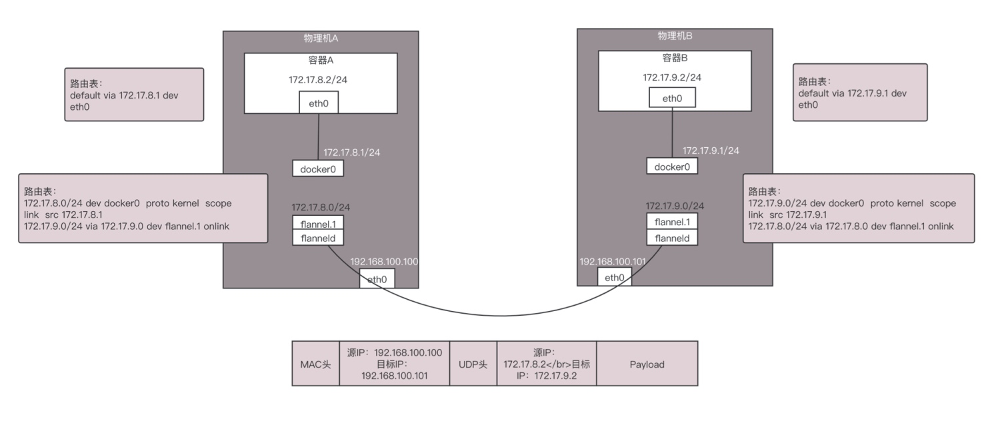
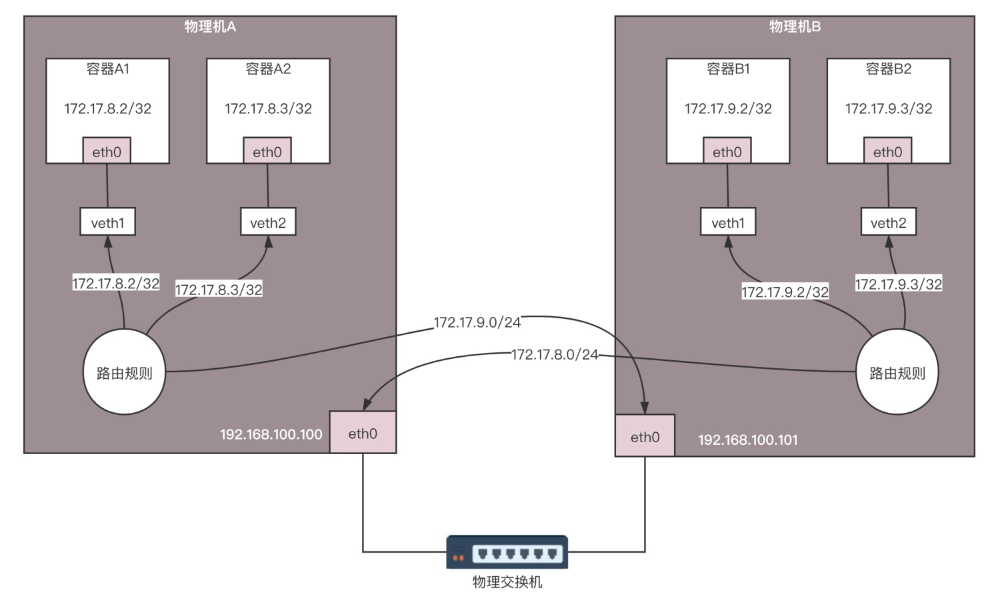

# 容器网络

```bash
ip netns add test

# 转发开关
ip netns exec test sysctl -w net.ipv4.ip_forward=1
```

## flanneld



> 容器 A 发往容器 B 的网络包会被转发到 flannel.1 这个网卡。在物理机上，flanneld 进程打开一个 /dev/net/tun 字符设备的时候，就出现了这个网卡。所有发到 flannel.1 这个网卡的包都会被 flanneld 进程读进去，接下来 flanneld 要对网络包进行处理。物理机 A 上的 flanneld 会将网络包封装在 UDP 包里面，然后外层加上物理机 A 和物理机 B 的 IP 地址，发送给物理机 B 上的 flanneld。物理机 B 上的 flanneld 收到包之后，解开 UDP 的包，将里面的网络包拿出来，从物理机 B 的 flannel.1 网卡发出去。在物理机 B 上，根据路由规则将包发给 docker0，docker0 将包转给容器 B

> Flannel 提供的 Overlay 方案主要有两种方式，一种是 UDP 在用户态封装，一种是 VXLAN 在内核态封装，而 VXLAN 的性能更好一些

## Calico
> Calico 网络的大概思路，将转发全部用三层网络的路由转发来实现



> 容器 A1 的 IP 地址为 172.17.8.2/32，容器 A1 作为一个单点的局域网