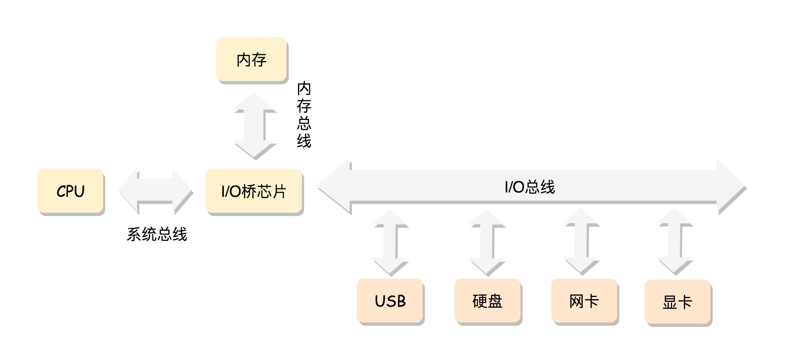
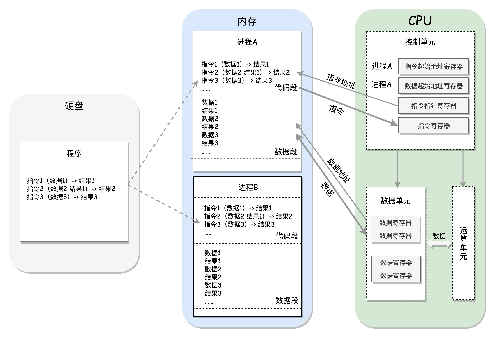
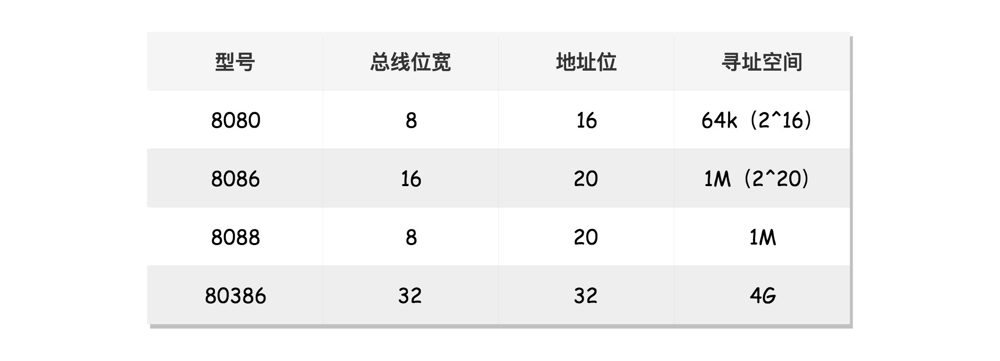
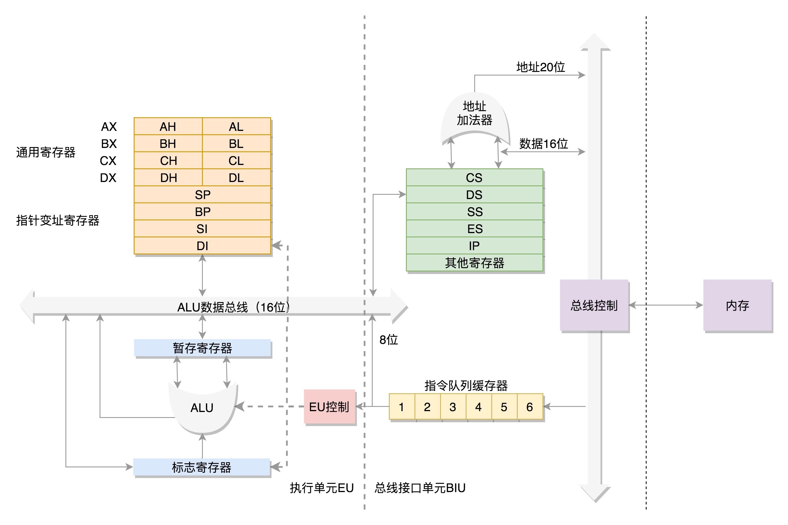
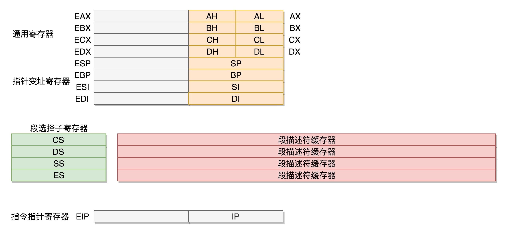

# x86 架构

## CPU
### 组成部分

> CPU 包括三个部分：运算单元、数据单元和控制单元

> 运算单元只进行计算，例如做加法、做位移等等

> 为了避免计算数据每次都经过总线，到内存里面获取，于是用数据单元暂存数据和运算结果，数据单元包括 CPU 内部的缓存和寄存器组

> 控制单元可以获得下一条指令，然后执行这条指令。这个指令会指导运算单元取出数据单元中的某几个数据，计算出个结果，然后放在数据单元的某个地方

> CPU 的控制单元里面，有一个指令指针寄存器，用来存放下一条指令在内存中的地址。控制单元会不停地将代码段的指令拿进来，放入指令寄存器。指令分两部分，一部分是计算操作，例如是加法还是位移；一部分是操作数据。要执行这条指令，就要把第一部分交给运算单元，第二部分交给数据单元

> 数据单元根据数据的地址，从数据段里读到数据寄存器里，参与运算。运算单元做完运算，产生的结果会暂存在数据单元的数据寄存器里。最终，会有指令将数据写回内存中的数据段

> CPU 里有两个寄存器，专门保存当前处理进程的代码段的起始地址，以及数据段的起始地址

### 系统总线
> CPU 和内存来来回回传数据，靠的都是总线。总线上主要有两类数据，一个是地址数据，也就是我想拿内存中哪个位置的数据，这类总线叫地址总线（Address Bus）；另一类是真正的数据，这类总线叫数据总线（Data Bus）

> 地址总线的位数，决定了能访问的地址范围。例如只有两位，CPU 就只能认 00，01，10，11 四个位置。位数越多，能够访问的位置就越多，能管理的内存的范围也就越广

> 数据总线的位数，决定了一次能拿多少个数据进来。例如只有两位，那 CPU 一次只能从内存拿两位数。要想拿八位，就要拿四次。位数越多，一次拿的数据就越多，访问速度也就越快

## 8086

### 数据单元
> 8086 处理器内部有 8 个 16 位的通用寄存器，也就是 CPU 内部的数据单元。分别是 AX、BX、CX、DX、SP、BP、SI、DI，这些寄存器主要用于在计算过程中暂存数据

> 这些寄存器比较灵活，其中 AX、BX、CX、DX 可以分成两个 8 位的寄存器来使用，分别是 AH、AL、BH、BL、CH、CL、DH、DL，其中 H 就是 High（高位），L 就是 Low（低位）的意思。这样，比较长的数据也能暂存，比较短的数据也能暂存

### 控制单元
> IP 寄存器就是指令指针寄存器（Instruction Pointer Register)，指向代码段中下一条指令的位置。CPU 会根据它来不断地将指令从内存的代码段中，加载到 CPU 的指令队列中，然后交给运算单元去执行

> 每个进程都分代码段和数据段，为了指向不同进程的地址空间，有四个 16 位的段寄存器，分别是 CS、DS、SS、ES。其中，CS 就是代码段寄存器（Code Segment Register），通过它可以找到代码在内存中的位置；DS 是数据段的寄存器，通过它可以找到数据在内存中的位置。SS 是栈寄存器（Stack Register）

> 如果运算中需要加载内存中的数据，需要通过 DS 找到内存中的数据，加载到通用寄存器中。对于一个段，有一个起始的地址，而段内的具体位置，称为偏移量（Offset）。在 CS 和 DS 中都存放着一个段的起始地址。代码段的偏移量在 IP 寄存器中，数据段的偏移量会放在通用寄存器中

> CS 和 DS 都是 16 位的，也就是说，起始地址都是 16 位的，IP 寄存器和通用寄存器都是 16 位的，偏移量也是 16 位的，但是 8086 的地址总线地址是 20 位，于是把 CS 和 DS 中的值左移 4 位，变成 20 位的，加上 16 位的偏移量，这样就可以得到最终 20 位的数据地址

> 因为偏移量只能是 16 位的，所以一个段最大的大小是 2 ^ 16 = 64k

### 32 位处理器
> 在 32 位处理器中，有 32 根地址总线，可以访问 2 ^ 32 = 4G 的内存

#### 寄存器

> 可以将 8 个 16 位的寄存器扩展到 8 个 32 位的，但是依然可以保留 16 位的和 8 位的使用方式。其中，指向下一条指令的指令指针寄存器 IP，就会扩展成 32 位的，同样也兼容 16 位的

> 改动比较大，有点不兼容的就是段寄存器（Segment Register）。因为它没有把 16 位当成一个段的起始地址，也没有按 8 位或者 16 位扩展的形式，而是根据当时的硬件，弄了一个不上不下的 20 位的地址。这样每次都要左移四位，也就意味着段的起始地址不能是任何一个地方，只是能整除 16 的地方

> CS、SS、DS、ES 仍然是 16 位的，但是不再是段的起始地址。段的起始地址放在内存的某个地方。这个地方是一个表格，表格中的一项一项是段描述符（Segment Descriptor）。这里面才是真正的段的起始地址。这样，将一个从段寄存器直接拿到的段起始地址，就变成了先间接地从段寄存器找到表格中的一项，再从表格中的一项中拿到段起始地址。这样段起始地址就会很灵活了。当然为了快速拿到段起始地址，段寄存器会从内存中拿到 CPU 的描述符高速缓存器中

> 在 32 位的系统架构下，将前一种模式称为实模式（Real Pattern），后一种模式称为保护模式（Protected Pattern）。当系统刚刚启动的时候，CPU 是处于实模式的，这个时候和原来的模式是兼容的。当需要更多内存的时候，你可以遵循一定的规则，进行一系列的操作，然后切换到保护模式，就能够用到 32 位 CPU 更强大的能力