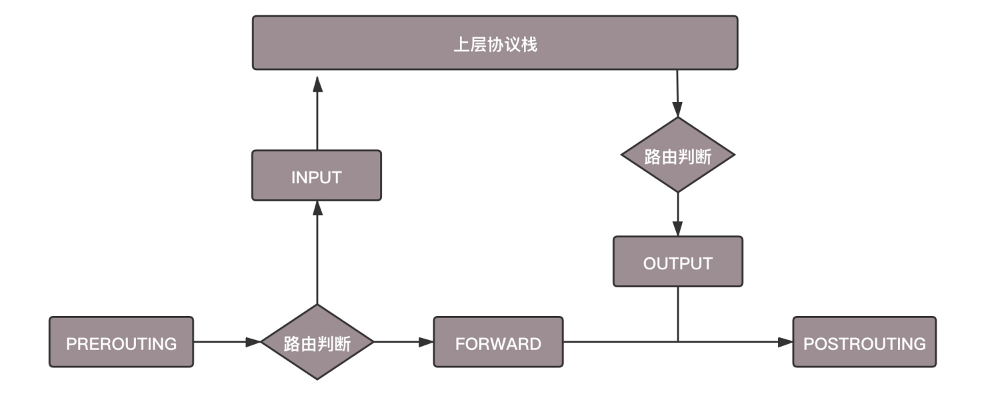
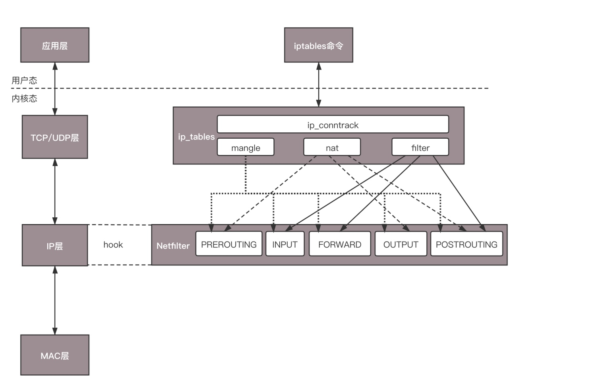
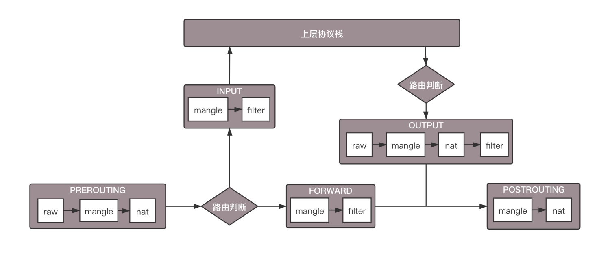

# 网络安全

> 当网络包到达机器之后，首先查看 MAC 头。如果是当前机器，再根据目标 IP，进行路由判断。在路由判断之前，这个节点称为 PREROUTING。如果 IP 是当前机器的，就发给传输层，这个节点叫作 INPUT；上层处理完毕后，一般会返回一个处理结果，这个节点称为 OUTPUT。如果 IP 不是当前机器的，就需要转发出去，这个节点称为 FORWARD。无论是 FORWARD 还是 OUTPUT，都是路由判断之后发生的，最后一个节点是 POSTROUTING



## Netfilter
> Netfilter 可以在节点插入 hook 函数。这些函数可以截获数据包，对数据包进行操作。比如：交回给协议栈，就是 ACCEPT；过滤掉，就是 DROP；发送给某个用户态进程处理，就是 QUEUE

## ip_tables
> ip tables 是 netfilter 的一个实现。它在这五个节点上埋下函数，提供以下功能：连接跟踪、数据包的过滤、网络地址转换和数据包的修改。其中连接跟踪是基础功能，被其他功能所依赖。其他三个可以实现包的过滤、修改和网络地址转换



> iptables 的表分为四种：raw、mangle、nat、filter。这四个优先级依次降低，其中 raw 不常用。每个表可以设置多个链

> filter 表处理过滤功能，主要包含三个链：
> - INPUT 链：过滤所有目标地址是本机的数据包
> - FORWARD 链：过滤所有路过本机的数据包
> - OUTPUT 链：过滤所有由本机产生的数据包

> nat 表主要是处理网络地址转换，可以进行 Snat（改变数据包的源地址）、Dnat（改变数据包的目标地址），包含三个链
> - PREROUTING 链：在数据包到达防火墙时改变目标地址
> - OUTPUT 链：改变本地产生的数据包的目标地址
> - POSTROUTING 链：在数据包离开防火墙时改变数据包的源地址

> mangle 表主要是修改数据包，包含
> - PREROUTING 链
> - INPUT 链
> - FORWARD 链
> - OUTPUT 链



```bash
# -s 表示源 IP 地址段，-d 表示目标地址段，DROP 表示丢弃
# 无论从哪里来，都拒绝访问
iptables -t filter -A INPUT -s 0.0.0.0/0.0.0.0 -d <ip> -j DROP

# 开放 ssh
iptables -I INPUT -s 0.0.0.0/0.0.0.0 -d <ip> -p tcp --dport 22 -j ACCEPT

# 开发 web
iptables -A INPUT -s 0.0.0.0/0.0.0.0 -d <ip> -p tcp --dport 80 -j ACCEP
```