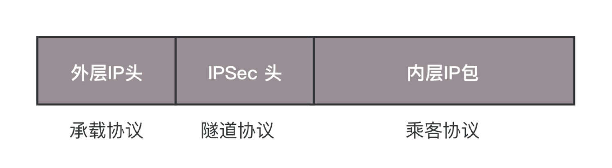

# VPN

> VPN，全名 Virtual Private Network。VPN 通过隧道技术在公众网络上仿真一条点到点的专线，是通过利用一种协议来传输另外一种协议的技术

## IPsec VPN

> 基于 IP 协议的安全隧道协议，为了保证在公网上面信息的安全，因而采取了一定的机制保证安全性：
> 1. 私密性
> 2. 完整性，通过数据摘要保证数据的完整性
> 3. 真实性，通过身份认证保证