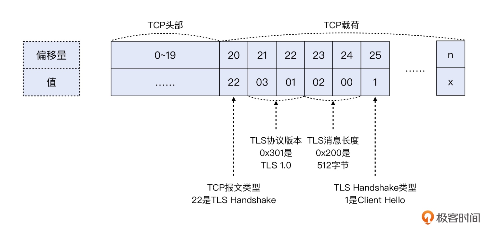

# 抓包分析

## Tcpdump

> 参数说明
> -D 查看网卡设备
> -i 指定网卡设备
> -w 文件名，可以把报文保存到文件
> -c 数量，可以抓取固定数量的报文，这在流量较高时，可以避免一不小心抓取过多报文
> -s 长度，可以只抓取每个报文的一定长度
> -n，不做地址转换（比如 IP 地址转换为主机名，port 80 转换为 http）
> -v/-vv/-vvv，可以打印更加详细的报文信息
> -e，可以打印二层信息，特别是 MAC 地址
> -p，关闭混杂模式。也就是嗅探，就是把目的地址不是本机地址的网络报文也抓取下来

> 抓取去往某个 ip，或者从某个 ip 过来的流量

```bash
tcpdump host 10.10.10.10
```

> 抓取某个端口的流量

```bash
tcpdump port 22
```

> -X 参数的用法

```bash
# 用 -X 这个参数，以 ASCII 码来展示 TCP 里面的数据
tcpdump -i any -X host 10.10.10.10 and port 80
```

> 配合 tcpdump 与 telnet 测试

```bash
# 请求 80 端口的数据丢弃
iptables -I INPUT -p tcp --dport 80 -j DROP

# 请求 80 端口的数据拒绝
iptables -I INPUT -p tcp --dport 80 -j REJECT

# 请求 80 端口的数据 tcp reset 拒绝
iptables -I INPUT -p tcp --dport 80 -j REJECT --reject-with tcp-reset

# 查看
iptables-save
```

## 报文过滤



> BPF 本身是基于偏移量来做报文解析的，可以在 tcpdump 中使用偏移量技术，实现需求

```bash
# 抓取 TLS 握手阶段的 Client Hello 报文

# dst port 443 表示抓取从客户端发过来的访问 HTTPS 的报文

# tcp[20]==22 表示提取 TCP 的第 21 个字节（初始序号从 0 开始），由于 TCP 头部占 20 字节，TLS 又是 TCP 的载荷，
# 那么 TLS 的第 1 个字节就是 TCP 的第 21 个字节

# tcp[25]==1 表示这是 TCP 头部的第 26 个字节，如果它等于 1，那么就表明这个是 Client Hello 类型的 TLS 握手报文
tcpdump -w file.pcap 'dst port 443 && tcp[20]==22 && tcp[25]==1'
```

> 过滤出 TCP RST 报文

```bash
tcpdump -w file.pcap 'tcp[tcpflags]&(tcp-rst) != 0'

# 偏移量的写法
tcpdump -w file.pcap 'tcp[13]&4 != 0'
```

### 报文读写
> 读文件

```bash
tcpdump -r file.pcap 'tcp[tcpflags] & (tcp-rst) != 0'
```

> 写文件

```bash
# 找到 TCP RST 报文，并把这些 RST 报文保存到新文件
tcpdump -r file.pcap 'tcp[tcpflags] & (tcp-rst) != 0' -w rst.pcap
```

> 加上 -s 参数，指定抓取的每个报文的最大长度，节省抓包文件的大小，延长抓包时间。一般来说，帧头是 14 字节，IP 头是 20 字节，TCP 头是 20~40 字节。如果只需要传输层数据，那么理论上，对于每一个报文，只要抓取到传输层头部即可，也就是前 74 个字节

```bash
tcpdump -s 74 -w file.pcap
```

> 如果还想看 TLS 甚至更上层的应用层的信息，就需要去掉 size 的限制，抓取全部数据。这是因为，应用层头部可能非常大，甚至超过了 TCP 的 MSS。比如 HTTP 头部，小的话可能只有几十个字节，大的话可能要几十个 KB，也就是好多个 TCP segment 才放得下

### 抓包位置
> 利用 IP 的 TTL 属性。无论是哪一端，它的报文在发出时，其 TTL 就是原始值，也就是 64、128、255 中的某一个。而对端报文的 TTL，因为会经过若干个网络跳数，所以一般都会比 64、128、255 这几个数值要小一些

> 只要看一下抓包文件中任何一个客户端报文的 TTL，如果它是 64、128 或 255，那说明这个抓包文件就是在客户端做的。反之，就是在服务端做的

> 在停止 tcpdump 时，用正常退出的方式，比如 Ctrl + C，或者 timeout 命令，或者 kill 但不要用 -9 作为参数

## Tcptrace
```bash
tcpdump -r test.pcap | head -10
```