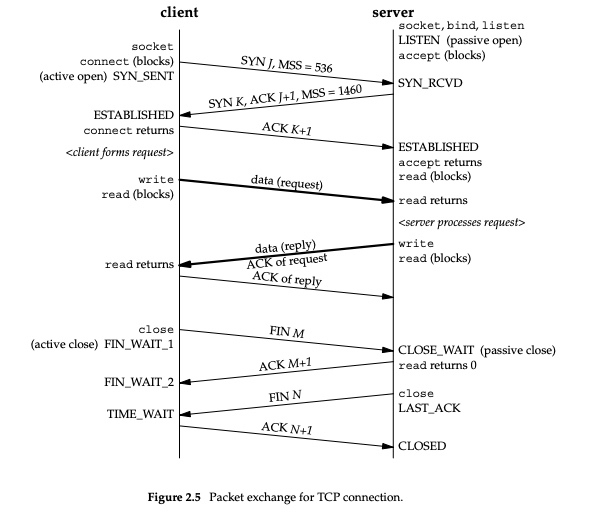
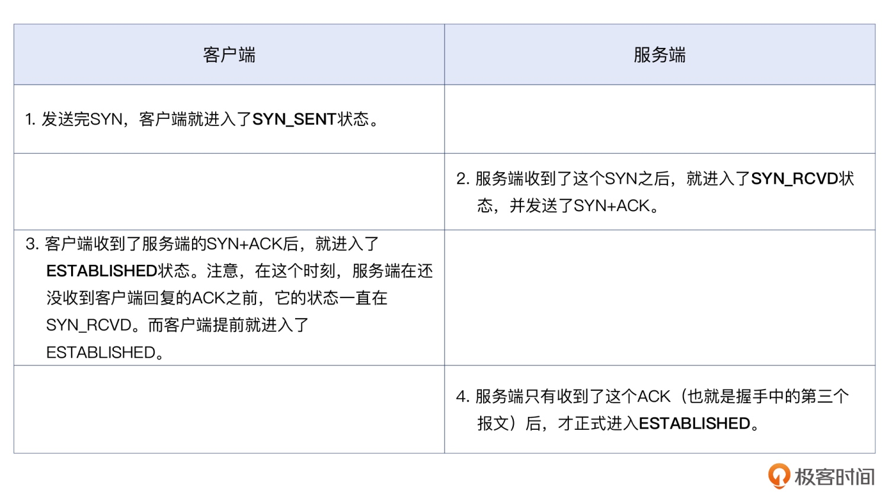
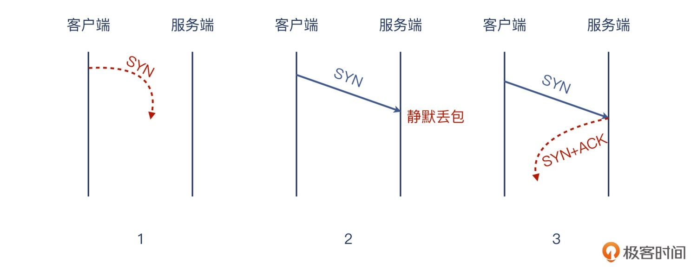

# TCP 问题

## 握手
### 状态图


```bash
# 查看状态
netstat -ant
```



### 服务连不上
> 一般来说 TCP 连接是标准的 TCP 三次握手完成的
> 1. 客户端发送 SYN
> 2. 服务端收到 SYN 后，回复 SYN + ACK
> 3. 客户端收到 SYN + ACK 后，回复 ACK

> 这里面 SYN 与 ACK 会在两端各发送一次，一共有 4 个报文，但只有三次发送，这是因为服务端的 SYN 和 ACK 是合并在一起发送的，就节省了一次发送。这就叫做 Piggybacking，意为搭顺风车。

> 如果服务端不想接受这次握手，可能会出现这么几种情况：
> 1. 不搭理这次连接
> 2. 给予回复，明确拒绝

> 第一种情况，服务端做了静默丢包，不给客户端回复任何消息。这导致客户端无法分清楚是以下哪种情况：
> 1. 在网络上丢失了，服务端收不到
> 2. 静默丢包
> 3. 对端的回包在网络中丢了



> 从客户端的角度，对于 SYN 包发出去之后迟迟没有回应的情况，它的策略是做重试，而且不止一次

```bash
# 服务端，静默丢弃掉发往 80 端口的数据包
iptables -I INPUT -p tcp --dport 80 -j DROP

# 客户端抓包
tcpdump -i any -w telnet-80.pcap port 80

telnet 服务端IP 80
```

> 握手请求一直没成功，客户端的 telnet 会挂起。客户端一共有 7 个 SYN 包发出，也就是说除了第一次 SYN，后续还有 6 次重试。在 Linux 中，这个设置是由内核参数 net.ipv4.tcp_syn_retries 控制的，默认值为 6

```bash
sudo sysctl net.ipv4.tcp_syn_retries
```

> iptables 的规则动作有好几种，可以使用 REJECT 让客户端立刻退出。执行下面的这条命令，让 iptables 拒绝发到 80 端口的数据包

```bash
iptables -I INPUT -p tcp --dport 80 -j REJECT
```

> 这时候，在客户端发起 telnet 请求会立刻退出，但是抓包文件里面并没有期望的 TCP RST。这是因为，我们默认为握手的所有过程都是通过这个 80 端口进行的。实际上，不限制抓包的端口号，就可以看到服务端回复了一个 ICMP 消息，这个 ICMP 消息通过 type=3 表示，这是一个端口不可达的错误消息，而且在它的 payload 里面，还携带了完整的 TCP 握手包的信息，而这个握手包就是客户端发过来的

