# TCP 问题

## 握手
### 状态图


```bash
# 查看状态
netstat -ant
```


### 服务连不上
> 一般来说 TCP 连接是标准的 TCP 三次握手完成的
> 1. 客户端发送 SYN
> 2. 服务端收到 SYN 后，回复 SYN + ACK
> 3. 客户端收到 SYN + ACK 后，回复 ACK

> 这里面 SYN 与 ACK 会在两端各发送一次，一共有 4 个报文，但只有三次发送，这是因为服务端的 SYN 和 ACK 是合并在一起发送的，就节省了一次发送。这就叫做 Piggybacking，意为搭顺风车。

> 如果服务端不想接受这次握手，可能会出现这么几种情况：
> 1. 不搭理这次连接
> 2. 给予回复，明确拒绝

> 第一种情况，服务端做了静默丢包，不给客户端回复任何消息。这导致客户端无法分清楚是以下哪种情况：
> 1. 在网络上丢失了，服务端收不到
> 2. 静默丢包
> 3. 对端的回包在网络中丢了


> 从客户端的角度，对于 SYN 包发出去之后迟迟没有回应的情况，它的策略是做重试，而且不止一次

```bash
# 服务端，静默丢弃掉发往 80 端口的数据包
iptables -I INPUT -p tcp --dport 80 -j DROP

# 客户端抓包
tcpdump -i any -w telnet-80.pcap port 80

telnet 服务端IP 80
```

> 握手请求一直没成功，客户端的 telnet 会挂起。客户端一共有 7 个 SYN 包发出，也就是说除了第一次 SYN，后续还有 6 次重试。在 Linux 中，这个设置是由内核参数 net.ipv4.tcp_syn_retries 控制的，默认值为 6

```bash
sudo sysctl net.ipv4.tcp_syn_retries
```

> iptables 的规则动作有好几种，可以使用 REJECT 让客户端立刻退出。执行下面的这条命令，让 iptables 拒绝发到 80 端口的数据包

```bash
iptables -I INPUT -p tcp --dport 80 -j REJECT
```

> 这时候，在客户端发起 telnet 请求会立刻退出，但是抓包文件里面并没有期望的 TCP RST。这是因为，我们默认为握手的所有过程都是通过这个 80 端口进行的。实际上，不限制抓包的端口号，就可以看到服务端回复了一个 ICMP 消息，这个 ICMP 消息通过 type=3 表示，这是一个端口不可达的错误消息，而且在它的 payload 里面，还携带了完整的 TCP 握手包的信息，而这个握手包就是客户端发过来的


## 挥手
### Nginx connection reset by peer

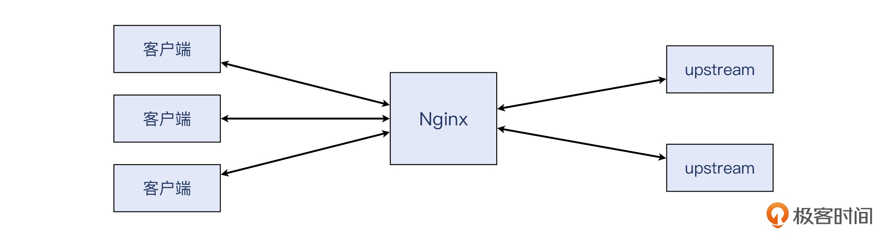

> Nginx 服务器上遇到了很多 connection reset by peer 的报错

```
2015/12/01 15:49:48 [info] 20521#0: *55077498 recv() failed (
	104: Connection reset by peer) while sending to client,
  client: 10.255.252.31,
  server: manager.example.com,
  request: "POST /weixin/notify_url.htm HTTP/1.1",
  upstream: "http://10.4.36.207:8080/WebPageAlipay/weixin/notify_url.htm",
  host: "manager.example.com"
```

> 首先选择在客户端进行抓包，检查应用日志，进行分析：
> 1. recv() failed：recv() 是一个系统调用，它的作用是用来接收数据的。可以直接 man recv，看到这个系统调用的详细信息，以及它的各种异常状态码
> 2. 104：recv() 调用出现异常时的一个状态码，是操作系统给出的。104 对应的是 ECONNRESET，也正是一个 TCP 连接被 RST 报文异常关闭的情况
> 3. upstream：后端的服务器

> 先从原始文件中过滤出跟这个 IP 相关的报文

```basj
# 过滤出源 IP 或者目的 IP 为 xxx 的报文
ip.addr eq xxx

# 过滤出源 IP 为 xxx 的报文
ip.src eq xxx

# 过滤出目的 IP 为 xxx 的报文
ip.dst eq xxx
```

> 然后寻找 TCP RST 报文，使用 tcp.flags 过滤器

```bash
# 标志位：SYN、ACK、FIN、PSH、 RST
tcp.flags.reset eq 1
```

> 观察 TCP 的 Flags 部分

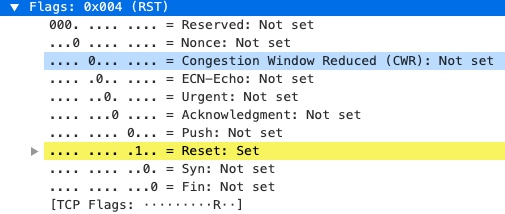

> 打开抓包文件，输入过滤条件

```bash
ip.addr eq 10.255.252.31 and tcp.flags.reset eq 1
```

> 在 Wireshark 中，基于一个报文。选择其中一个报文，右单击，选中 Follow -> TCP Stream，就找到了它所属的整个 TCP 流的报文

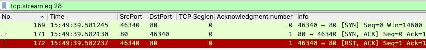

> 由于这个 RST 是握手阶段里的第三个报文，但它又不是期望的 ACK，而是 RST + ACK，所以握手失败了

> 这种握手阶段的 RST，一般来说，客户端发起连接，依次调用以下几个系统调用
> 1. socket()
> 2. connect()

> 服务端监听端口并提供服务，依次调用以下几个系统调用
> 1. socket()
> 2. bind()
> 3. listen()
> 4. accept()

> 服务端的用户空间程序要使用 TCP 连接，首先要获得上面最后一个接口，也就是 accept() 调用的返回。而 accept() 调用能成功返回的前提是正常完成三次握手。这次客户端在握手中的第三个包不是 ACK，而是 RST + ACK，握手失败了，也不会转化为一次有效的连接了，所以 Nginx 都不知道还存在过这么一次失败的握手

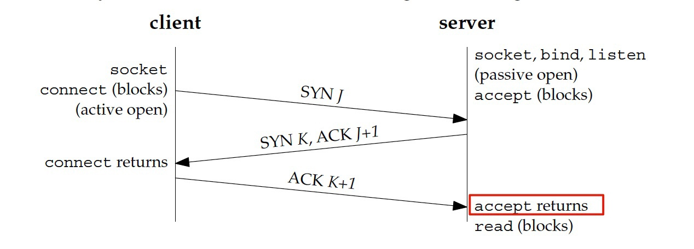

> 不过，在客户端日志里，是可以记录到这次握手失败的。这是因为，客户端是 TCP 连接的发起方，它调用 connect()，而 connect() 失败的话，其 ECONNRESET 返回码，还是可以通知给应用程序的

> 由此可见，上面这个虽然也是 RST，但并不是期望中的那种在连接建立后发生的 RST。还需要进一步打磨一下过滤条件，把握手阶段的 RST 给排除

```bash
# 排除序列化与确认号为 1 报文
ip.addr eq 10.255.252.31 and tcp.flags.reset eq 1 and !(tcp.seq eq 1 and tcp.ack eq 1)
```

> 利用 Nginx 日志中的 URL 等信息，以及日志时间进一步过滤。下面使用 frame.time 过滤器进行时间过滤

```bash
# 排除序列化与确认号为 1 报文
frame.time >="dec 01, 2015 15:49:48" and frame.time <="dec 01, 2015 15:49:49" and ip.addr eq 10.255.252.31 and tcp.flags.reset eq 1 and !(tcp.seq eq 1 and tcp.ack eq 1)
```

> 成功地锁定到只有 3 个 RST 报文，进行深入分析：核对时间、RST 行为、URL 路径

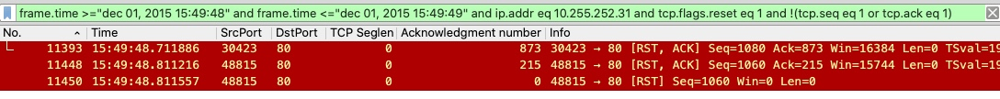

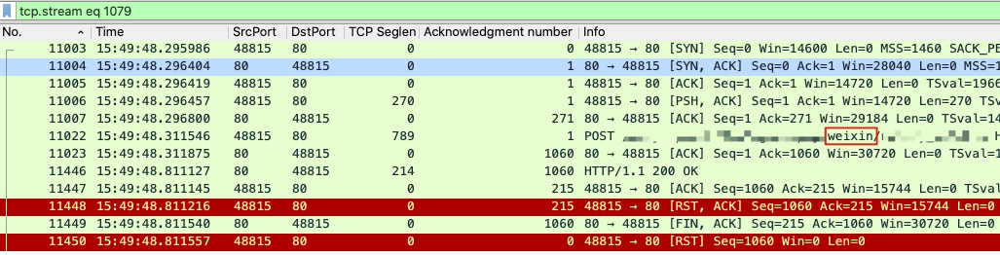

> 可以看出，客户端在对 HTTP 200 这个响应回复 ACK 之后，随即发送了 RST + ACK，这个行为破坏了正常的 TCP 四次挥手。从而导致 Nginx 的 recv() 调用收到了 ECONNRESET 报错

> 对于服务端来说，表面上记录了一次报错日志。但是这个 POST 请求还是成功了，已经被正常处理完了，要不然 Nginx 不会回复 HTTP 200。对于客户端而言，需要进一步排查客户端的日志，不排除客户端认为这次是失败，可能会有重试等等

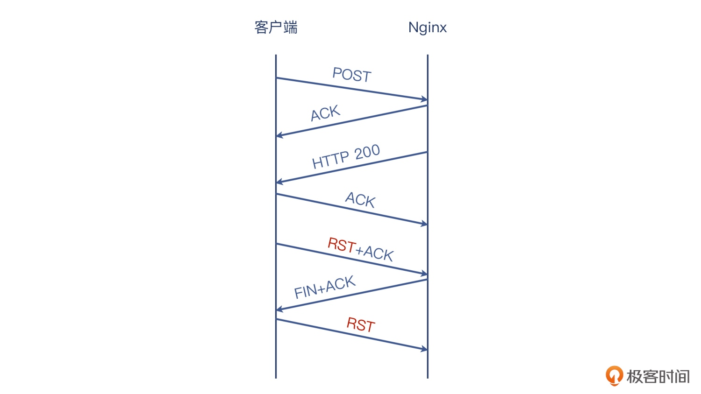

### 挥手只有一次 FIN
> TCP 的挥手是任意一端都可以主动发起的。也就是说，挥手的发起权并不固定给客户端或者服务端。这跟 TCP 握手不同

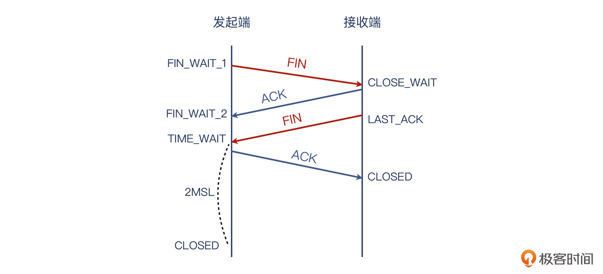

> 有一个奇怪的现象：偶然发现应用在 TCP 关闭阶段，只有一个 FIN，而不是两个 FIN

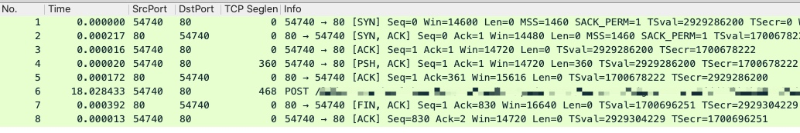

> TCP 里一个报文可以搭另一个报文的顺风车，以提高 TCP 传输的运载效率。所以，TCP 挥手倒不是一定要四个报文，Piggybacking 后，就可能是 3 个报文了。看起来就类似三次挥手

> Wireshark 的主界面还有个特点，就是当它的 Information 列展示的是应用层信息时，这个报文的 TCP 层面的控制信息就不显示了。上面的 POST 请求报文，其 Information 列就是 POST 方法加上具体的 URL。它的 TCP 信息，包括序列号、确认号、标志位等，都需要到详情里面去找

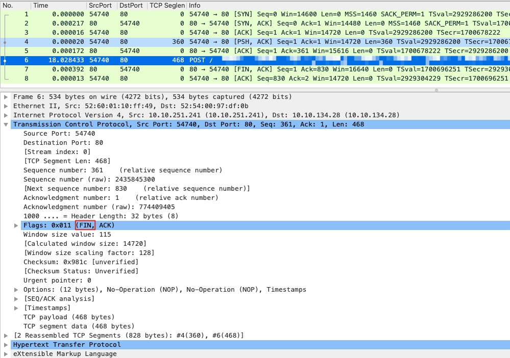


> 可以看出，第一个 FIN 控制报文，并没有像常规的那样单独出现，而是合并在 POST 报文里。所以，整个挥手过程，其实依然十分标准，完全遵循了协议规范

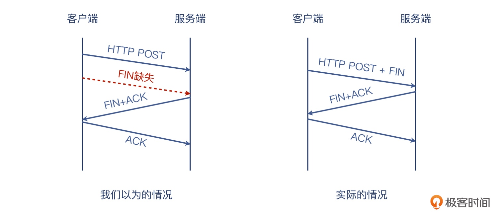

## 同时挥手

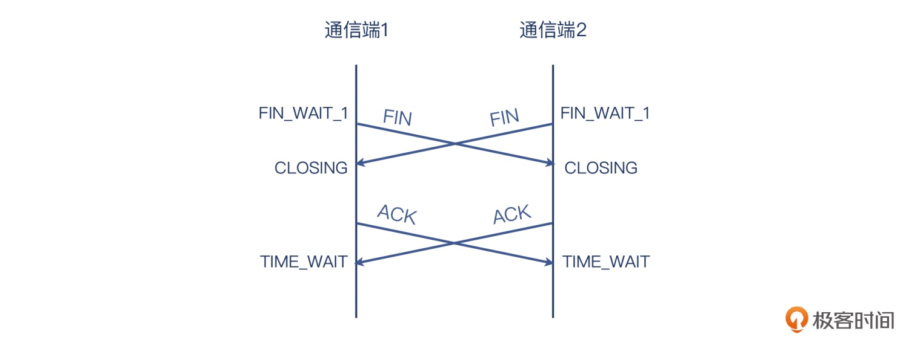

> 1. 双方同时发起关闭后，也同时进入了 FIN_WAIT_1 状态
> 2. 然后也因为收到了对方的 FIN，也都进入了 CLOSING 状态
> 3. 当双方都收到对方的 ACK 后，最终都进入了 TIME_WAIT 状态
