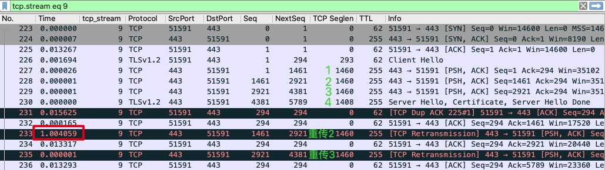

# 防火墙问题

> 防火墙本质上是一种网络设备

## 结合传输层和应用层
> 这里传输层就是指 TCP/UDP，应用层就是问题表象，比如超时、报错之类

> 具体的例子：一个应用 A 访问应用 B 的时候，经常耗时过长，甚至有时候事务无法在限定时间内完成，就导致报错。这是在访问 B 的 HTTPS 时发生的，访问 B 的 HTTP 就一切正常

> 应用 A 和应用 B 各自都是一组独立的集群。A 的众多机器，都访问 B 的位于负载均衡上的 VIP，然后 LB 再把请求转发给 B 的机器。这里的 HTTP 和 HTTPS 都位于同一个虚拟 IP，只是服务端口不同而已

> 选择两侧抓包，在 A 中选择了一台机器做 tcpdump 抓包，同时在 LB 的 HTTPS VIP 上也进行抓包。做这种双向抓包，需要注意：
> 1. 各端的抓包过滤条件一般以对端 IP 作为条件，比如 tcpdump dst host {对端 IP}，这样可以过滤掉无关的流量
> 2. 两端的抓包应该差不多在同时开始和结束，这样两端的报文就有尽量多的时间是重合的，便于对比分析
> 3. 在同时抓包的时间段内，要把问题重现。一边抓包，一边观察应用日志。出现错误日志后，停止了抓包

### 客户端报文
> 先查看客户端的报文情况。打开抓包文件后，进行以下操作：
> 1. 查看 expert information
> 2. 重点关注可疑报文（比如 Warining 级别），追踪其整个 TCP 流
> 3. 分析这个可疑 TCP 流的第二到四层的报文，再结合应用层表象，综合分析其根因
> 4. 结合两侧的抓包文件，找到属于同一个 TCP 流的数据包，对比分析

> 查看 expert information 这一步主要是为了获取整体的网络传送情况。在查看的时候，一种方式是打开 Analyze 菜单，选择最底部的 expert information。另一种方式是直接在窗口左下角，点击黄色的小圆圈

> - Warning 意味着可能有问题，应重点关注
> - Note 条目的底色是浅蓝色，是在允许范围内的小问题，也要关注。比如说 TCP 本身就是容许一定程度的重传的
> - Chat 条目的底色是正常蓝色，属于 TCP/UDP 的正常行为，可以作为参考

> Warning：有 7 个乱序的 TCP 报文，6 个未抓到的报文（如果是在抓包开始阶段，这种未抓到报文的情况也属正常）
> Note：有 1 个怀疑是快速重传，5 个是重传（一般是超时重传），6 个重复确认
> Chat：有 TCP 挥手阶段的 20 个 FIN 包，握手阶段的 10 个 SYN 包和 10 个 SYN + ACK 包

> 一般来说，乱序是应该被重点关注的。因为正常情况下，发送端的报文是按照先后顺序发送的，如果到了接收端发生了乱序，那么很可能是中间设备出现了问题，比如中间的交换机路由器做了一些处理，引发了报文乱序

> 点击 Warning 左边的小箭头，展开乱序的报文集合，就能看到这些报文的概览信息，习惯上会选择靠后一点的报文（因为相对靠后的报文所属的 TCP 流相对更完整），然后跟踪这些报文（Follow -> TCP Stream），找到所属的 TCP 流来进一步分析

> 这时，Wireshark 的显示过滤器栏出现了 tcp.stream eq 8 这个过滤器，这是点击 Follow -> TCP Stream 后自动生成的。重点关注下以下报文：
> 1. 189，服务端回复给客户端的报文，TCP previous segment not captured 意思是，它之前的报文没有在应该出现的位置上被抓到
> 2. 190，客户端回复给服务端的重复确认报文，可能会引起重传
> 3. 191，服务端给客户端的报文，是 TCP Out-of-Order，即乱序报文
> 4. 193，服务端给客户端的 TCP Retransmission，即重传报文
> 5. 195，也是服务端给客户端的重传报文

> 在 192 和 193 号报文之间，有 1.020215 秒的时间间隔。对于内网通信来说，时间是以毫秒计算的。一般内网的微服务的处理时间，等于网络往返时间 + 应用处理时间。基本可以判定：这个超长的耗时，很可能就是导致问题的直接原因

> TCP 里面有重传超时的设计，也就是如果发送端发送了一个数据包之后，对方迟迟没有回应的话，可以在一定时间内重传。这个一定时间就是 TCP 重传超时（Retransmission Timeout）。这里的 1 秒，很可能是这个重传超时的设计导致的

### 报文对比分析
> 对比两侧文件两端报文。TCP 序列号的长度是 4 个字节，其本质含义就是网络 IO 的字节位置。因为是 4 个字节，最大值可代表 4GB 的数据，如果一个流的数据超过 4GB，其序列号就要回绕复用了。不过一般来说，因为这个值的范围足够大，在短时间碰巧相同的概率几乎为零

> 首先，记录下客户端侧抓包文件中，那条 TCP 流的某个报文的 TCP 序列号。比如选择 SYN 包的序列号，是 4022234701。这里必须选裸序列号（Raw Sequence Number）。Wireshark 主窗口里显示的序 列号是处理过的相对序列号，为了方便阅读，把握手阶段的初始序列号当 1 处理，后续序列号相应地也都减去初始序列号，从而变成了相对序列号。但这样处理后，无论在哪个 TCP 流里面，Wireshark 展示的握手阶段序列号都是 1，后续序列号也都是 1+ 载荷字节数。相对序列号肯定是到处撞车的，所以不能作为选取的条件

> 查看裸序列号的方法：
> 1. 打开 Wireshark 的 Preference 菜单
> 2. 在弹出菜单的左侧选择 Protocols，选中其中的 TCP，然后在右侧的选项中，把 Relative sequence numbers 前面的勾去掉，就可以显示裸序列号了

> 然后，到服务端抓包文件里输入过滤器：tcp.seq_raw eq 4022234701，得到同样的这个 SYN 包。接下来还是 Follow -> TCP Stream，翻出来这个 SYN 包所属的服务端抓包里的 TCP 流

> 左侧是服务端抓包，右侧是客户端抓包。前 4 个报文的顺序没有任何变化，但服务端随后 一口气发送的 4 个包，到了客户端却变成了 4、1、2、3

> 后面 3 个报文的顺序还是正确的，真正乱序的其实只是 4，所以就导致了这样一个状况，不能满足快速重传的条件 3 个重复确认。这样的话，服务端就不得不用另外一种方式做重传，即超时重传。这里的 1 秒超时是硬件 LB 的设置值，而 Linux 的默认设置是 200 毫秒

> 这种程度的乱序发生在内网是不应该的，因为内网比公网要稳定很多。具体来说，是这样两个事实：
> 1. 在客户端和服务端之间，各有一道防火墙，两者之间设立有隧道
> 2. 因为软件 Bug 的问题，这个隧道在大包的封包拆包的过程中，很容易发生乱序

> 隧道是在原有的网络封装上再加上一层额外的封装，比如 IPIP 隧道，就是在 IP 头部外面再包上一层 IP 头部，于是形成了在原有 IP 层面里的又一个 IP 层，即隧道。由于这个封装和拆封都会消耗系统资源，加上代码方面处理不好，那么出 Bug 的概率就大大增加了

> 从抓包来看，HTTP 的 TCP 载荷只有两三百字节，远小于 MSS 的 1460 字节。这个跟隧道的关系是很大的，因为隧道会增加报文的大小。比如通常 MTU 为 1500 字节的 IP 报文，做了 IPIP 隧道封装后，就会达到 1520 字节，所以一般有隧道的场景下，主机的 MTU 都需要改小以适配隧道需求。如果网络没有启用 Jumbo Frame，那这个 1520 字节的报文，就会被路由器 / 防火墙拆分为 2 个报文。而到了接收端，又得把这两个报文合并起来。这一拆一合，出问题的概率就大大增加了

> 在 Linux 中，设置了 ipip 隧道后，这个隧道接口的 MTU 会自动降低 20 字节，从默认 1500 降低到 1480 字节

> 在大包情况下，这个隧道引发的是两种不同的开销：
> 1. IPIP 本身的隧道头的封包和拆包
> 2. IP 层因为超过 MTU 而引发的报文分片和合片

> HTTPS 是基于 TLS 加密的，TLS 握手阶段的多个 TCP 段就都撑满了 MSS，于是就触发了防火墙隧道的 Bug