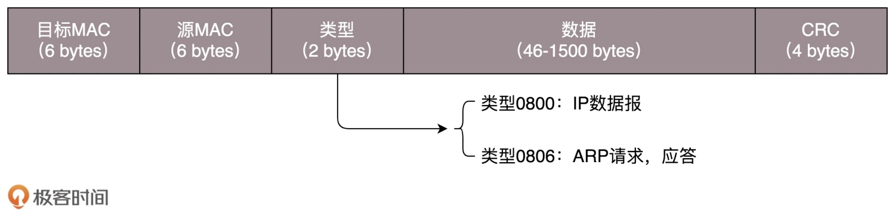
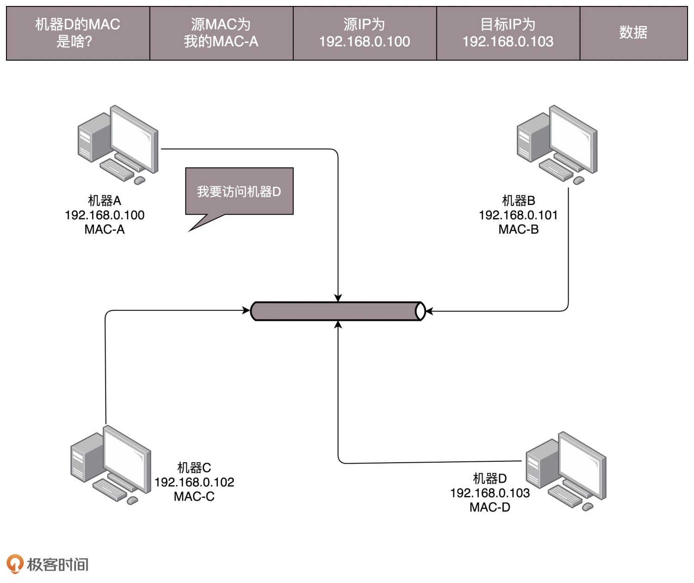
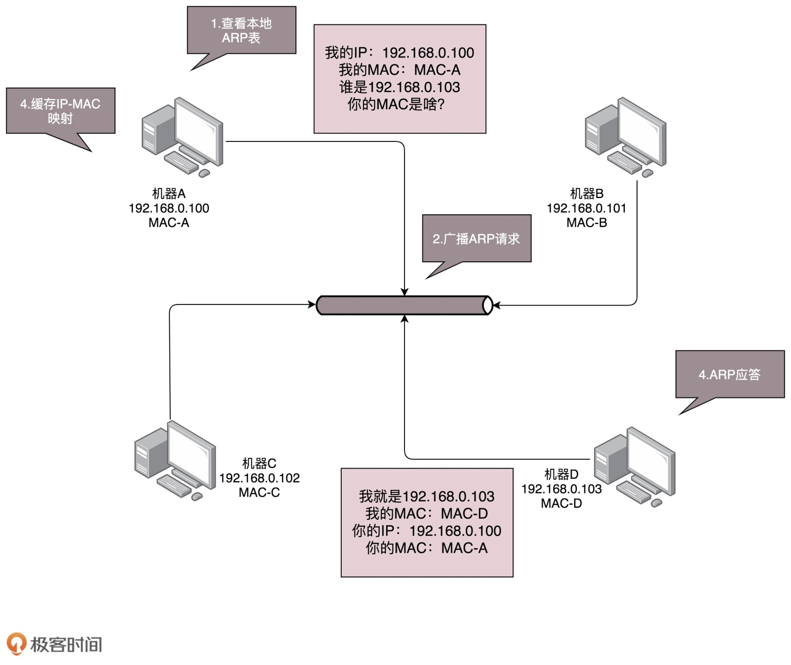
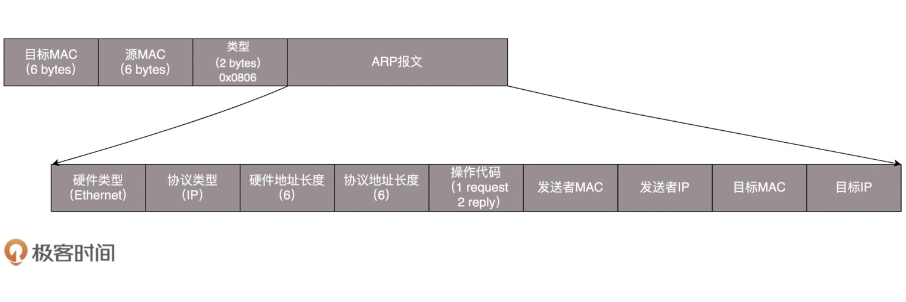

# 网络底层

## 物理层
> 集线器（Hub）是工作中物理层的设备。这种设备有多个口，可以将宿舍里的多台电脑连接起来

> 与交换机不同，集线器没有大脑，它完全在物理层工作。它会将自己收到的每一个字节，都复制到其他端口上去

## 数据链路层
> MAC 的全称是 Medium Access Control，即媒体访问控制。其实就是控制在往媒体上发数据的时候，谁先发、谁后发的问题。防止发生混乱

### ARP

> 在一个局域网里面，当知道了 IP 地址，不知道 MAC 的时候，就发送一个广播包，谁是这个 IP 谁来回答。为了避免每次都用 ARP 请求，机器本地也会进行 ARP 缓存。由于机器会不断地上线下线，IP 也可能会变，所以 ARP 的 MAC 地址缓存过一段时间就会过期

> ARP 报文：

### 交换机
> 在局域网中，集线器是广播的，不管某个接口是否需要，所有的 Bit 都会被发送出去，然后让主机来判断是不是需要。这种方式在机器少的情况下没问题，机器一旦变多，产生冲突的概率就提高了。而且把不需要的包转发过去，纯属浪费

> 一台 MAC1 电脑将一个包发送给另一台 MAC2 电脑，当这个包到达交换机的时候，一开始交换机也不知道 MAC2 的电脑在哪个口，所以没办法，它只能将包转发给除了来的那个口之外的其他所有的口。但是，这个时候交换机会记住，MAC1 是来自一个明确的口。以后有包的目的地址是 MAC1 的，直接发送到这个口就可以了

> 当过了一段时间之后，交换机就有了整个网络的一个结构了，这个时候，基本上不用广播了，全部可以准确转发。每个机器的 IP 地址会变，所在的口也会变，因而交换机上的学习的结果，称为转发表，是有一个过期时间的

### 广播风暴
> ARP 广播时，交换机会将一个端口收到的包转发到其它所有的端口上。比如数据包经过交换机 A 到达交换机 B，交换机 B 又将包复制为多份广播出去。如果整个局域网存在一个环路，使得数据包又重新回到了最开始的交换机 A，这个包又会被 A 再次复制多份广播出去

> 如此循环，数据包会不停得转发，而且越来越多，最终占满带宽，或者使解析协议的硬件过载，形成广播风暴

### RARP
> 没有硬盘的机器，无法持久化 IP 地址到本地，但有网卡，可以用 RARP 协议来获取 IP 地址。RARP 可以用于局域网管理员想指定机器 IP，又不想每台机器去设置静态 IP 的情况，可以在 RARP 服务器上配置 MAC 和 IP 对应的 ARP 表

> 这个协议现在用的不多了，都用 BOOTP 或者 DHCP 取代了