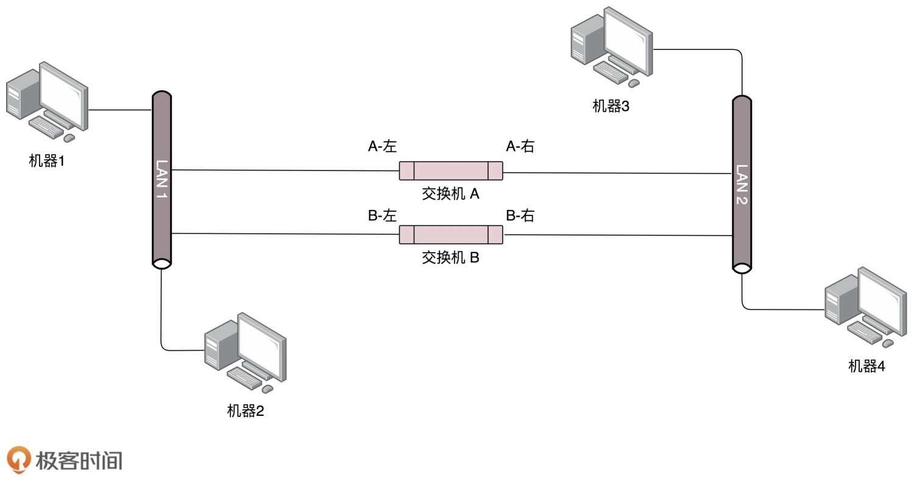
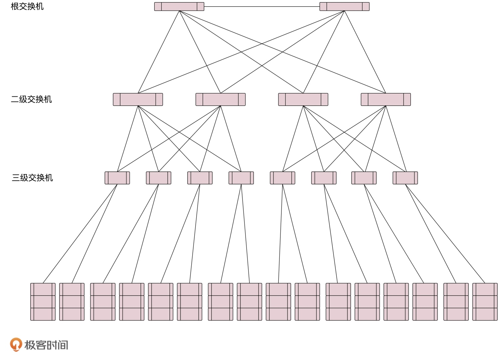
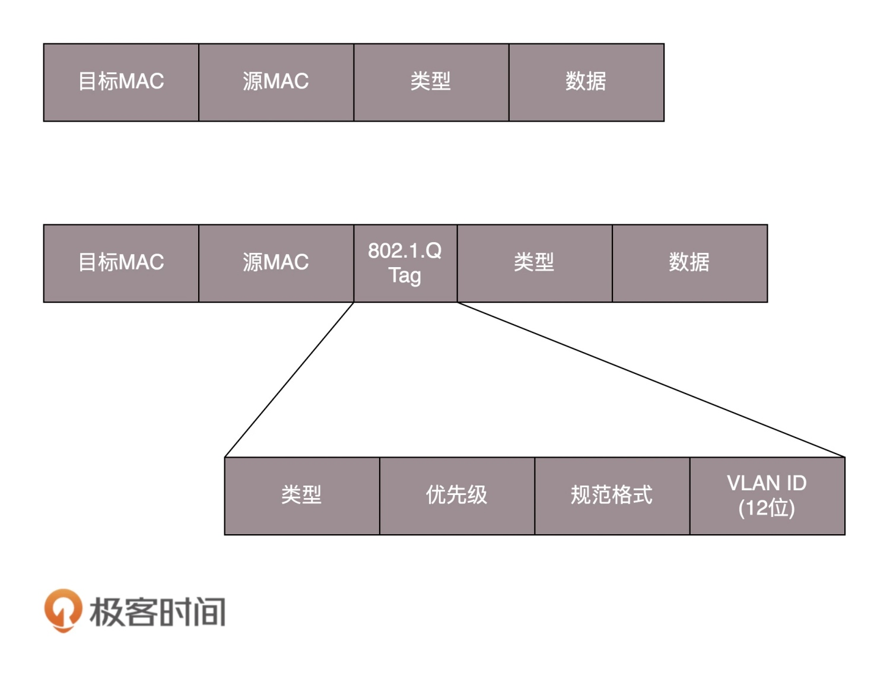
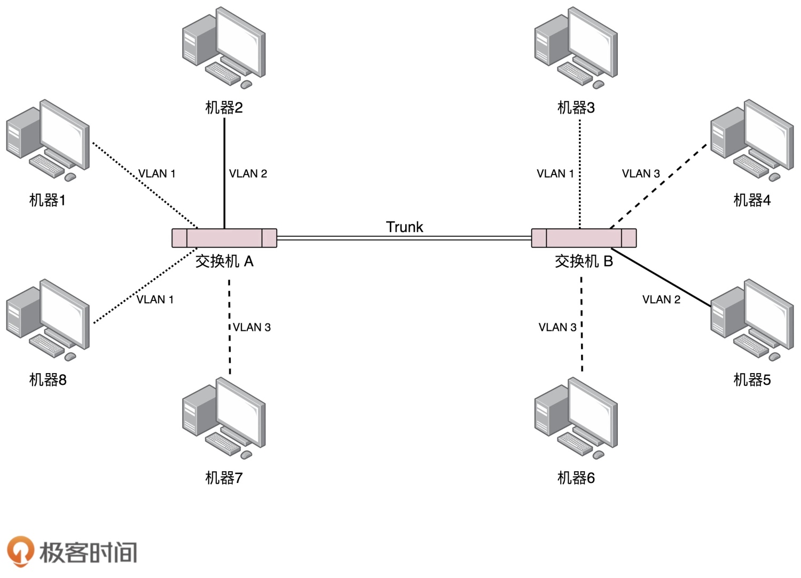

# VLAN

## 环路问题

> 机器 1 访问机器 2。一开始，机器 1 并不知道机器 2 的 MAC 地址，于是发起一个 ARP 的广播。机器 1 的广播包到达交换机 A 和交换机 B 的时候，两个交换机都知道了机器 1 是在局域网一，但是当交换机 A 将包广播到局域网二之后，交换机 B 右边的网口收到了来自交换机 A 的广播包。根据学习机制，交换机 B 发现机器 1 从左边的网口变到了右边的网口，误以为机器 1 换了位置。同理，交换机 A 右边的网口，也能收到交换机 B 转发过来的广播包，同样也误认为机器 1 从左边的网口变到了右边的网口。然而当广播包从左边的局域网一广播的时候，两个交换机再次改变了看法。如此往复，每台机器都会发广播包，交换机转发也会复制广播包，当广播包越来越多的时候，会越来越堵

## STP 协议
> STP，全称 Spanning Tree Protocol

> - Root Bridge，也就是根交换机。这个比较容易理解，可以比喻为掌门
> - Designated Bridges，可以想像成一个小弟
> - Bridge Protocol Data Units（BPDU）：网桥协议数据单元。BPDU 只有掌门能发，已经隶属于某个掌门的交换机只能传达掌门的指示
> - Priority Vector，优先级向量，可以比喻为实力，值越小越强。实力就是一组 ID 数目，[Root Bridge ID, Root Path Cost, Bridge ID, and Port ID]。实力对比，先看 Root Bridge ID，再比 Root Path Cost，最后比 Bridge ID

## 广播与安全
> 网络划分有两种方法：

> 一个是物理隔离。就是每个区域有单独的交换机，配置单独的子网，这样区域之间的沟通就需要路由器了。这样的问题在于，有的区域机器多，有的区域机器少。如果每个机器有单独的交换机，口多了浪费，少了又不够用

> 另外一种方式是虚拟隔离，就是 VLAN，或者叫虚拟局域网。使用 VLAN，一个交换机上会连属于多个局域网的机器。只需要在原来的二层的头上加一个 TAG，里面有一个 VLAN ID，一共 12 位，可以划分 4096 个 VLAN。当交换机把二层的头取下来的时候，就能够识别这个 VLAN ID。这样只有相同 VLAN 的包，才会互相转发，不同 VLAN 的包，是看不到的。这样广播问题和安全问题就都能够解决了

> 可以设置交换机每个口所属的 VLAN。如果某个口坐的是程序员，他们属于 VLAN 10；如果某个口坐的是财务，他们属于 VLAN 30。这样，财务发的包，交换机只会转发到 VLAN 30 的口上。而且对于交换机来讲，每个 VLAN 的口都是可以重新设置的。一个财务走了，把他所在座位的口从 VLAN 30 移除掉，来了一个程序员，坐在财务的位置上，就把这个口设置为 VLAN 10，十分灵活

> 对于支持 VLAN 的交换机，有一种口叫作 Trunk 口。它可以转发属于任何 VLAN 的口。交换机之间可以通过这种口相互连接

