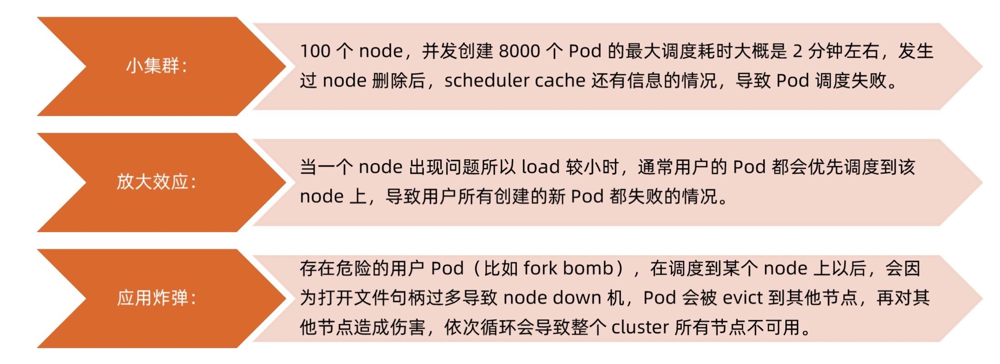

# scheduler

> scheduler 负责分配调度 pod 到集群内的节点上，它监听 apiserver，查询还未分配 Node 的 pod，然后根据调度策略为这些 pod 分配节点

> 调度器充分考虑以下因素：
> 1. 公平调度
> 2. 资源高效利用
> 3. QoS
> 4. affinity 和 anti-affinity
> 5. 数据本地化
> 6. 内部负载干扰
> 7. deadlines

> scheduler 调度分为两个阶段，predicate 和 priority
> 1. predicate: 过滤不符合条件的节点
> 2. priority: 优先级排序，选择优先级最高的节点

## 调度策略
### Predicates 策略


> Predicates plugin 工作原理


### Priorities 策略


## 资源需求
### CPU
> - requests: kubernetes 调度 pod 时，会判断当前节点正在运行的 pod 的 CPU Request 的总和，再加上当前调度 pod 的 CPU Request，计算其是否超过节点的 CPU 的可分配资源
> - limits: 配置 cgroups 以限制资源上限

### 内存
> - requests: 判断节点的剩余内存是否满足 pod 的内存请求量，以确定是否可以将 pod 调度到该节点
> - limits: 配置 cgroups 以限制资源上限

### 磁盘资源需求
> 容器临时存储包含日志和可写层数据，可以通过定义 pod spec 中的 limits.ephemeral-storage 和 requests.ephemeral-storage 来申请

> pod 调度完成后，计算节点对临时存储的限制不是基于 cgroup 的，而是由 kubelet 定时获取容器的日志和容器可写层的磁盘使用情况，如果超过限制，则会对 pod 进行驱逐

### init container 的资源需求
> 当 scheduler 调度带有多个 init 容器的 pod 时，只计算 cpu.request 最多的 init 容器，而不是计算所有的 init 容器总和

> 由于多个 init 容器按顺序执行，并且执行完成立即退出，所以申请最多的资源 init 容器中的所需资源，即可满足所有 init 容器需求

> scheduler 在计算该节点被占用的资源时，init 容器的资源依然会被纳入计算。因为 init 容器在特定情况下可能会被再次执行，比如由于更换镜像引起 sandbox 重建时

## node 选择



> 可以通过 nodeSelector、nodeAffinity、podAffinity 以及 Taints 和 tolerations 等来将 pod 调度到需要的 node 上。也可以通过设置 nodeName 参数，将 pod 调度到指定 node 节点上

### nodeSelector
```bash
# 指定该 pod 只想运行在带有 disktype=ssd 标签的 node 上
kubectl label nodes <node_name> disktype=ssd
```

### nodeAffinity
> nodeAffinity 目前支持两种：requiredDuringSchedulingIgnoredDuringExecution 和 preferredDuringSchedulingIgnoredDuringExecution，分别代表必须满足条件和优先条件

### podAffinity
> podAffinity 基于 pod 的标签来选择 node，仅调度到满足条件 pod 所在的 node 上，支持 podAffinity 和 podAntiAffinity

### Taints
> Taints 和 Tolerations 用于保证 pod 不被调度到不合适的 node 上，其中 Taint 应用于 node 上，Tolerations 应用于 pod 上

> 目前支持的 Taint 类型：
> - NoSchedule: 新的 pod 不调度到该 node 上，不影响正在运行的 pod
> - PreferNoSchedule: soft 版的 NoSchedule，尽量不调度到该 node 上
> - NoExecute: 新的 pod 不调度到该 node，并且删除已在运行的 pod。pod 可以增加 tolerationSeconds 时间

> 从 1.8 版本开始，scheduler 支持定义 pod 的优先级，从而保证高优先级的 pod 优先调度。开启方法：
> - apiserver 配置 --feature-gates=PodPriority=true 和 --runtime-config=scheduling.k8s.io/v1alpha1=true
> - scheduler 配置 --feature-gates=PodPriority=true

> 在指定 pod 优先级之前需要定义一个 PriorityClass（非 namespace 资源）

> 如果默认的调度器不满足要求，还可以部署自定义的调度器，并且整个集群中还可以同时运行多个调度器实例，通过 pod.Spec.scheduleName 来选择使用哪一个调度器
