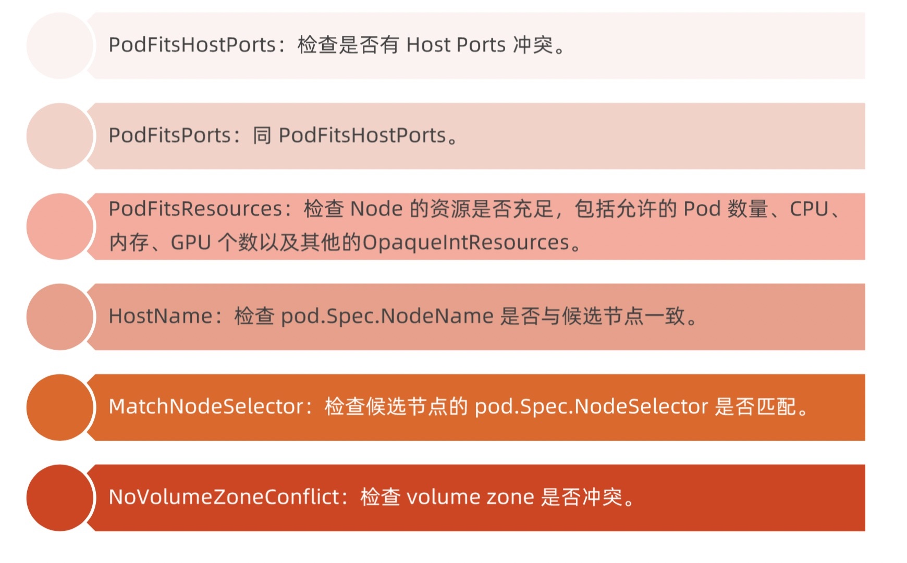
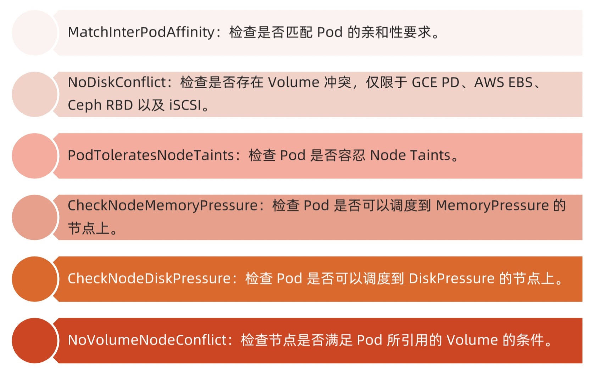
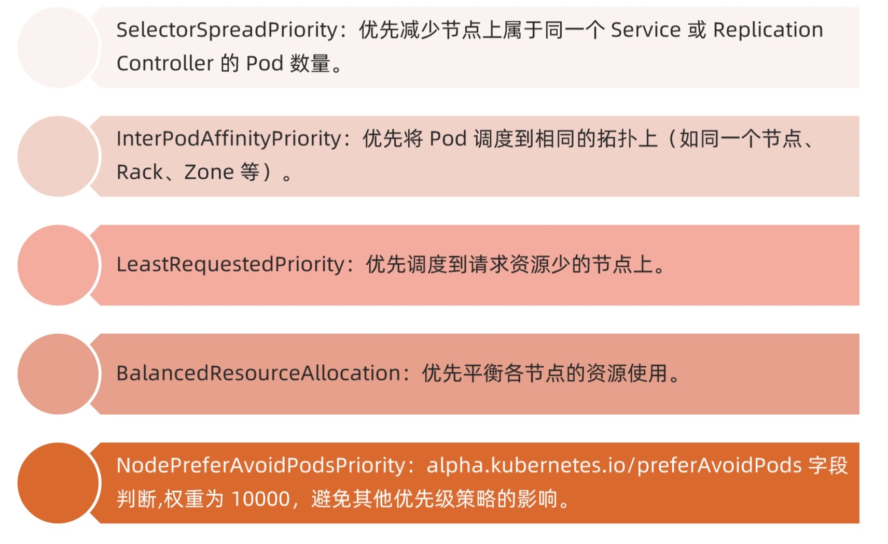
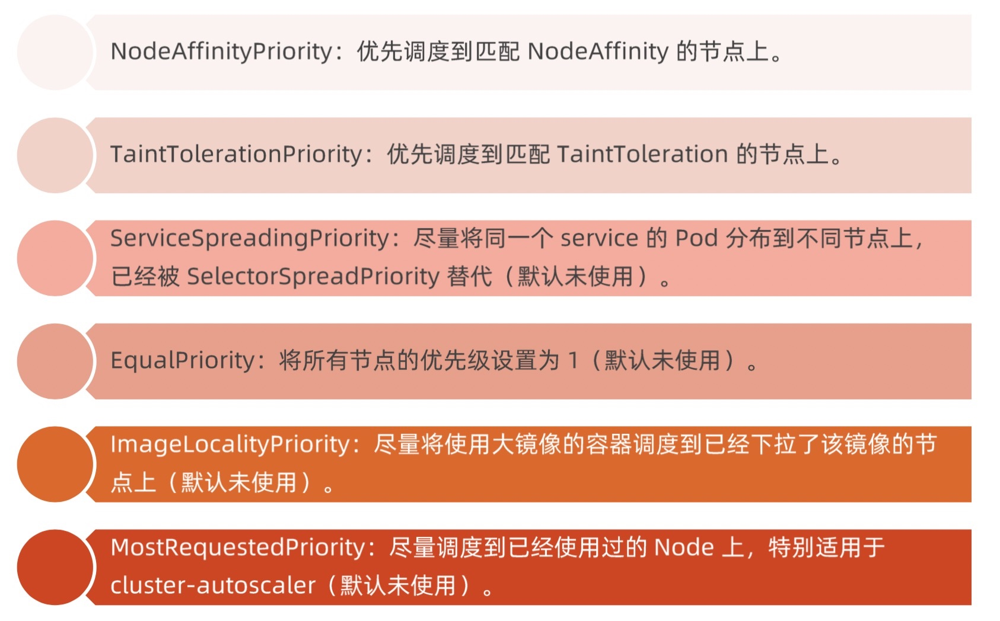

# scheduler

> scheduler 负责分配调度 pod 到集群内的节点上，它监听 apiserver，查询还未分配 Node 的 pod，然后根据调度策略为这些 pod 分配节点

> 调度器充分考虑以下因素：
> 1. 公平调度
> 2. 资源高效利用
> 3. QoS
> 4. affinity 和 anti-affinity
> 5. 数据本地化
> 6. 内部负载干扰
> 7. deadlines

> scheduler 调度分为两个阶段，predicate 和 priority
> 1. predicate: 过滤不符合条件的节点
> 2. priority: 优先级排序，选择优先级最高的节点

## 调度策略
### Predicates 策略

> Predicates plugin 工作原理

### Priorities 策略

