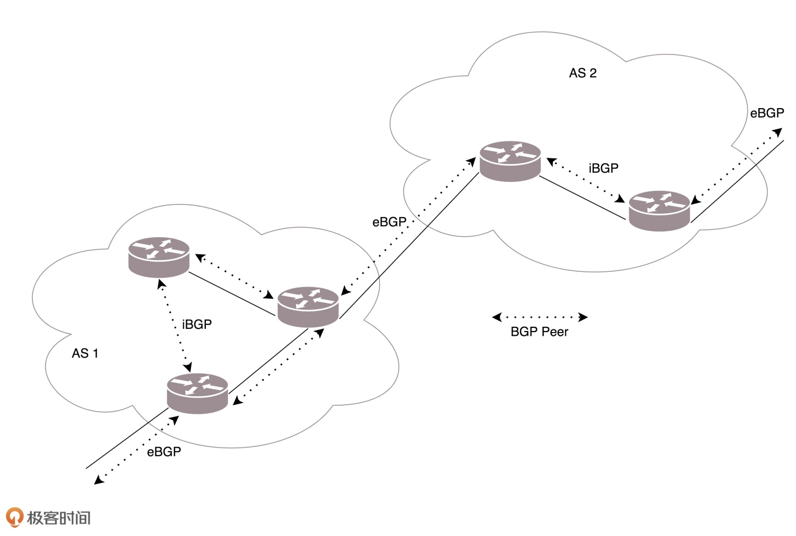

# 路由

## 网关


> 在 MAC 头里面，有一个协议类型，用来说明里面是 IP 协议。IP 头里面的版本号，目前主流的还是 IPv4。另外，还有 8 位标识协议，表示下一层的协议，是 TCP 还是 UDP

> 当要访问另一个 IP 地址的时候，都会先判断，这个目标 IP 地址，和当前机器的 IP 地址，是否在同一个网段。如果是同一个网段，就跟网关没有关系，直接将源地址和目标地址放入 IP 头中，然后通过 ARP 获得 MAC 地址，将源 MAC 和目的 MAC 放入 MAC 头中，发出去就可以了。如果不是同一网段，就需要发往默认网关 Gateway。Gateway 的地址一定是和源 IP 地址是一个网段的。往往不是第一个，就是第二个。发往网关的过程就和发往同一个网段的其他机器是一样的：将源地址和目标 IP 地址放入 IP 头中，通过 ARP 获得网关的 MAC 地址，将源 MAC 和网关的 MAC 放入 MAC 头中，发送出去

> 一个路由器往往有多个网口，如果是一台服务器做这个事情，则就有多个网卡，其中一个网卡是和源 IP 同网段的。路由器是一台设备，它有多个网口或者网卡，分别连着多个局域网。每个端口就是那个局域网的网关，它的 IP 地址都和局域网的 IP 地址有相同的网段。任何一个想发往其他局域网的包，都会到达其中一个网关，然后网关根据自己的路由算法，选择另一个网关，加上 IP 头和 MAC 头，然后发送出去

## 静态路由
> 静态路由，其实就是在路由器上，配置一条一条规则

> MAC 地址是一个局域网内才有效的地址。因而，MAC 地址只要过网关，就必定会改变，因为已经换了局域网。两者主要的区别在于 IP 地址是否改变。不改变 IP 地址的网关，称为转发网关；改变 IP 地址的网关，称为 NAT 网关


> 服务器 A 要访问服务器 B。首先，服务器 A 与 192.168.4.101 不是一个网段，因而需要先发给网关。那网关 192.168.1.1。网关的 MAC 地址通过发送 ARP 获取网关。然后发送数据包：
> - 源 MAC：服务器 A 的 MAC
> - 目标 MAC：192.168.1.1 这个网口的 MAC
> - 源 IP：192.168.1.101
> - 目标 IP：192.168.4.101

> 包到达 192.168.1.1 这个网口，发现 MAC 一致，将包收进来，找到匹配的路由，要从 192.168.56.1 这个口发出去，发给 192.168.56.2。路由器 A 发送 ARP 获取 192.168.56.2 的 MAC 地址，然后发送数据包：
> - 源 MAC：192.168.56.1 的 MAC 地址
> - 目标 MAC：192.168.56.2 的 MAC 地址
> - 源 IP：192.168.1.101
> - 目标 IP：192.168.4.101

> 包到达 192.168.56.2 这个网口，发现 MAC 一致，将包收进来，找到匹配的路由，要从 192.168.4.1 这个口出去，发给 192.168.4.101。路由器 B 发送 ARP 获取 192.168.4.101 的 MAC 地址，然后发送数据包：
> - 源 MAC：192.168.4.1 的 MAC 地址
> - 目标 MAC：192.168.4.101 的 MAC 地址
> - 源 IP：192.168.1.101
> - 目标 IP：192.168.4.101

> 包到达服务器 B，MAC 地址匹配，将包收进来


> 局域网之间没有商量过，各定各的网段，因而 IP 段冲突了。要解决这个问题，首先，目标服务器 B 在要有一个外部身份，比如 192.168.56.2。在网关 B 上，记下来外部身份 192.168.56.2 对应内部身份 192.168.1.101。凡是要访问 192.168.56.2，都转成 192.168.1.101

> 于是，源服务器 A 要访问目标服务器 B，要指定的目标地址为 192.168.56.2，这是它的外部身份。由于 192.168.56.2 和服务器 A 不是一个网段的，因而需要发给网关 192.168.1.1，发送数据包的内容是这样的：
> - 源 MAC：服务器 A 的 MAC
> - 目标 MAC：192.168.1.1 这个网口的 MAC
> - 源 IP：192.168.1.101
> - 目标 IP：192.168.56.2

> 包到达 192.168.1.1 这个网口，发现 MAC 一致，将包收进来。然后发给 192.168.56.2。当网络包发送到中间的局域网的时候，服务器 A 也需要有个外部身份，所以源 IP 地址也不能用 192.168.1.101，需要改成 192.168.56.1。发送包的内容是这样的：
> - 源 MAC：192.168.56.1 的 MAC 地址
> - 目标 MAC：192.168.56.2 的 MAC 地址
> - 源 IP：192.168.56.1
> - 目标 IP：192.168.56.2

> 包到达 192.168.56.2 这个网口，发现 MAC 一致，将包收进来，路由器 B 是一个 NAT 网关，它上面配置了，要访问外部身份 192.168.56.2 对应内部身份 192.168.1.101，于是改为访问 192.168.1.101。于是，从 192.168.1.1 这个口发出去，发给 192.168.1.101。数据包的内容是这样的：
> - 源 MAC：192.168.1.1 的 MAC 地址
> - 目标 MAC：192.168.1.101 的 MAC 地址
> - 源 IP：192.168.56.1
> - 目标 IP：192.168.1.101

> 包到达服务器 B，MAC 地址匹配，将包收进来。从服务器 B 接收的包可以看出，源 IP 为服务器 A 的外部身份，因而发送返回包的时候，也发给这个外部身份，由路由器 A 做 NAT，转换为内部身份。从这个过程可以看出，IP 地址也会变

## 路由配置
> 通过 route 命令和 ip route 命令都可以进行查询或者配置

### 根据目标 IP 配置
> 去 10.176.48.0/20 这个目标网络，要从 eth0 端口出去，经过 10.173.32.1

```bash
ip route add 10.176.48.0/20 via 10.173.32.1 dev eth0
```

### 策略路由
> 从 192.168.1.10/24 这个网段来的，使用 table 10 中的路由表，而从 192.168.2.0/24 网段来的，使用 table 20 的路由表

```bash
ip rule add from 192.168.1.0/24 table 10
ip rule add from 192.168.2.0/24 table 20
```

> 在一条路由规则中，下一跳可以有多个地方，分别是 100.100.100.1 和 200.200.200.1，权重分别为 1 比 2

```bash
ip route add default scope global nexthop via 100.100.100.1 weight 1 nexthop via 200.200.200.1 weight 2
```

> 查看以下网络拓扑的配置

```bash
ip route list table main
```

```
60.190.27.189/30 dev eth3  proto kernel  scope link  src 60.190.27.190
183.134.188.1 dev eth2  proto kernel  scope link  src 183.134.189.34
192.168.1.0/24 dev eth1  proto kernel  scope link  src 192.168.1.1
127.0.0.0/8 dev lo  scope link
default via 183.134.188.1 dev eth2
```

> 路由规则解释如下：
> 1. 如果去运营商二，走 eth3
> 2. 如果去运营商一，走 eth2
> 3. 如果访问内网，走 eth1
> 4. 如果所有的规则都匹配不上，默认走运营商一，也即走快的网络


> 定制化，添加一个 Table，名字为 pain

```bash
echo 200 pain >> /etc/iproute2/rt_tables
```

> 添加一条规则：设定规则为：从 192.168.1.101 来的包都查看 pain 这个新的路由表

```bash
ip rule add from 192.168.1.101 table pain
ip rule ls
```

> 在 pain 路由表中添加规则：

```bash
ip route add default via 60.190.27.189 dev eth3 table pain
ip route flush cache
```

## 动态路由
### 路由算法
#### 距离矢量路由
> 距离矢量路由（distance vector routing）是基于 Bellman-Ford 算法的。这种算法的基本思路是，每个路由器都保存一个路由表，包含多行，每行对应网络中的一个路由器，每一行包含两部分信息，一个是要到目标路由器，从那条线出去，另一个是到目标路由器的距离。由此可以看出，每个路由器都是知道全局信息的

> 每个路由器都知道自己和邻居之间的距离，每过几秒，每个路由器都将自己所知的到达所有的路由器的距离告知邻居，每个路由器也能从邻居那里得到相似的信息。每个路由器根据新收集的信息，计算和其他路由器的距离，比如自己的一个邻居距离目标路由器的距离是 M，而自己距离邻居是 x，则自己距离目标路由器是 x + M

> 这个算法比较简单，有以下不足之处：
> 1. 好消息传得快，坏消息传得慢。如果有个路由器加入了这个网络，它的邻居就能很快发现它，然后将消息广播出去。要不了多久，整个网络就都知道了。但是一旦一个路由器挂了，挂的消息是没有广播的。当每个路由器发现原来的道路到不了这个路由器的时候，感觉不到它已经挂了，而是试图通过其他的路径访问，直到试过了所有的路径，才发现这个路由器是真的挂了
> 2. 每次发送的时候，要发送整个全局路由表。最早的路由协议 RIP 就是这个算法，它适用于小型网络（小于 15 跳）


#### 链路状态路由
> 链路状态路由（link state routing），基于 Dijkstra 算法。这种算法的基本思路是：当一个路由器启动的时候，首先是发现邻居，向邻居 say hello，邻居都回复。然后计算和邻居的距离，发送一个 echo，要求马上返回，除以二就是距离。然后将自己和邻居之间的链路状态包广播出去，发送到整个网络的每个路由器。这样每个路由器都能够收到它和邻居之间的关系的信息。因而，每个路由器都能在自己本地构建一个完整的图，然后针对这个图使用 Dijkstra 算法，找到两点之间的最短路径

> 不需要像距离距离矢量路由算法那样，更新时发送整个路由表。链路状态路由协议只广播更新的或改变的网络拓扑，这使得更新信息更小，节省了带宽和 CPU 利用率。而且一旦一个路由器挂了，它的邻居都会广播这个消息，可以使得坏消息迅速收敛

### 路由协议
#### OSPF
> OSPF（Open Shortest Path First，开放式最短路径优先）是基于链路状态路由算法的路由协议，广泛应用在数据中心中。由于主要用在数据中心内部，用于路由决策，因而称为内部网关协议（Interior Gateway Protocol，简称 IGP）

> 内部网关协议的重点就是找到最短的路径。在一个组织内部，路径最短往往最优。当然有时候 OSPF 可以发现多个最短的路径，可以在这多个路径中进行负载均衡，这常常被称为等价路由


> 有了等价路由，到一个地方去可以有相同的两个路线，可以分摊流量，还可以当一条路不通的时候，走另外一条路

#### BGP
> BGP（Border Gateway Protocol，简称 BGP），外网路由协议

> 在网络世界，自治系统 AS（Autonomous System）分几种类型
> 1. Stub AS：对外只有一个连接。这类 AS 不会传输其他 AS 的包。例如，个人或者小公司的网络
> 2. Multihomed AS：可能有多个连接连到其他的 AS，但是大多拒绝帮其他的 AS 传输包。例如一些大公司的网络
> 3. Transit AS：有多个连接连到其他的 AS，并且可以帮助其他的 AS 传输包。例如主干网。每个自治系统都有边界路由器，通过它和外面的世界建立联系

> BGP 又分为两类，eBGP 和 iBGP。自治系统间，边界路由器之间使用 eBGP 广播路由。内部网络也需要访问其他的自治系统，边界路由器通过运行 iBGP，使得内部的路由器能够找到到达外网目的地的最好的边界路由器

> BGP 协议使用的算法是路径矢量路由协议（path-vector protocol）。它是距离矢量路由协议的升级版。在 BGP 里面，除了下一跳之外，还包括了自治系统 AS 的路径，从而可以避免坏消息传得慢的问题，也即上面所描述的，B 知道 C 原来能够到达 A，是因为通过自己，一旦自己都到达不了 A 了，就不用假设 C 还能到达 A 了。另外，在路径中将一个自治系统看成一个整体，不区分自治系统内部的路由器，这样自治系统的数目是非常有限的

