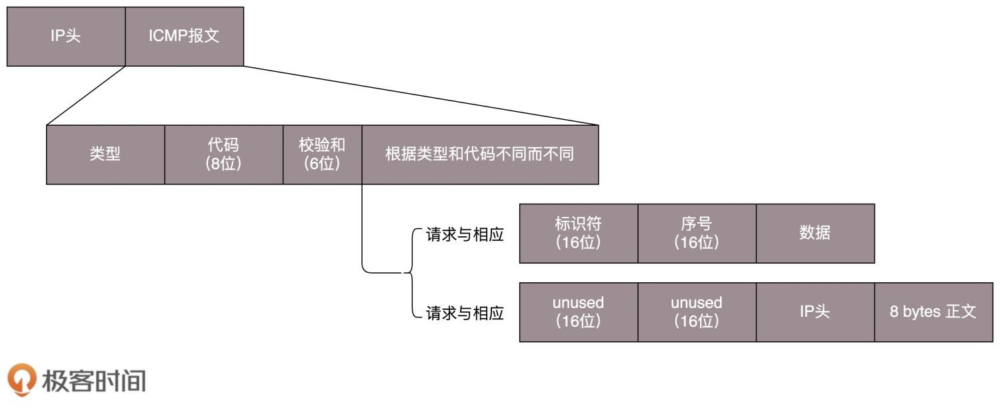
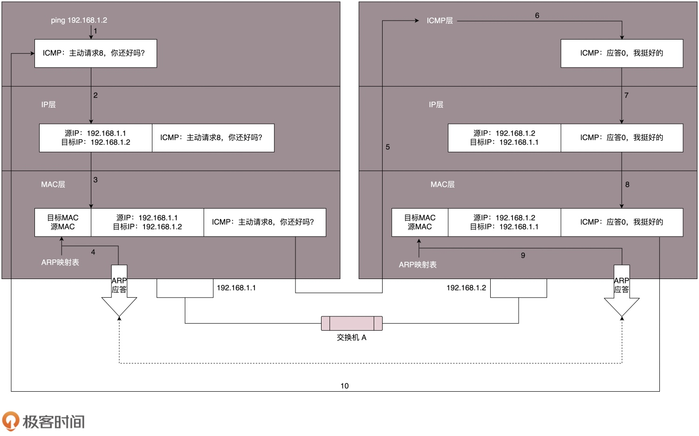

# ICMP

> ICMP 全称 Internet Control Message Protocol，是互联网控制报文协议

## 格式
> ICMP 报文是封装在 IP 包里面的

## 类型
> ICMP 报文有很多的类型，不同的类型有不同的代码。最常用的类型是主动请求为 8，主动请求的应答为 0

### 查询报文类型
> 常用的 ping 就是查询报文，是一种主动请求，并且获得主动应答的 ICMP 协议。所以，ping 发的包也是符合 ICMP 协议格式的，只不过它在后面增加了自己的格式

> 对 ping 的主动请求，进行网络抓包，称为 ICMP ECHO REQUEST。同理主动请求的回复，称为 ICMP ECHO REPLY。比起原生的 ICMP，这里面多了两个字段，一个是标识符，另一个是序号。在选项数据中，ping 还会存放发送请求的时间值，来计算往返时间，说明路程的长短

### 差错报文类型
> ICMP 差错报文的例子：终点不可达为 3，源抑制为 4，超时为 11，重定向为 5

> 1. 终点不可达，具体的原因又分为：网络不可达代码为 0，主机不可达代码为 1，协议不可达代码为 2，端口不可达代码为 3，需要进行分片但设置了不分片位代码为 4
> 2. 源站抑制，也就是让源站放慢发送速度
> 3. 时间超时，也就是超过网络包的生存时间还是没到
> 4. 路由重定向，也就是让下次发给另一个路由器。

> 差错报文的结构相对复杂一些。除了前面还是 IP，ICMP 的前 8 字节不变，后面则跟上出错的那个 IP 包的 IP 头和 IP 正文的前 8 个字节

## Ping

> 假定主机 A 的 IP 地址是 192.168.1.1，主机 B 的 IP 地址是 192.168.1.2，它们都在同一个子网。在主机 A 上运行 ping 192.168.1.2 后，源主机首先会构建一个 ICMP 请求数据包，ICMP 数据包内包含多个字段。最重要的有两个：
> 1. 类型字段，对于请求数据包而言该字段为 8
> 2. 顺序号，用于区分连续 ping 的时候发出的多个数据包。每发出一个请求数据包，顺序号会自动加 1。为了能够计算往返时间 RTT，它会在报文的数据部分插入发送时间

> 然后，由 ICMP 协议将这个数据包连同地址 192.168.1.2 一起交给 IP 层。IP 层将以 192.168.1.2 作为目的地址，本机 IP 地址作为源地址，加上一些其他控制信息，构建一个 IP 数据包。接下来，由数据链路层构建一个数据帧，依据以太网的介质访问规则，将它们传送出去

> 主机 B 收到这个数据帧后，将 IP 数据包从帧中提取出来，IP 层将有用的信息提取后交给 ICMP 协议。主机 B 会构建一个 ICMP 应答包，应答数据包的类型字段为 0，顺序号为接收到的请求数据包中的顺序号，然后再发送出去给主机 A

> 在规定的时候间内，源主机如果没有接到 ICMP 的应答包，则说明目标主机不可达；如果接收到了 ICMP 应答包，则说明目标主机可达。此时，源主机会检查，用当前时刻减去该数据包最初从源主机上发出的时刻，就是 ICMP 数据包的时间延迟

## Traceroute
> Traceroute 使用 ICMP 的规则，故意制造一些能够产生错误的场景

> Traceroute 的第一个作用就是故意设置特殊的 TTL，来追踪去往目的地时沿途经过的路由器。Traceroute 的参数指向某个目的 IP 地址，它会发送一个 UDP 的数据包。将 TTL 设置成 1。于是，返回一个 ICMP 包，也就是网络差错包，类型是时间超时。接下来，将 TTL 设置为 2。如此反复，直到到达目的主机。这样，Traceroute 就拿到了所有的路由器 IP。当然，有的路由器压根不会回这个 ICMP

> Traceroute 程序会发送一份 UDP 数据报给目的主机，但它会选择一个不可能的值作为 UDP 端口号（大于 30000）。当该数据报到达时，将使目的主机的 UDP 模块产生一份端口不可达错误 ICMP 报文。如果数据报没有到达，则可能是超时

> Traceroute 还有一个作用是故意设置不分片，从而确定路径的 MTU。首先是发送分组，并设置不分片标志。发送的第一个分组的长度正好与出口 MTU 相等。如果中间遇到窄的关口会被卡住，会发送 ICMP 网络差错包，类型为需要进行分片但设置了不分片位。每次收到 ICMP 不能分片差错时就减小分组的长度，直到到达目标主机