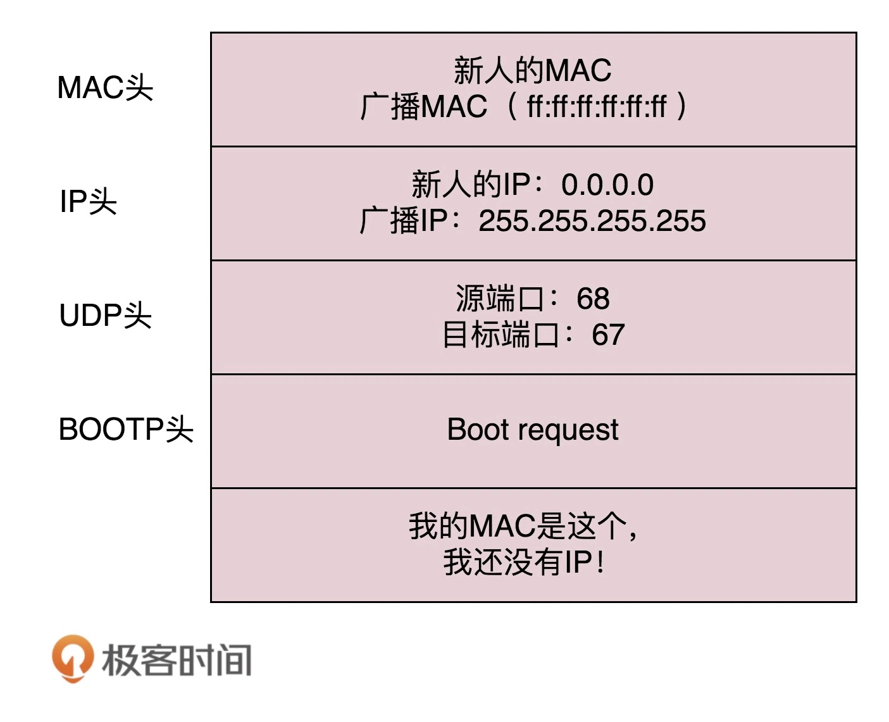
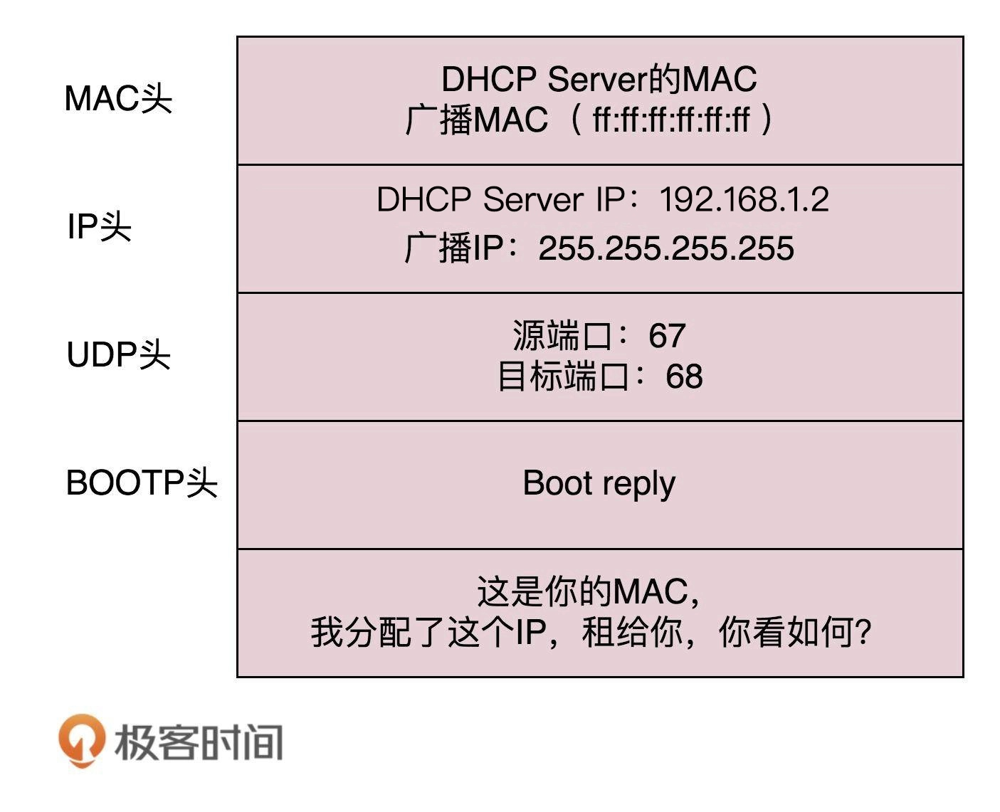
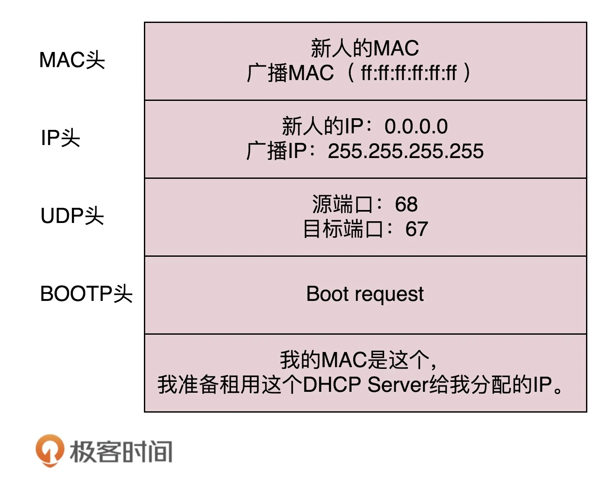
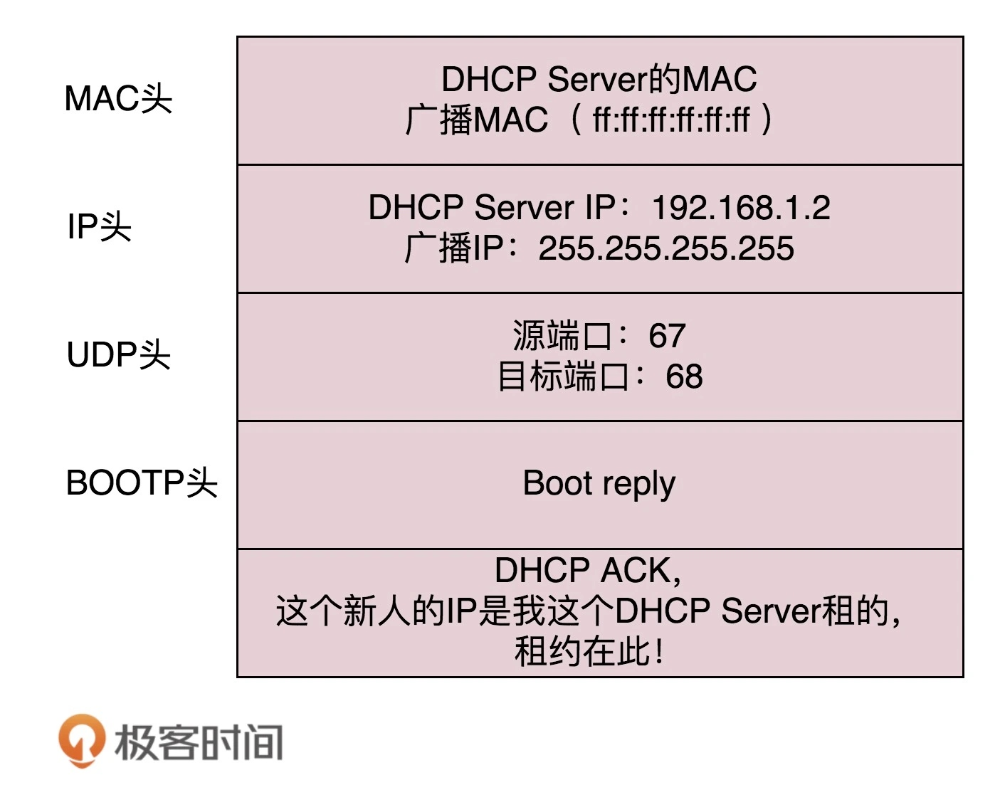
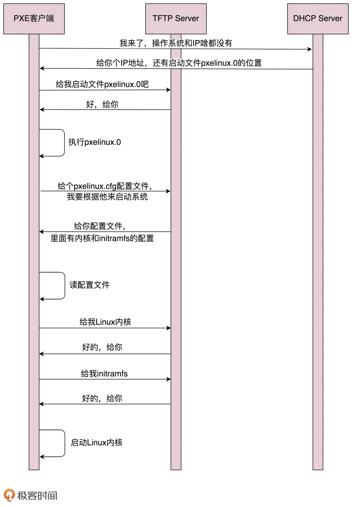

# DHCP

## IP 配置
> net-tools

```bash
sudo ifconfig eth1 10.0.0.1/24
sudo ifconfig eth1 up
```

> iproute2

```bash
sudo ip addr add 10.0.0.1/24 dev eth1
sudo ip link set up eth1
```

> 配置 IP 地址的时候，要特别注意不能配错。例如，旁边的机器都是 192.168.1.x，结果配置一个 16.158.23.6，会导致包发不出去

> 源 IP 地址是 16.158.23.6，目标 IP 地址是 192.168.1.6。自己的 MAC 地址是知道的，但是目标 MAC 还不知道。Linux 会判断，目标 IP 地址和源 IP 地址是否是一个网段的，或者和机器上的一个网卡是同一网段。只有是一个网段的，它才会发送 ARP 请求，获取 MAC 地址。如果不是，那就是跨网段调用，就不会直接将包发送到网络上，而是将包发送到网关

> 如果配置了网关，Linux 会获取网关的 MAC 地址，然后将包发出去。对于 192.168.1.6 这台机器来讲，虽然路过的数据包，目标 IP 是它，但是 MAC 地址不是它的，所以它的网卡是不会把包收进去的。如果没有配置网关呢，那包压根就发不出去

> 如果想将网关配置为 192.168.1.6，是不会成功的，因为网关要和当前的网络至少一个网卡是同一个网段的，因此 16.158.23.6 的网关不可能是 192.168.1.6

## 动态主机配置协议（DHCP）
### DHCP Discover
> 当一台机器新加入一个网络的时候，只知道自己的 MAC 地址。先使用 IP 地址 0.0.0.0 发送了一个广播包，目的 IP 地址为 255.255.255.255。广播包封装了 UDP，UDP 封装了 BOOTP。其实 DHCP 是 BOOTP 的增强版，但是如果去抓包的话，很可能看到的名称还是 BOOTP 协议



### DHCP Offer
> 当一台机器带着自己的 MAC 地址加入一个网络的时候，MAC 是它唯一的身份，如果连这个都重复了，就没办法配置了。只有 MAC 唯一，IP 管理员（DHCP Server）才能知道这是一个新人，需要租给它一个 IP 地址，这个过程称为 DHCP Offer。同时，DHCP Server 为此客户保留为它提供的 IP 地址，从而不会为其他 DHCP 客户分配此 IP 地址



> DHCP Server 仍然使用广播地址作为目的地址，因为，此时请求分配 IP 的新人还没有自己的 IP。DHCP Server 回复分配了一个可用的 IP，此外，服务器还发送了子网掩码、网关和 IP 地址租用期等信息。如果有多个 DHCP Server，这台新机器会收到多个 IP 地址，它会选择其中一个 DHCP Offer，一般是最先到达的那个，并且会向网络发送一个 DHCP Request 广播数据包，包中包含客户端的 MAC 地址、接受的租约中的 IP 地址、提供此租约的 DHCP 服务器地址等，并告诉所有 DHCP Server 它将接受哪一台服务器提供的 IP 地址，告诉其他 DHCP 服务器，请求撤销它们提供的 IP 地址，以便提供给下一个 IP 租用请求者



> 此时，由于还没有得到 DHCP Server 的最后确认，客户端仍然使用 0.0.0.0 为源 IP 地址、255.255.255.255 为目标地址进行广播。在 BOOTP 里面，接受某个 DHCP Server 的分配的 IP。当 DHCP Server 接收到客户机的 DHCP request 之后，会广播返回给客户机一个 DHCP ACK 消息包，表明已经接受客户机的选择，并将这一 IP 地址的合法租用信息和其他的配置信息都放入该广播包，发给客户机



### IP 地址收回与续租
> DHCP Server 分配的 IP 地址是有租期的，租期到了，管理员就要将 IP 收回。如果不用的话，收回就收回了。如果还要续租的话，客户机会在租期过去 50% 的时候，直接向为其提供 IP 地址的 DHCP Server 发送 DHCP request 消息包。客户机接收到该服务器回应的 DHCP ACK 消息包，会根据包中所提供的新的租期以及其他已经更新的 TCP/IP 参数，更新自己的配置。这样，IP 租用更新就完成了

## PXE
> 预启动执行环境（Pre-boot Execution Environment），简称 PXE。PXE 协议分为客户端和服务器端，由于还没有操作系统，只能先把客户端放在 BIOS 里面。当计算机启动时，BIOS 把 PXE 客户端调入内存里面，就可以连接到服务端做一些操作了

> 首先，PXE 客户端自己也需要有个 IP 地址。因为 PXE 的客户端启动起来，就可以发送一个 DHCP 的请求，让 DHCP Server 给它分配一个地址。PXE 客户端有了自己的地址，但不知道 PXE 服务器的地址，好在 DHCP Server 除了分配 IP 地址以外，还可以做一些其他的事情。这里有一个 DHCP Server 的一个样例配置：

```
ddns-update-style interim;
ignore client-updates;
allow booting;
allow bootp;
subnet 192.168.1.0 netmask 255.255.255.0
{
option routers 192.168.1.1;
option subnet-mask 255.255.255.0;
option time-offset -18000;
default-lease-time 21600;
max-lease-time 43200;
range dynamic-bootp 192.168.1.240 192.168.1.250;
filename "pxelinux.0";
next-server 192.168.1.180;
}
```

> 默认的 DHCP Server 是需要配置的，一般配置所需要的 IP 地址段、子网掩码、网关地址、租期等。如果想使用 PXE，则需要配置 next-server，指向 PXE 服务器的地址，另外要配置初始启动文件 filename。这样 PXE 客户端启动之后，发送 DHCP 请求之后，除了能得到一个 IP 地址，还可以知道 PXE 服务器的位置，也可以知道如何从 PXE 服务器上下载某个文件，去初始化操作系统

> 解析 PXE 的工作过程：
> 1. 启动 PXE 客户端。第一步是通过 DHCP 协议向 DHCP Server 申请 IP 地址，DHCP Server 提供 IP 地址，同时也提供 PXE 服务器的地址、启动文件 pxelinux.0
> 2. PXE 客户端开始下载文件，下载的时候使用的是 TFTP 协议。所以 PXE 服务器上，往往还需要有一个 TFTP 服务器
> 3. PXE 客户端收到文件后，开始执行文件。这个文件会指示 PXE 客户端，向 TFTP 服务器请求计算机的配置信息 pxelinux.cfg。配置文件里面会提供内核地址、initramfs 地址。PXE 客户端会请求这些文件
> 4. 启动 Linux 内核

