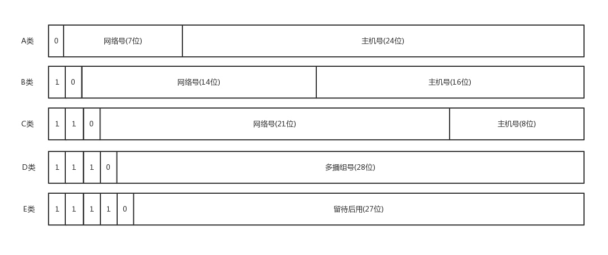
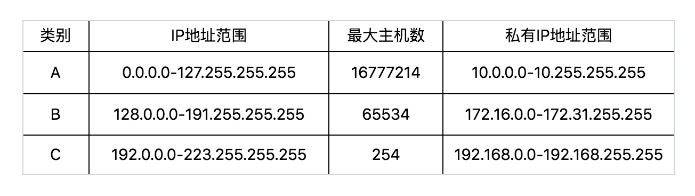

# IP 地址

## IP 分类
### ABC 分类





> 这种分类方式有一个问题：C 类地址能包含的最大主机数量太少了，只有 254 个，估计一个网吧都不够用。而 B 类地址能包含的最大主机数量又太多了。6 万多台机器放在一个网络下面，一般的企业基本达不到这个规模，闲着的地址就是浪费

### CIDR
> 无类型域间选路，简称 CIDR。这种方式打破了原来设计的几类地址的做法，将 32 位的 IP 地址一分为二，前面是网络号，后面是主机号。比如 10.100.122.2/24，前 24 位是网络号，后 8 位是主机号

> 伴随着 CIDR 存在的，一个是广播地址，10.100.122.255。如果发送这个地址，所有 10.100.122 网络里面的机器都可以收到。另一个是子网掩码，255.255.255.0。将子网掩码和 IP 地址按位计算 AND，就可得到网络号

### 公有与私有


> 表格最右列是私有 IP 地址段。这些地址允许组织内部的 IT 人员自己管理、自己分配，而且可以重复。公有 IP 地址有个组织统一分配，需要去买

## MAC 地址
> MAC 地址，是一个网卡的物理地址，用十六进制，6 个 byte 表示。MAC 地址号称全局唯一，不会有两个网卡有相同的 MAC 地址，而且网卡自生产出来，就带着这个地址

> 很多人会认为：整个互联网的通信可以全部用 MAC 地址，只要知道了对方的 MAC 地 址，就可以把信息传过去。这样是不可行的。一个网络包要从一个地方传到另一个地方，除了要有确定的地址，还需要有定位功能

> MAC 地址更像是身份证，是一个唯一的标识。它的唯一性设计是为了组网的时候，不同的网卡放在一个网络里面的时候，可以不用担心冲突。从硬件角度，保证不同的网卡有不同的标识

> MAC 地址是有一定定位功能的，只不过范围非常有限，通信范围比较小，局限在一个子网里面。例如，从 192.168.0.2/24 访问 192.168.0.3/24 是可以用 MAC 地址的。一旦跨子网，即从 192.168.0.2/24 到 192.168.1.2/24，MAC 地址就不行了，需要 IP 地址起作用

## 网络设备状态标识

```bash
ip addr
```

```
<BROADCAST,MULTICAST,UP,LOWER_UP>
```

> UP 表示网卡处于启动的状态；BROADCAST 表示这个网卡有广播地址，可以发送广播包；MULTICAST 表示网卡可以发送多播包；LOWER_UP 表示 L1 是启动的

```
MTU1500
```

> 表示最大传输单元 MTU 为 1500，这是以太网的默认值。MTU 是二层 MAC 层的概念。MAC 层有 MAC 的头，以太网规定连 MAC 头带正文合起来，不允许超过 1500 个字节。正文里面有 IP 的 头、TCP 的头、HTTP 的头。如果放不下，就需要分片来传输

```
qdisc pfifo_fast
```

> qdisc 全称是 queueing discipline，中文叫排队规则。 内核如果需要通过某个网络接口发送数据包，它都需要按照为这个接口配置的排队规则把数据包加入队列。最简单的 qdisc 是 pfifo，它不对进入的数据包做任何的处理，数据包采用先入先出的方式通过队列。pfifo_fast 稍微复杂一些，它的队列包括三个波段（band）。在每个波段里面，使用先进先出规则

> 三个波段的优先级也不相同。band 0 的优先级最高，band 2 的最低。如果 band 0 里面有数据包，系统就不会处理 band 1 里面的数据包，band 1 和 band 2 之间也是一样

> 数据包按照服务类型（Type of Service，TOS）被分配到三个波段里面。TOS 是 IP 头里面的一个字段，代表了当前的包是高优先级的，还是低优先级的