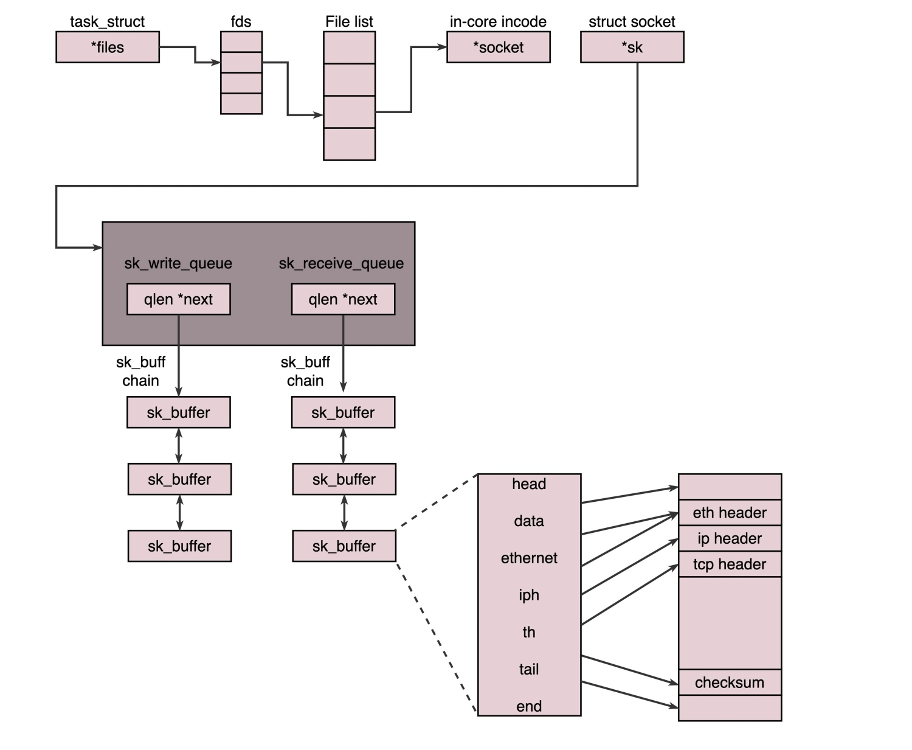

# SOCKET

## TCP
> 服务端调用 listen 函数进行监听，然后进入了 listen 状态，这个时候客户端就可以发起连接了。在内核中，为每个 Socket 维护两个队列：一个是已经建立了连接的队列，这时候连接三次握手已经完毕，处于 established 状态；一个是还没有完全建立连接的队列，这个时候三次握手还没完成，处于 syn_rcvd 的状态

> 接下来，服务端调用 accept 函数，拿出一个已经完成的连接进行处理。如果还没有完成，就要等着

## UDP
> UDP 是没有维护连接状态的，因而不需要每对连接建立一组 Socket，而是只要有一个 Socket，就能够和多个客户端通信。也正是因为没有连接状态，每次通信的时候，都调用 sendto 和 recvfrom，都传入 IP 地址和端口