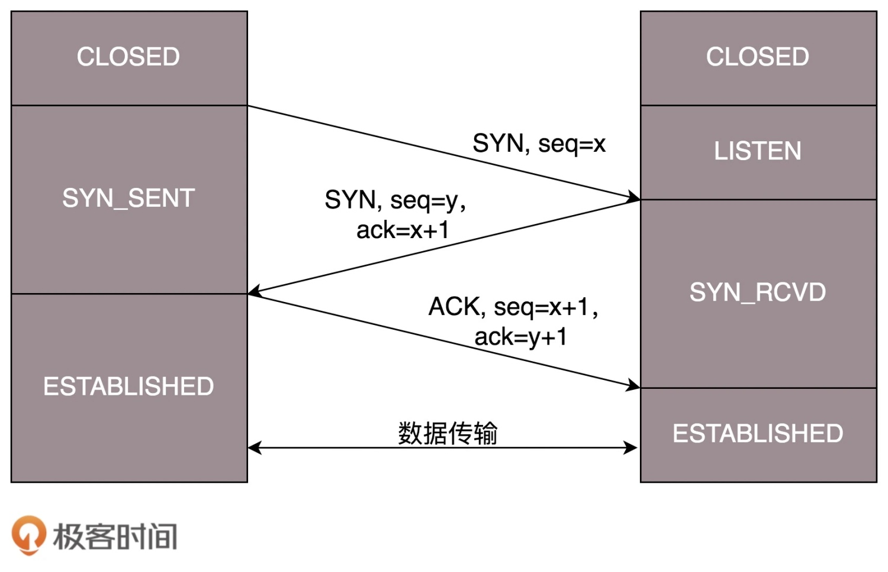

# TCP

## 包头


> 1. 首先，跟 UDP 一样，是源端口号和目标端口号
> 2. 接下来是包的序号，序号用来解决乱序的问题
> 3. 然后是确认序号。发出去的包应该有确认，否则不知道对方是否收到。如果没有收到就应该重新发送，直到送达。可以解决丢包的问题
> 4. 接下来有一些状态位。SYN 是发起一个连接，ACK 是回复，RST 是重新连接，FIN 是结束连接等。TCP 是面向连接的，因而双方要维护连接的状态，这些带状态位的包的发送，会引起双方的状态变更
> 5. 窗口大小。TCP 要做流量控制，通信双方各声明一个窗口，标识自己当前能够的处理能力。此外，TCP 还会做拥塞控制，即控制发送的速度

## 三次握手
> TCP 的连接建立，常常称为三次握手

> A 要发起一个连接，当发了第一个请求没有应答的时候，会有很多的可能性：比如第一个请求包丢了，再如没有丢，但是绕了弯路，超时了，还有 B 没有响应，不想与 A 连接。A 不能确认结果，于是再发

> 终于，有一个请求包到了 B，但是请求包到了 B 的这个事情，目前 A 还是不知道的，A 还有可能再发。B 收到了请求包，就知道了 A 的存在，并且知道 A 要和它建立连接。如果 B 不乐意建立连接，则 A 会重试一阵后放弃，连接建立失败，没有问题；如果 B 是乐意建立连接的，则会发送应答包给 A

> 对于 B 来说，这个应答包也是不知道能不能到达 A。这个时候 B 自然不能认为连接是建立好了，因为应答包仍然会丢，会绕弯路，或者 A 已经挂了都有可能。而且这个时候 B 还能碰到一个诡异的现象就是，A 和 B 原来建立了连接，做了简单通信后，结束了连接。如果 A 建立连接的时候，请求包重复发了几次，有的请求包绕了一大圈又回来了，B 会认为这也是一个正常的的请求的话，因此建立了连接，可以想象，这个连接不会进行下去，也没有个终结的时候。因而两次握手肯定不行

> B 发送的应答可能会发送多次，但是只要一次到达 A，A 就认为连接已经建立了，因为对于 A 来讲，他的消息有去有回。A 会给 B 发送应答之应答，而 B 也在等这个消息，才能确认连接的建立，只有等到了这个消息，对于 B 来讲，才算它的消息有去有回

> 当然 A 发给 B 的应答之应答也会丢，也会绕路，甚至 B 挂了。按理来说，还应该有个应答之应答之应答，这样下去就没底了。所以四次握手是可以的，关键四十次也不能保证就真的可靠了。只要双方的消息都有去有回，就基本可以了。好在大部分情况下，A 和 B 建立了连接之后，A 会马上发送数据的，一旦 A 发送数据，则很多问题都得到了解决。例如 A 发给 B 的应答丢了，当 A 后续发送的数据到达的时候，B 可以认为这个连接已经建立，或者 B 压根就挂了，A 发送的数据，会报错，说 B 不可达，A 就知道 B 出事情了。如果 A 一直不发数据，建立连接后空着。但是只要开启 keepalive 机制，即使没有真实的数据包，也有探活包。另外，B 作为服务端，对于 A 这种长时间不发包的客户端，可以主动关闭，从而空出资源来给其他客户端使用

> 三次握手除了双方建立连接外，主要还是为了沟通一件事情，就是 TCP 包的序号的问题。A 要告诉 B，发起的包的序号起始是从哪个号开始的，B 同样也要告诉 A，B 发起的包的序号起始是从哪个号开始的

> 为了避免冲突，序号不能都从 1 开始。例如，A 连上 B 之后，发送了 1、2、3 三个包，但是发送 3 的时候，中间丢了，或者绕路了，于是重新发送，后来 A 掉线了，重新连上 B 后，序号又从 1 开始，然后发送 2，但是没想发送 3，但是上次绕路的那个 3 又回来了，发给了 B，B 自然认为，这就是下一个包，于是发生了错误。因而，每个连接都要有不同的序号。这个序号的起始序号是随着时间变化的，可以看成一个 32 位的计数器，每 4 微秒加一，如果计算一下，如果到重复，需要 4 个多小时，那个绕路的包早就不存在了。这是因为 IP 包头里面有个 TTL，也即生存时间



> 1. 一开始，客户端和服务端都处于 CLOSED 状态
> 2. 先是服务端主动监听某个端口，处于 LISTEN 状态
> 3. 然后客户端主动发起连接 SYN，之后处于 SYN-SENT 状态
> 4. 服务端收到发起的连接，返回 SYN，并且 ACK 客户端的 SYN，之后处于 SYN-RCVD 状态
> 5. 客户端收到服务端发送的 SYN 和 ACK 之后，发送 ACK 的 ACK，之后处于 ESTABLISHED 状态，因为它一发一收成功了
> 6. 服务端收到 ACK 的 ACK 之后，处于 ESTABLISHED 状态，因为它也一发一收了

## 四次挥手
> 如果 A 发送结束连接，没有收到回复，则 A 会重新发送。但是这个回合结束之后，就有可能出现异常情况了。一种情况是：A 发送结束连接之后，直接断开。由于 B 还没有发起结束，此时就算 B 发起结束，也得不到回答，B 就不知道该怎么办了。另一种情况是：A 发送结束连接之后，B 直接断开，由于 A 不知道 B 是还有事情要处理，还是过一会儿会发送结束，也不知道该怎么办


> 1. 当 A 发送断开连接，进入 FIN_WAIT_1 的状态
> 2. B 收到消息后，发送应答消息，就进入 CLOSE_WAIT 的状态
> 3. A 收到 B 的应答消息，进入 FIN_WAIT_2 的状态，如果这个时候 B 直接断开，则 A 将永远在这个状态。TCP 协议里面并没有对这个状态的处理，但是 Linux 有，可以调整 tcp_fin_timeout 这个参数，设置一个超时时间
> 4. B 发送了断开连接的请求到达 A，A 发送应答消息后，从 FIN_WAIT_2 状态结束。此时 A 还不能断开连接，因为最后的这个 ACK B 可能收不到，那么 B 会重新发一次断开连接请求，如果这个时候 A 已经断开连接，B 就再也收不到 ACK 了。因而 TCP 协议要求 A 最后等待一段时间 TIME_WAIT，这个时间要足够长，长到如果 B 没收到 ACK 的话，断开连接会重发的，A 会重新发一个 ACK 并且足够时间到达 B。A 直接断开连接还有一个问题是，A 的端口就直接空出来了，但是 B 原来发过的很多包很可能还在路上，如果 A 的端口被一个新的应用占用了，这个新的应用会收到上个连接中 B 发过来的包，虽然序列号是重新生成的，但是为了防止产生混乱，因而也需要等足够长的时间，等到原来 B 发送的所有的包都不存在，再空出端口来。等待的时间设为 2MSL
> 5. 如果 B 超过了 2MSL 的时间，依然没有收到它发的 FIN 的 ACK。按照 TCP 的原理，B 当然还会重发 FIN，这个时候 A 再收到这个包之后，A 就直接发送 RST。B 也就知道 A 已经断开连接了

> MSL 是 Maximum Segment Lifetime，报文最大生存时间，它是任何报文在网络上存在的最长时间，超过这个时间报文将被丢弃。因为 TCP 报文基于是 IP 协议的，而 IP 头中有一个 TTL 域，是 IP 数据报可以经过的最大路由数，每经过一个处理他的路由器此值就减 1，当此值为 0 则数据报将被丢弃，同时发送 ICMP 报文通知源主机。协议规定 MSL 为 2 分钟，实际应用中常用的是 30 秒，1 分钟和 2 分钟等

## 窗口
### 顺序与可靠
> TCP 为了保证顺序性，每一个包都有一个 ID。在建立连接的时候，会商定起始的 ID，然后按照 ID 一个个发送。为了保证不丢包，对于发送的包都要进行应答，但是这个应答也不是一个一个来的，而是会应答某个之前的 ID，表示都收到了，这种模式称为累计确认或者累计应答

> 为了记录所有发送的包和接收的包，TCP 也需要发送端和接收端分别都有缓存来保存这些记录。发送端的缓存里是按照包的 ID 一个个排列，根据处理的情况分成四个部分：
> 1. 发送了并且已经确认的，应该划掉
> 2. 发送了并且尚未确认的。需要等待做完的回复之后，才能划掉
> 3. 没有发送，但是已经等待发送的
> 4. 没有发送，并且暂时还不会发送的

> 在 TCP 里，接收端会给发送端报一个窗口的大小，叫 Advertised window。这个窗口的大小应该等于上面的第二部分加上第三部分。超过这个窗口的，接收端做不过来，就不能发送了


> LastByteAcked：第一部分和第二部分的分界线
> LastByteSent：第二部分和第三部分的分界线
> LastByteAcked + AdvertisedWindow：第三部分和第四部分的分界线

> 对于接收端来讲，它的缓存里记录的内容要简单一些
> 1. 接受并且确认过的
> 2. 还没接收，但是马上就能接收的
> 3. 还没接收，也没法接收的


> 在发送端来看，1、2、3 已经发送并确认；4、5、6、7、8、9 都是发送了还没确认；10、11、12 是还没发出的；13、14、15 是接收方没有空间，不准备发的。在接收端来看，1、2、3、4、5 是已经完成 ACK，但是没读取的；6、7 是等待接收的；8、9 是已经接收，但是没有 ACK 的

> 发送端和接收端当前的状态如下：1、2、3 没有问题，双方达成了一致。4、5 接收方说 ACK 了，但是发送方还没收到，有可能丢了，有可能在路上。6、7、8、9 肯定都发了，但是 8、9 已经到了，但是 6、7 没到，出现了乱序，缓存着但是没办法 ACK。根据这个例子

> 假设 4 的确认到了，5 的 ACK 丢了，6、7 的数据包丢了

> 一种方法就是超时重试，对每一个发送了，但是没有 ACK 的包，都有设一个定时器，超过了一定的时间，就重新尝试。这个超时时间不宜过短，时间必须大于往返时间 RTT，否则会引起不必要的重传。也不宜过长，这样超时时间变长，访问就变慢了。估计往返时间，需要 TCP 通过采样 RTT 的时间，然后进行加权平均，算出一个值，而且这个值还是要不断变化的，因为网络状况不断地变化。除了采样 RTT，还要采样 RTT 的波动范围，计算出一个估计的超时时间。由于重传时间是不断变化的，称为自适应重传算法（Adaptive Retransmission Algorithm）。如果过一段时间，5、6、7 都超时了，就会重新发送。接收方发现 5 原来接收过，于是丢弃 5；6 收到了，发送 ACK，要求下一个是 7，7 不幸又丢了。当 7 再次超时的时候，有需要重传的时候，TCP 的策略是超时间隔加倍。每当遇到一次超时重传的时候，都会将下一次超时时间间隔设为先前值的两倍。两次超时，就说明网络环境差，不宜频繁反复发送

> 超时触发重传存在的问题是，超时周期可能相对较长。有一个可以快速重传的机制，当接收方收到一个序号大于下一个所期望的报文段时，就会发送冗余的 ACK。而当客户端收到三个冗余的 ACK 后，就会在定时器过期之前，重传丢失的报文段。例如，接收方发现 6 收到了，8 也收到了，但是 7 还没来，那肯定是丢了，于是发送 6 的 ACK，要求下一个是 7。接下来，收到后续的包，仍然发送 6 的 ACK，要求下一个是 7。当客户端收到 3 个重复 ACK，就会发现 7 的确丢了，不等超时，马上重发。还有一种方式称为 Selective Acknowledgment（SACK）。这种方式需要在 TCP 头里加一个 SACK 的东西，可以将缓存的地图发送给发送方。例如可以发送 ACK6、SACK8、SACK9，有了地图，发送方一下子就能看出来是 7 丢了

### 流量控制
> 假设窗口不变的情况，窗口始终为 9。4 的确认来的时候，会右移一个，这个时候第 13 个包也可以发送了


> 这个时候，假设发送端发送过快，会将第三部分的 10、11、12、13 全部发送完毕，之后就停止发送了，未发送可发送部分为 0


> 当对于包 5 的确认到达的时候，在客户端相当于窗口再滑动了一格，这个时候，才可以有更多的包可以发送了


> 如果接收方实在处理的太慢，导致缓存中没有空间了，可以通过确认信息修改窗口的大小，甚至可以设置为 0，则发送方将暂时停止发送。极端情况下，接收端的应用一直不读取缓存中的数据，当数据包 6 确认后，窗口大小就不能再是 9 了，就要缩小一个变为 8


> 如果接收端还是一直不处理数据，则随着确认的包越来越多，窗口越来越小，直到为 0。当这个窗口通过包 14 的确认到达发送端的时候，发送端的窗口也调整为 0，停止发送


> 如果这样的话，发送方会定时发送窗口探测数据包，看是否有机会调整窗口的大小。当接收方比较慢的时候，要防止低能窗口综合征，别空出一个字节来就赶快告诉发送方，然后马上又填满了，可以当窗口太小的时候，不更新窗口，直到达到一定大小，或者缓冲区一半为空，才更新窗口

### 拥塞控制
> 滑动窗口 rwnd 是怕发送方把接收方缓存塞满，而拥塞窗口 cwnd，是怕把网络塞满。这里有一个公式：

```
LastByteSent - LastByteAcked <= min {cwnd, rwnd}
```

> TCP 的拥塞控制就是在不堵塞，不丢包的情况下，尽量发挥带宽。在理想状态下，通道的容量 = 带宽 × 往返延迟。如果我们设置发送窗口，使得发送但未确认的包为为通道的容量，就能够撑满整个管道


> TCP 的拥塞控制主要来避免两种现象，包丢失和超时重传。一旦出现了这些现象就说明，发送速度太快了，要慢一点。一条 TCP 连接开始，cwnd 设置为一个报文段，一次只能发送一个；当收到这一个确认的时候，cwnd 加一，于是一次能够发送两个；当这两个的确认到来的时候，每个确认 cwnd 加一，两个确认 cwnd 加二，于是一次能够发送四个；当这四个的确认到来的时候，每个确认 cwnd 加一，四个确认 cwnd 加四，于是一次能够发送八个

> 有一个值 ssthresh 为 65535 个字节，当超过这个值的时候，再慢下来。每收到一个确认后，cwnd 增加 1/cwnd。比如，一次发送八个，当八个确认到来的时候，每个确认增加 1/8，八个确认一共 cwnd 增加 1，于是一次能够发送九个，变成了线性增长。但是线性增长还是增长，还是越来越多，直到出现了拥塞，表现形式是丢包，需要超时重传。这个时候，将 sshresh 设为 cwnd/2，将 cwnd 设为 1，重新开始慢启动

> 这种方式太激进了，将一个高速的传输速度一下子停了下来，会造成网络卡顿。当接收端发现丢了一个中间包的时候，发送三次前一个包的 ACK，于是发送端就会快速地重传，不必等待超时再重传。TCP 认为这种情况不严重，因为大部分没丢，只丢了一小部分，cwnd 减半为 cwnd/2，然后 sshthresh = cwnd，当三个包返回的时候，cwnd = sshthresh + 3


> TCP 的拥塞控制主要来避免的两个现象都是有问题的。第一个问题是丢包并不代表着通道满了，因为公网上带宽不满也会丢包，这个时候就认为拥塞了，退缩了，其实是不对的。第二个问题是 TCP 的拥塞控制要等到将中间设备都填充满了，才发生丢包，从而降低速度，这时候已经晚了。其实 TCP 只要填满管道就可以了，不应该接着填，直到连缓存也填满。为了优化这两个问题，后来有了 TCP BBR 拥塞算法。它企图找到一个平衡点，就是通过不断地加快发送速度，将管道填满，但是不要填满中间设备的缓存，因为这样时延会增加，在这个平衡点可以很好的达到高带宽和低时延的平衡

