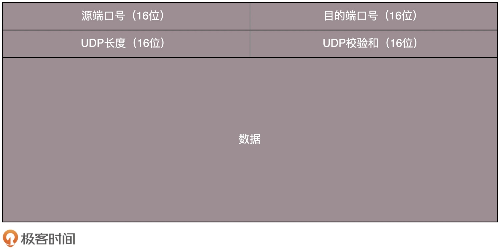

# UDP

## TCP 与 UDP
> 1. TCP 提供可靠交付。通过 TCP 连接传输的数据，无差错、不丢失、不重复、并且按序到达。UDP 继承了 IP 包的特性，不保证不丢失，不保证按顺序到达
> 2. TCP 是面向字节流的。发送的时候发的是一个流，没头没尾。IP 包不是一个流，而是一个个的 IP 包，UDP 继承了这种特性，基于数据报的，一个一个地发，一个一个地收
> 3. TCP 是可以有拥塞控制的。UDP 没有

> 可以看出，TCP 是一个有状态服务，而 UDP 则是无状态服务

## UDP 包
> 当 UDP 包到达目标机器后，发现 MAC 地址匹配，于是就取下来，将剩下的包传给处理 IP 层的代码。把 IP 头取下来，发现目标 IP 匹配，然后根据在 IP 头里面的 8 位协议，得知这是 UDP 包。于是，根据 UDP 头的格式进行解析

> UDP 的三大特点：
> 1. 不需要大量的数据结构、处理逻辑、包头字段
> 2. 不会建立连接，虽然有端口号，但是监听在这个地方，任何人都可以传给他数据，他也可以传给任何人数据，甚至可以同时传给多个人数据
> 3. 不会根据网络的情况进行发包的拥塞控制

## 使用场景
> 1. 需要资源少，在网络情况比较好的内网，或者对于丢包不敏感的应用。DHCP 就是基于 UDP 协议的，一般的获取 IP 地址都是内网请求，而且一次获取不到 IP 又没事，过一会儿还有机会。PXE 可以在启动的时候自动安装操作系统，操作系统镜像的下载使用的 TFTP，也是基于 UDP 协议的。在还没有操作系统的时候，客户端拥有的资源很少，不适合维护一个复杂的状态机，而且因为是内网，一般也没有问题

> 2. 不需要一对一沟通，建立连接，而是可以广播的应用。DHCP 就是一种广播的形式，是基于 UDP 协议的。使用 D 类地址，可以将包组播给一批机器。当一台机器上的某个进程想监听某个组播地址的时候，需要发送 IGMP 包，所在网络的路由器就能收到这个包，知道有个机器上有个进程在监听这个组播地址。当路由器收到这个组播地址的时候，会将包转发给这台机器，这样就实现了跨路由器的组播

> 3. 需要处理速度快，时延低，可以容忍少数丢包。UDP 简单、处理速度快，不需要像 TCP 那样，各种重传，保证顺序，以至于前面的不收到，后面的没法处理。而 TCP 在网络不好出现丢包的时候，拥塞控制策略会主动的退缩，降低发送速度，这就相当于本来用户本来就卡，这下更卡了

## UDP 示例
### 网页或者 APP 的访问
> 原来访问网页和手机 APP 都是基于 HTTP 协议的。HTTP 协议是基于 TCP 的，建立连接都需要多次交互，建立一次连接需要的时间会比较长，然而既然是移动中，TCP 可能还会断了重连，也是很耗时的。而且目前的 HTTP 协议，往往采取多个数据通道共享一个连接的情况，这样本来为了加快传输速度，但是 TCP 的严格顺序策略使得哪怕共享通道，前一个不来，后一个和前一个即便没关系，也要等着，时延也会加大

> QUIC（全称 Quick UDP Internet Connections，快速 UDP 互联网连接）是 Google 提出的一种基于 UDP 改进的通信协议，其目的是降低网络通信的延迟，提供更好的用户互动体验。QUIC 在应用层上，会自己实现快速连接建立、减少重传时延，自适应拥塞控制

### 流媒体的协议
> 直播协议多使用 RTMP，而这个 RTMP 协议也是基于 TCP 的。TCP 的严格顺序传输要保证前一个收到了，下一个才能确认，如果前一个收不到，下一个就算包已经收到了，也需要在缓存里面等着。但是直播的实时性比较比较重要，宁可丢包，也不要卡顿的。另外，对于视频播放来讲，有的包可以丢，有的包不能丢，因为视频的连续帧里面，有的帧重要，有的不重要，隔几个帧丢一个，其实看视频的人不会感知，但是如果连续丢帧，就会感知了。因而在网络不好的情况下，应用希望选择性的丢帧。另外，当网络不好的时候，TCP 协议会主动降低发送速度，这对本来就卡的看视频来讲是致命的

### 实时游戏
> 游戏对实时要求较为严格的情况下，采用自定义的可靠 UDP 协议，自定义重传策略，能够把丢包产生的延迟降到最低，尽量减少网络问题对游戏性造成的影响

### IoT 物联网
> 物联网领域终端资源少，很可能只是个内存非常小的嵌入式系统，而维护 TCP 协议代价太大。另外，物联网对实时性要求也很高，Google 旗下的 Nest 建立 Thread Group，推出了物联网通信协议 Thread，就是基于 UDP 协议的

### 移动通信领域
> 在 4G 网络里，移动流量上网的数据面对的协议 GTP-U 是基于 UDP 的。因为移动网络协议比较复杂，而 GTP 协议本身就包含复杂的手机上线下线的通信协议。如果基于 TCP，TCP 的机制就显得非常多余