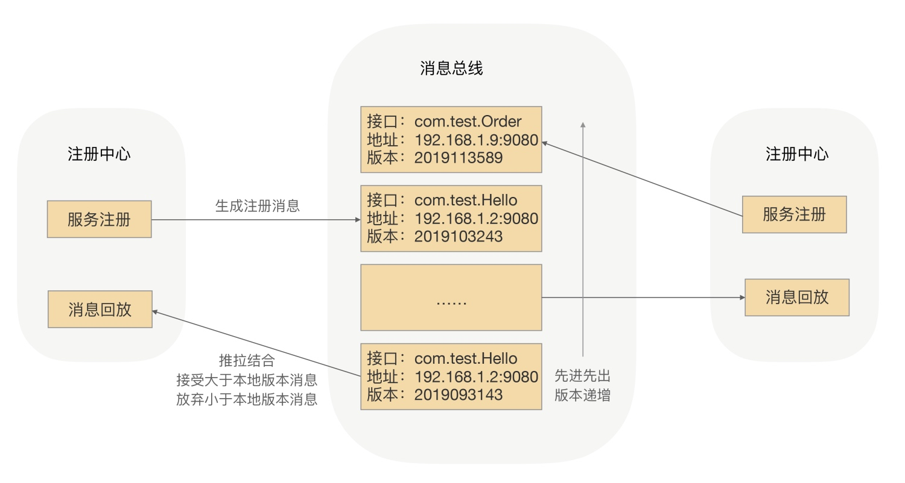

# 服务发现

## 基于 ZooKeeper

> 1. 服务平台管理端先在 ZooKeeper 中创建一个服务根路径，可以根据接口名命名，在这个路径再创建服务提供方目录与服务调用方目录，分别用来存储服务提供方的节点信息和服务调用方的节点信息
> 2. 当服务提供方发起注册时，会在服务提供方目录中创建一个临时节点，节点中存储该服务提供方的注册信息
> 3. 当服务调用方发起订阅时，则在服务调用方目录中创建一个临时节点，节点中存储该服务调用方的信息，同时服务调用方 watch 该服务的服务提供方目录中所有的服务节点数据
> 4. 当服务提供方目录下有节点数据发生变更时，ZooKeeper 就会通知给发起订阅的服务调用方

> 如果微服务变得越来越多，ZooKeeper 集群整体压力也越来越高，尤其在集中上线的时候越发明显。当大规模上线的时候，就会有超大批量的服务节点在同时发起注册操作，ZooKeeper 集群的 CPU 突然飙升，导致 ZooKeeper 集群不能工作

> 由于 ZooKeeper 本身存在性能问题，当连接到 ZooKeeper 的节点数量特别多，对 ZooKeeper 读写特别频繁，且 ZooKeeper 存储的目录达到一定数量的时候，ZooKeeper 将不再稳定，CPU 持续升高，最终宕机

## 基于消息总线

> ZooKeeper 的一大特点就是强一致性，ZooKeeper 集群的每个节点的数据每次发生更新操作，都会通知其它 ZooKeeper 节点同时执行更新。它要求保证每个节点的数据能够实时的完全一致，这也就直接导致了 ZooKeeper 集群性能上的下降

> RPC 框架的服务发现，在服务节点刚上线时，服务调用方是可以容忍在一段时间之后发现这个新上线的节点的。毕竟服务节点刚上线之后的几秒内，甚至更长的一段时间内没有接收到请求流量，对整个服务集群是没有影响的。所以可以牺牲掉 CP，而选择 AP，来换取整个注册中心集群的性能和稳定性

> 注册数据可以全量缓存在每个注册中心内存中，通过消息总线来同步数据。当有一个注册中心节点接收到服务节点注册时，会产生一个消息推送给消息总线，再通过消息总线通知给其它注册中心节点更新数据并进行服务下发，从而达到注册中心间数据最终一致性

> 当有服务上线，注册中心节点收到注册请求，服务列表数据发生变化，会生成一个消息，推送给消息总线，每个消息都有整体递增的版本。消息总线会主动推送消息到各个注册中心，同时注册中心也会定时拉取消息。对于获取到消息的在消息回放模块里面回放，只接受大于本地版本号的消息，小于本地版本号的消息直接丢弃，从而实现最终一致性

> 消费者订阅可以从注册中心内存拿到指定接口的全部服务实例，并缓存到消费者的内存里面。采用推拉模式，消费者可以及时地拿到服务实例增量变化情况，并和内存中的缓存数据进行合并

> 为了性能，这里采用了两级缓存，注册中心和消费者的内存缓存，通过异步推拉模式来确保最终一致性。在服务调用方发送请求到目标节点后，目标节点会进行合法性验证，如果指定接口服务不存在或正在下线，则会拒绝该请求。服务调用方收到拒绝异常后，会安全重试到其它节点

> 通过消息总线的方式，可以完成注册中心集群间数据变更的通知，保证数据的最终一致性，并能及时地触发注册中心的服务下发操作