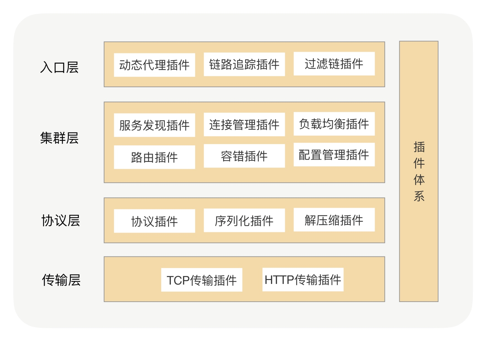

# RPC 框架

> 在 RPC 框架里面，我们可以将每个功能点抽象成一个接口，将这个接口作为插件的契约，然后把这个功能的接口与功能的实现分离，并提供接口的默认实现。在 Java 里面，JDK 有自带的 SPI 服务发现机制，它可以动态地为某个接口寻找服务实现。使用 SPI 机制需要在 Classpath 下的 META-INF/services 目录里创建一个以服务接口命名的文件，这个文件里的内容就是这个接口的具体实现类

> 但在实际项目中，很少使用到 JDK 自带的 SPI 机制。首先它不能按需加载，ServiceLoader 加载某个接口实现类的时候，会遍历全部获取，也就是接口的实现类得全部载入并实例化一遍，会造成不必要的浪费。另外就是做不到自动注入和装配，这就很难和其他框架集成，比如扩展里面依赖了一个 Spring Bean，原生的 Java SPI 就不支持