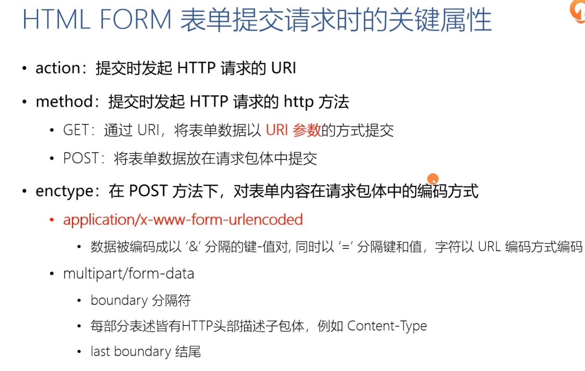
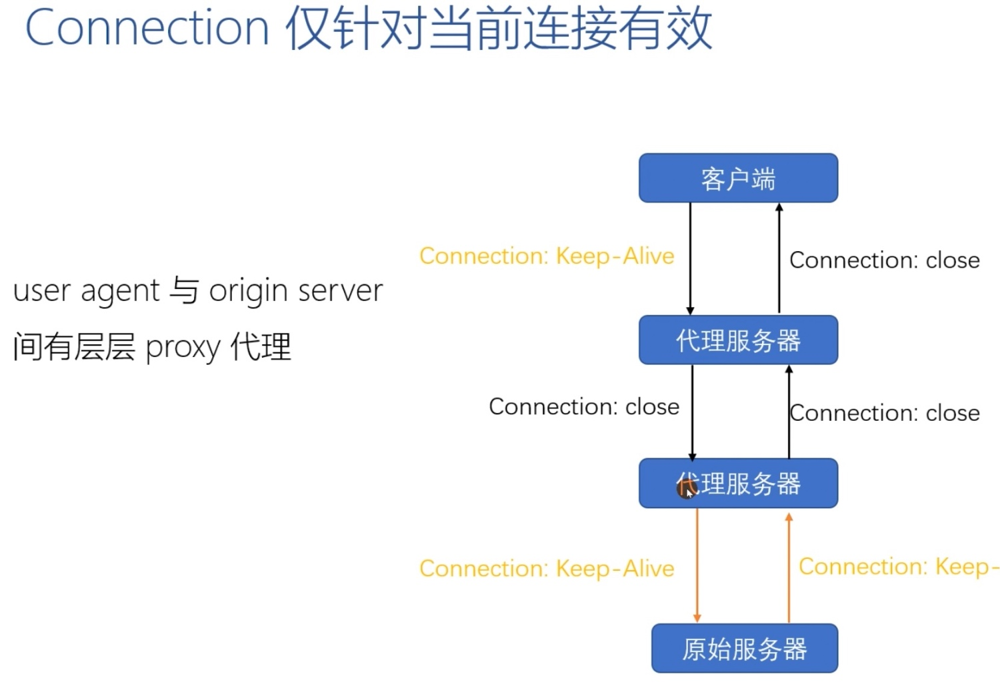
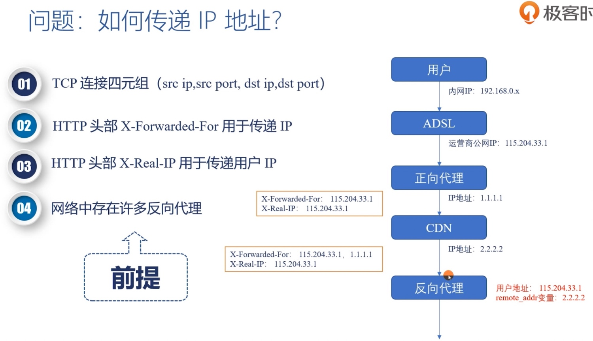

# 请求与响应

## 请求
### 表单

### 请求 Header

## 响应
### 响应码
#### 100 Continue
> 上传大文件前时使用，由客户端发起请求中携带 Expect: 100-continue 头部触发

#### 101 Switch Protocols
> 协议升级使用，由客户端发起请求中携带 Upgrade: 头部触发，如升级 websocket 或者 http2.0

#### 301 Moved Permanently
> 资源永久性的重定向到另一个 URI 中

#### 302 Found
> 资源临时性的重定向到另一个 URI 中

## 格式
### Header

> 1. 字段名不区分大小写，例如 Host 也可以写成 host
> 2. 字段名里不允许出现空格，可以使用连字符 -，但不能使用下划线 _
> 3. 字段名后面必须紧接着 :，不能有空格，而 : 后的字段值前可以有多个空格
> 4. 字段的顺序是没有意义的，可以任意排列不影响语义
> 5. 字段原则上不能重复，除非这个字段本身的语义允许，例如 Set-Cookie

### 内容协商
#### MIME type
> 1. text：即文本格式的可读数据，例如 text/html、text/plain、text/css 等
> 2. image：即图像文件，有 image/gif、image/jpeg、image/png 等
> 3. audio/video：音频和视频数据，例如 audio/mpeg、video/mp4 等
> 4. application：数据格式不固定，可能是文本也可能是二进制，必须由上层应用程序来解释。常见的有 application/json，application/javascript、application/pdf 等。另外，如果不知道数据的类型，就会是 application/octet-stream，即不透明的二进制数据

> Accept 字段标记的是客户端可理解的 MIME type，可以用 , 做分隔符列出多个类型，让服务器有更多的选择余地。服务器会在响应报文里用头字段 Content-Type 告诉实体数据的真实类型

#### Encoding type
> 1. gzip：GNU zip 压缩格式
> 2. deflate：zlib（deflate）压缩格式
> 3. br：一种专门为 HTTP 优化的新压缩算法（Brotli）

> Accept-Encoding 字段标记的是客户端支持的压缩格式，同样也可以用 , 列出多个，服务器可以选择其中一种来压缩数据，实际使用的压缩格式放在响应头字段 Content-Encoding 里

> 如果请求报文里没有 Accept-Encoding 字段，就表示客户端不支持压缩数据；如果响应报文里没有 Content-Encoding 字段，就表示响应数据没有被压缩

#### 语言
> Accept-Language 字段标记了客户端可理解的自然语言，也允许用 , 做分隔符列出多个类型，服务器在响应报文里用头字段 Content-Language 告诉客户端实体数据使用的实际语言类型

#### 字符集
> 字符集在 HTTP 里使用的请求头字段是 Accept-Charset，但响应头里却没有对应的 Content-Charset，而是在 Content-Type 字段的数据类型后面用 charset=xxx 来表示

> 现在的浏览器都支持多种字符集，通常不会发送 Accept-Charset，而服务器也不会发送 Content-Language，因为使用的语言完全可以由字符集推断出来，所以在请求头里一般只会有 Accept-Language 字段，响应头里只会有 Content-Type 字段
