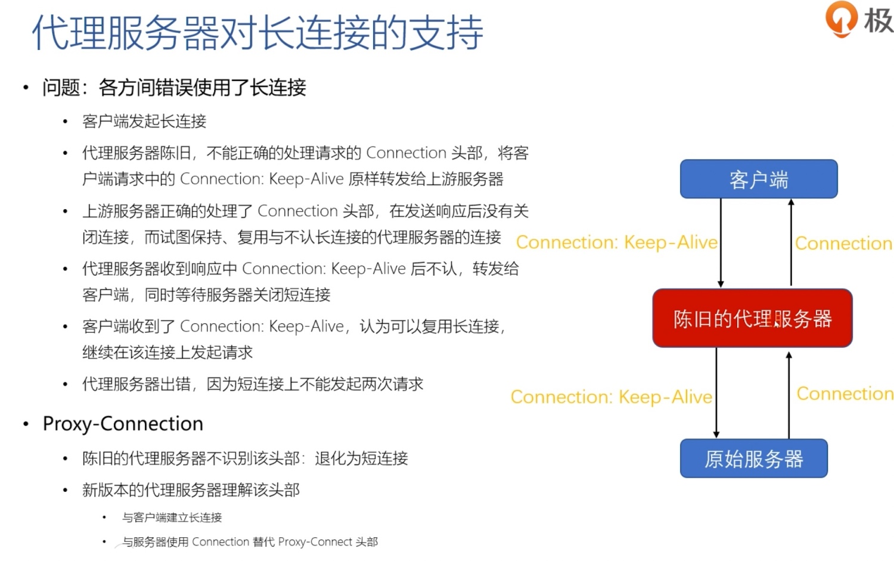

# 代理服务



## 作用
> - 负载均衡：把访问请求均匀分散到多台机器，实现访问集群化
> - 健康检查：使用心跳等机制监控后端服务器，发现有故障就及时踢出集群，保证服务高可用
> - 安全防护：保护被代理的后端服务器，限制 IP 地址或流量，抵御网络攻击和过载
> - 加密卸载：对外网使用 SSL/TLS 加密通信认证，而在安全的内网不加密，消除加解密成本
> - 数据过滤：拦截上下行的数据，任意指定策略修改请求或者响应
> - 内容缓存：暂存、复用服务器响应

## 分类
> - 匿名代理：完全隐匿了被代理的机器，外界看到的只是代理服务器
> - 透明代理：在传输过程中是透明开放的，外界既知道代理，也知道客户端
> - 正向代理：靠近客户端，代表客户端向服务器发送请求
> - 反向代理：靠近服务器端，代表服务器响应客户端的请求

> CDN 就是一种代理，它代替源站服务器响应客户端的请求，通常扮演着透明代理和反向代理的角色代理应用场景

## 代理 Header
### Via
> Via 是一个通用字段，请求头或响应头里都可以出现。每当报文经过一个代理节点，代理服务器就会把自身的信息追加到字段的末尾。如果通信链路中有很多中间代理，就会在 Via 里形成一个链表。Via 字段只解决了客户端和源服务器判断是否存在代理的问题，还不能知道对方的真实信息

### X-Forwarded-For
> 每经过一个代理节点就会在字段里追加一个信息。Via 追加的是代理主机名，而 X-Forwarded-For 追加的是请求方的 IP 地址

### X-Real-IP
> 记录客户端 IP 地址，没有中间的代理信息，相当于是 X-Forwarded-For 的简化版

> 通过 X-Forwarded-For 操作代理信息必须要解析 HTTP 报文头，会降低代理的转发性能。而且， X-Forwarded-For 等头必须要修改原始报文，而有些情况下是不可能的（比如使用 HTTPS 通信被加密）

## 代理协议
> 代理协议有 v1 和 v2 两个版本。v1 版本在 HTTP 报文前增加了一行 ASCII 码文本，相当于又多了一个头。这一行文本开头必须是 PROXY 五个大写字母，然后是 TCP4 或者 TCP6，表示客户端的 IP 地址类型，再后面是请求方地址、应答方地址、请求方端口号、应答方端口号，最后用一个回车换行（\r\n）结束

```
PROXY TCP4 1.1.1.1 2.2.2.2 55555 80\r\n
GET / HTTP/1.1\r\n
Host: www.xxx.com\r\n
\r\n
```

## 负载均衡
### 域名实现
> - 因为域名解析可以返回多个 IP 地址，所以一个域名可以对应多台主机，客户端收到多个 IP 地址后，就可以自己使用轮询算法依次向服务器发起请求，实现负载均衡
> - 域名解析可以配置内部的策略，返回离客户端最近的主机，或者返回当前服务质量最好的主机，这样在 DNS 端把请求分发到不同的服务器，实现负载均衡