# cookie

> Cookie 最基本的一个用途就是身份识别，其次还常用于广告跟踪

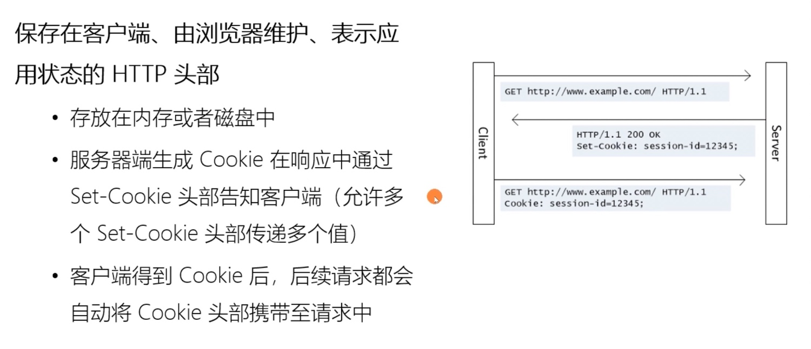

## 有效期
> Cookie 的有效期可以使用 Expires 和 Max-Age 两个属性来设置。Expires 用的是绝对时间点，可以理解为截止日期。Max-Age 用的是相对时间，单位是秒，浏览器用收到报文的时间点再加上 Max-Age，就可以得到失效的绝对时间

> Expires 和 Max-Age 可以同时出现，两者的失效时间可以一致，也可以不一致，但浏览器会优先采用 Max-Age 计算失效期

## 作用域
> 设置作用域让浏览器仅发送给特定的服务器和 URI，避免被其他网站盗用。作用域中 Domain 和 Path 指定了 Cookie 所属的域名和路径，浏览器在发送 Cookie 前会从 URI 中提取出 host 和 path 部分，对比 Cookie 的属性。如果不满足条件，就不会在请求头里发送 Cookie

## 安全
> 属性 HttpOnly 会告诉浏览器，此 Cookie 只能通过浏览器 HTTP 协议传输，禁止其他方式访问，这样浏览器的 JS 引擎就会禁用 document.cookie 等一切相关的 API，脚本攻击也就无效了

> 属性 SameSite 可以防范跨站请求伪造（XSRF）攻击，设置成 SameSite=Strict 可以严格限定 Cookie 不能随着跳转链接跨站发送，而 SameSite=Lax 则略宽松一点，允许 GET/HEAD 等安全方法，但禁止 POST 跨站发
送

> 属性叫 Secure 表示这个 Cookie 仅能用 HTTPS 协议加密传输，明文的 HTTP 协议会禁止发送。但 Cookie 本身不是加密的，浏览器里还是以明文的形式存在

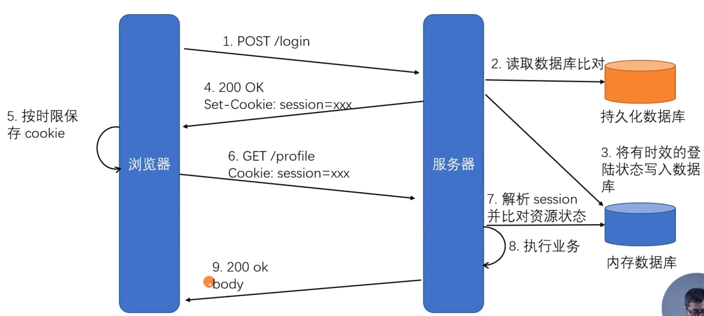

## 第三方 Cookie

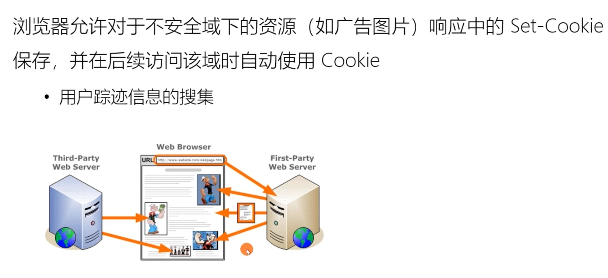

## 同源策略

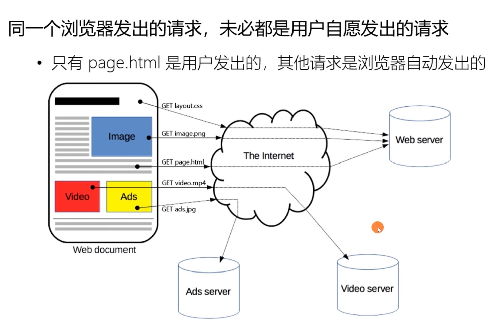

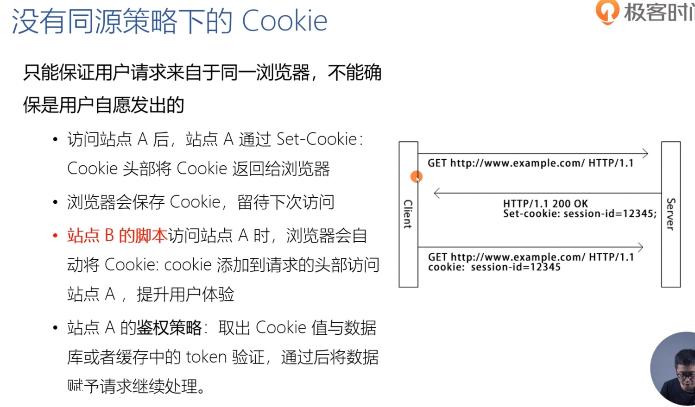

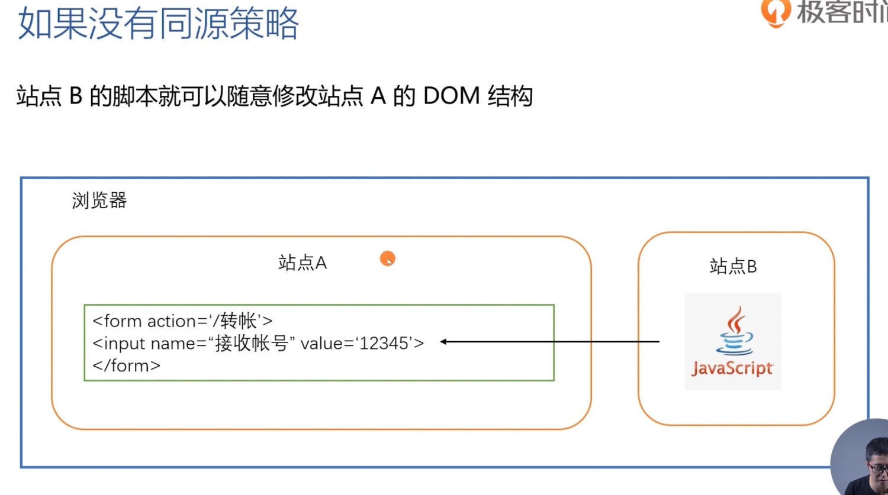

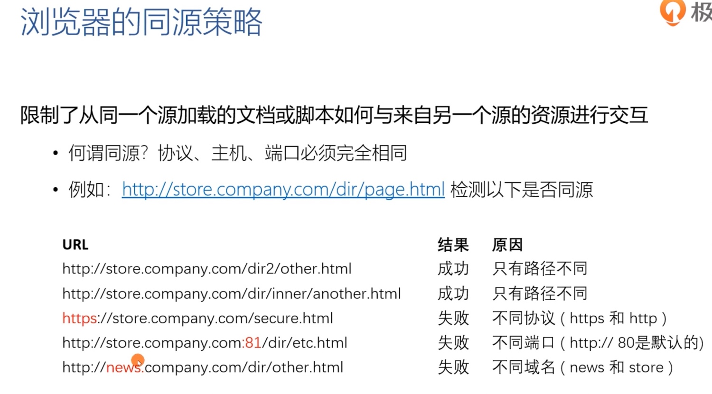

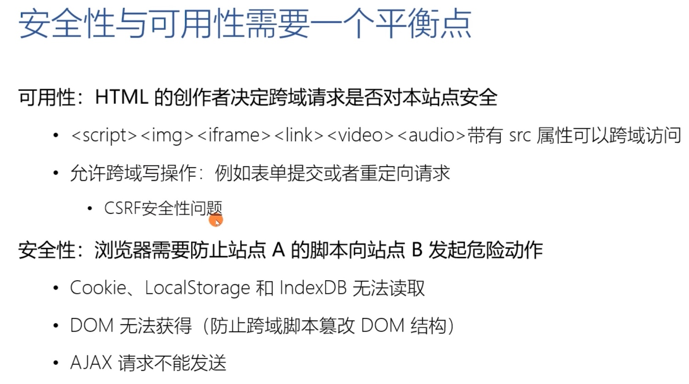

## CSRF

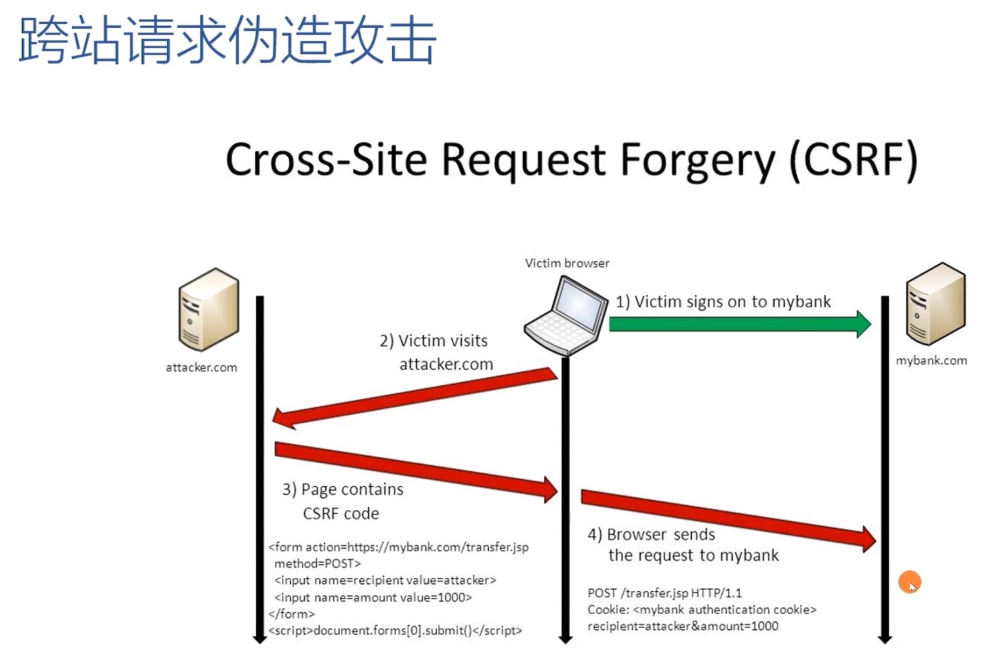

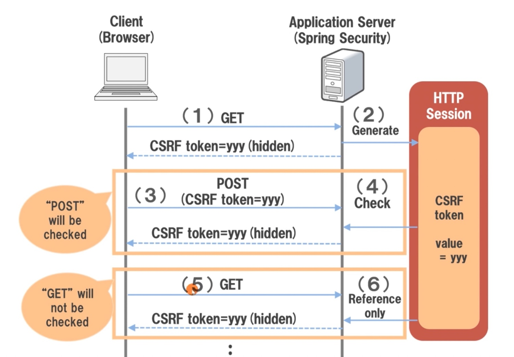

## CORS

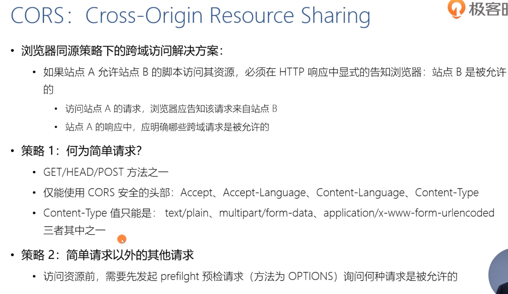

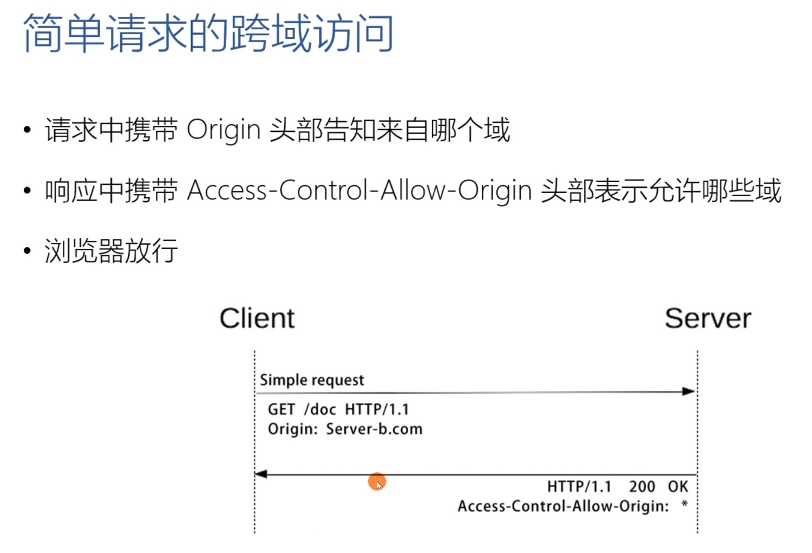

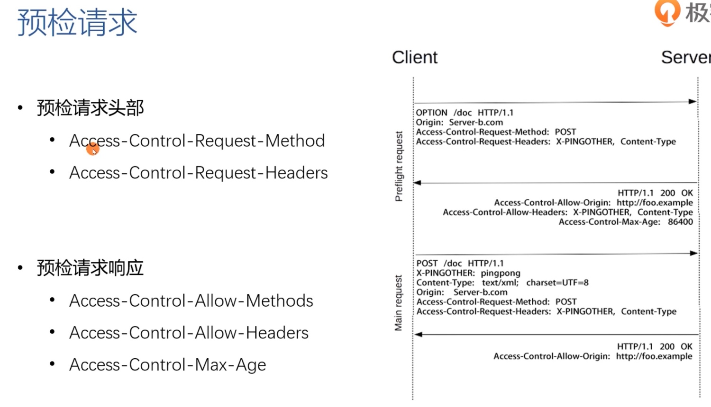

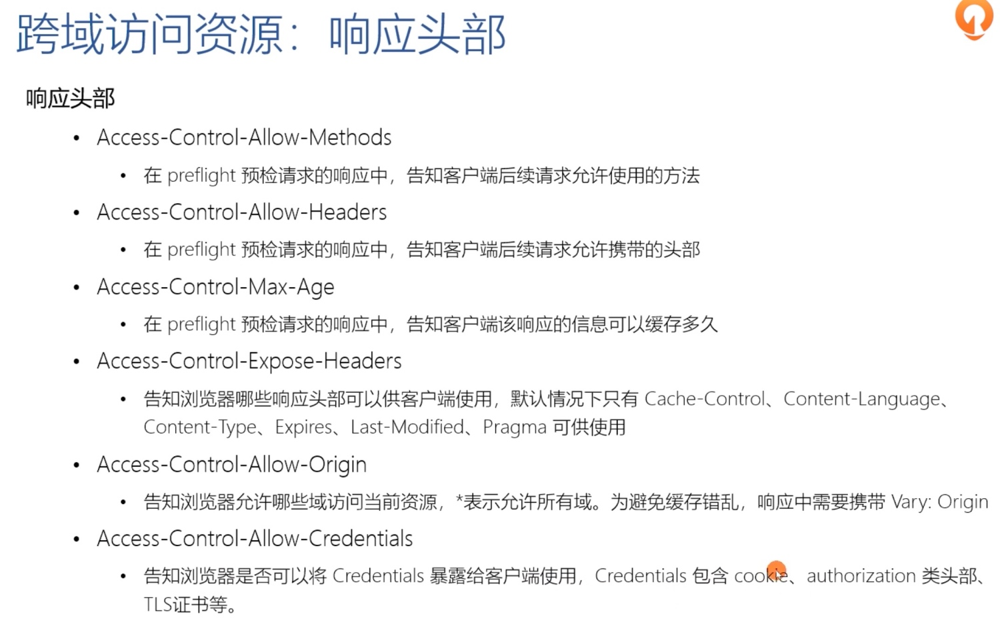

