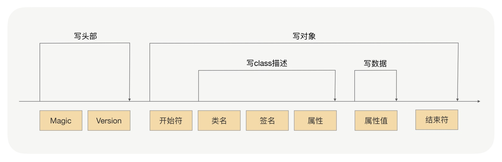
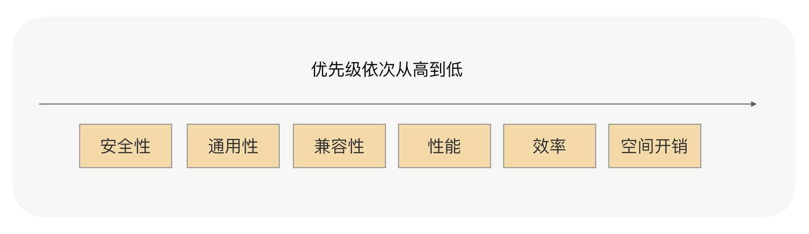

# 序列化

## 分类
### JDK
> JDK 自带的序列化的实现是由 ObjectOutputStream 完成的，而反序列化的具体实现是由 ObjectInputStream 完成的

### JSON
> JSON 进行序列化的额外空间开销比较大；JSON 没有类型，像 Java 这种强类型语言，需要通过反射统一解决，性能不会太好

### Hessian
> Hessian 是动态类型、二进制、紧凑的，并且可跨语言移植的一种序列化框架。Hessian 协议要比 JDK、JSON 更加紧凑，性能上要比 JDK、JSON 序列化高效很多，而且生成的字节数也更小

> 相对于 JDK、JSON，由于 Hessian 更加高效，生成的字节数更小，有非常好的兼容性和稳定性，所以 Hessian 更加适合作为 RPC 框架远程通信的序列化协议

### Protobuf
> 序列化后体积相比 JSON、Hessian 小很多；IDL 能清晰地描述语义，足以帮助并保证应用程序之间的类型不会丢失，无需类似 XML 解析器；序列化反序列化速度很快，不需要通过反射获取类型；消息格式升级和兼容性不错，可以做到向后兼容

## 注意点

> 1. 对象构造得过于复杂：属性很多，并且存在多层的嵌套，对象依赖关系过于复杂。序列化框架在序列化与反序列化对象时，对象越复杂就越浪费性能，严重影响 RPC 框架整体的性能；而且，出现问题的概率就越高
> 2. 对象过于庞大：入参对象非常得大，序列化之后字节长度达到了上兆字节。这种情况会严重地浪费了性能、CPU
> 3. 使用不支持的类作为入参类：大多数情况下最好不要使用第三方集合类
> 4. 对象有复杂的继承关系：对象关系越复杂，就越浪费性能，同时很容易出现序列化问题