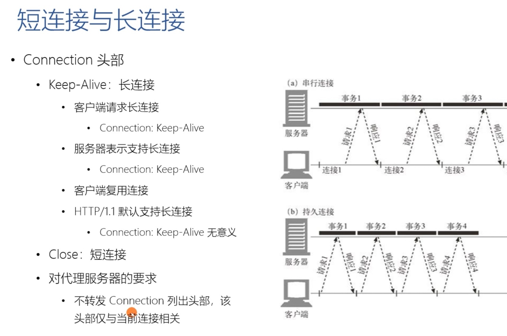

# 连接

## 关闭连接

> 客户端，可以在请求头里加上 Connection: close 字段，告诉服务器：这次通信后就关闭连接。服务器看到这个字段，就知道客户端要主动关闭连接，于是在响应报文里也加上这个字段，发送之后就调用 Socket API 关闭 TCP 连接

> 服务器端通常不会主动关闭连接，但也可以使用一些策略。拿 Nginx 来举例，它有两种方式：

> 1. 使用 keepalive_timeout 指令，设置长连接的超时时间，如果在一段时间内连接上没有任何数据收发就主动断开连接，避免空闲连接占用系统资源
> 2. 使用 keepalive_requests 指令，设置长连接上可发送的最大请求次数。比如设置成 1000，那么当 Nginx 在这个连接上处理了 1000 个请求后，也会主动断开连接
> 3. 另外，客户端和服务器都可以在报文里附加通用头字段 Keep-Alive: timeout=value，限定长连接的超时时间。但这个字段的约束力并不强，通信的双方可能并不会遵守，所以不太常见

## 并发连接
> 同时对一个域名发起多个长连接

## 域名分片