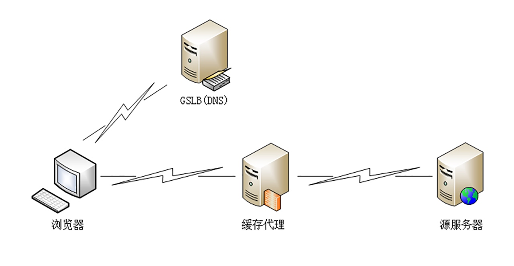

# CDN

## 负载均衡
> 全局负载均衡（Global Sever Load Balance）一般简称为 GSLB，主要的职责是当用户接入网络的时候在 CDN 专网中挑选出一个最佳节点提供服务

> GSLB 最常见的实现方式是 DNS 负载均衡。没有 CDN 的时候，权威 DNS 返回的是网站自己服务器的实际 IP 地址，浏览器收到 DNS 解析结果后直连网站。加入 CDN 后，权威 DNS 返回的不是 IP 地址，而是一个 CNAME 别名记录，指向的就是 CDN 的 GSLB。因为没拿到 IP 地址，于是本地 DNS 就会向 GSLB 再发起请求，这样就进入了 CDN 的全局负载均衡系统，开始智能调度：
> 1. 看用户的 IP 地址，查表得知地理位置，找相对最近的边缘节点
> 2. 看用户所在的运营商网络，找相同网络的边缘节点
> 3. 检查边缘节点的负载情况，找负载较轻的节点
> 4. 其他，比如节点的健康状况、服务能力、带宽、响应时间等

> GSLB 把这些因素综合起来，用一个复杂的算法，最后找出一台最合适的边缘节点，把这个节点的 IP 地址返回给用户，用户就可以就近访问 CDN 的缓存代理了

## 缓存代理
> 命中就是指用户访问的资源恰好在缓存系统里，可以直接返回给用户；回源表示缓存里没有，必须用代理的方式回源站取