# 缓存控制

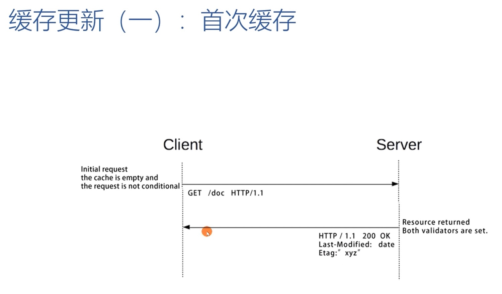

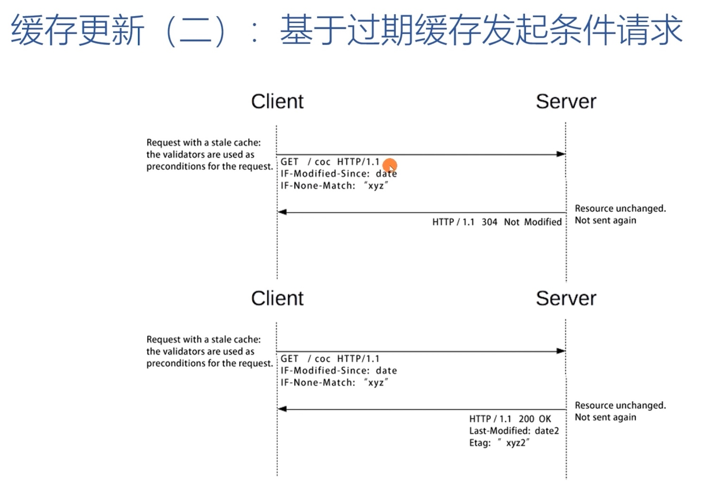

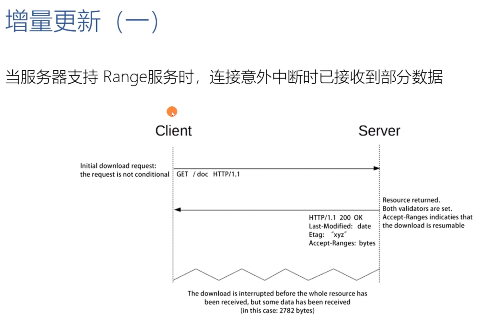

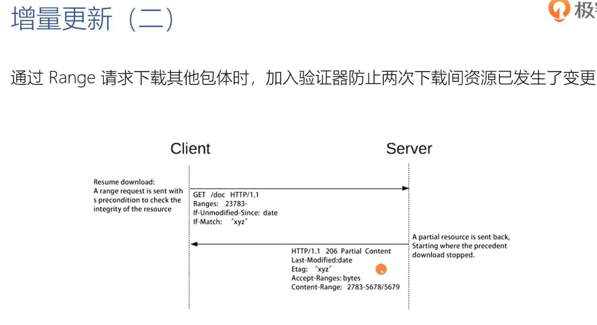

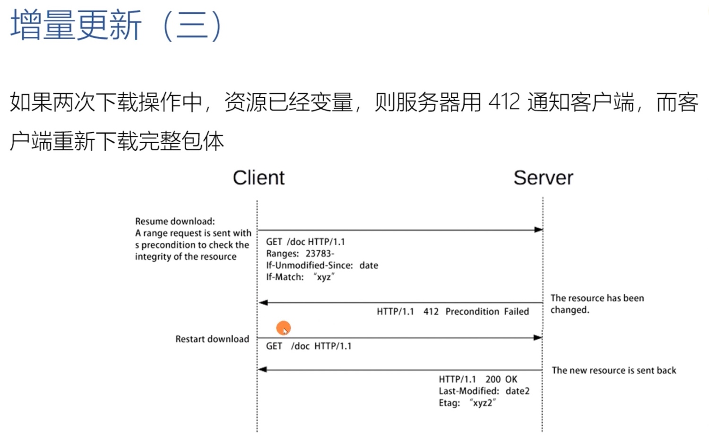

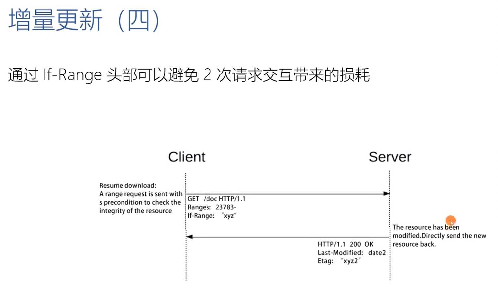

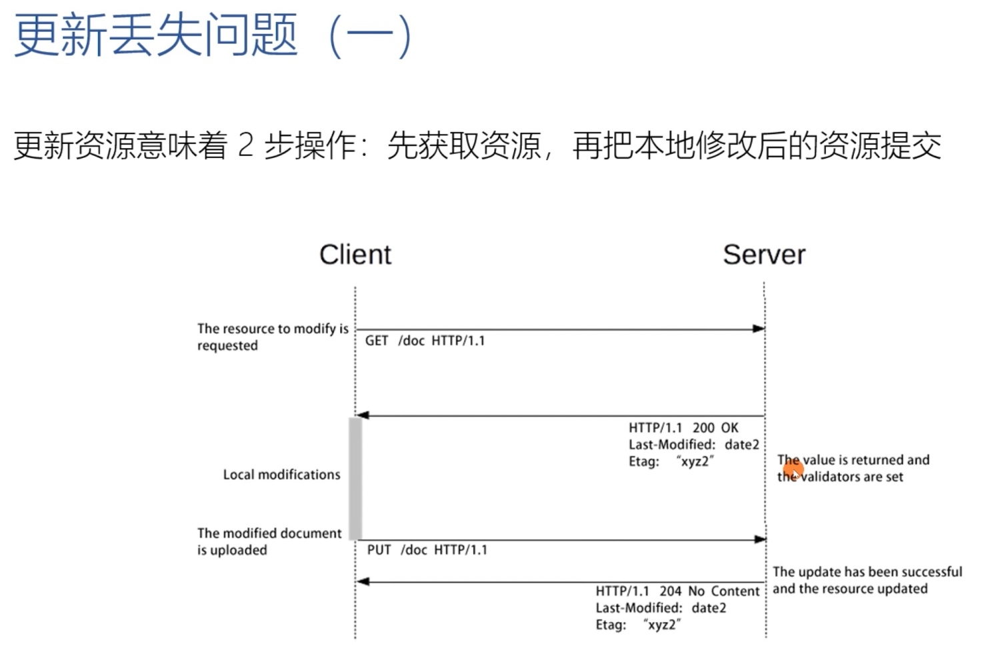

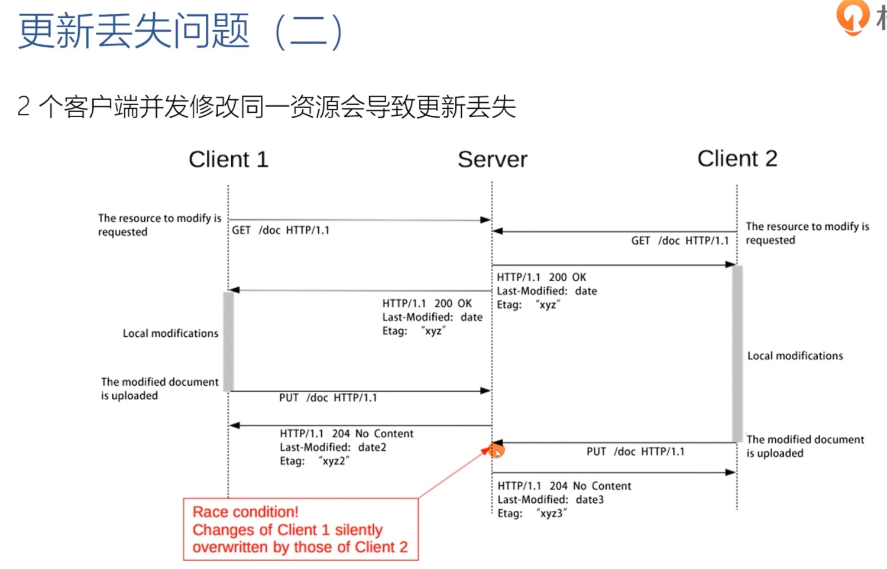

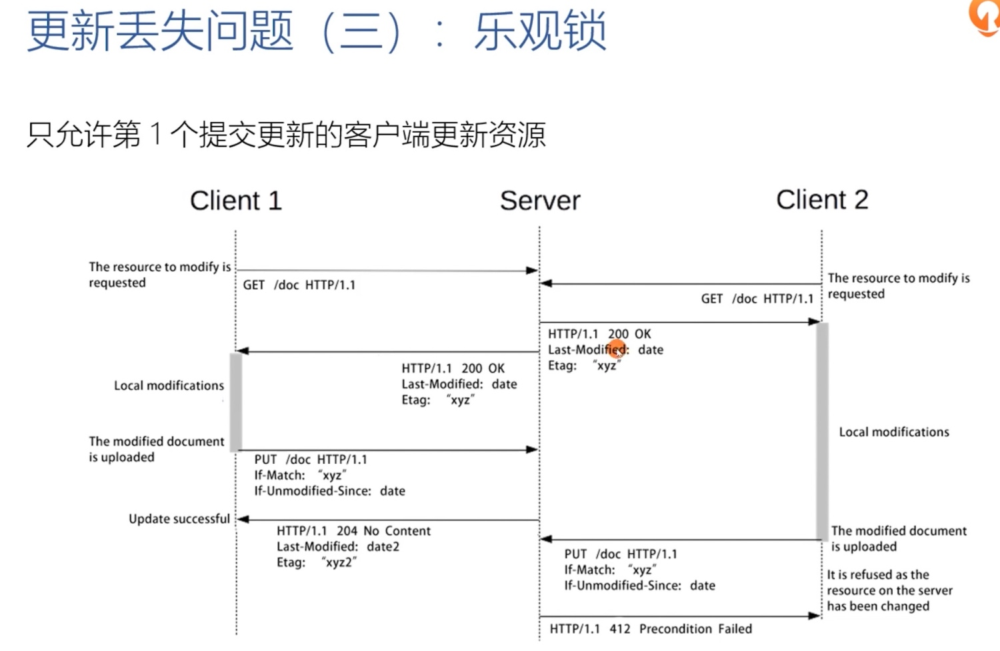

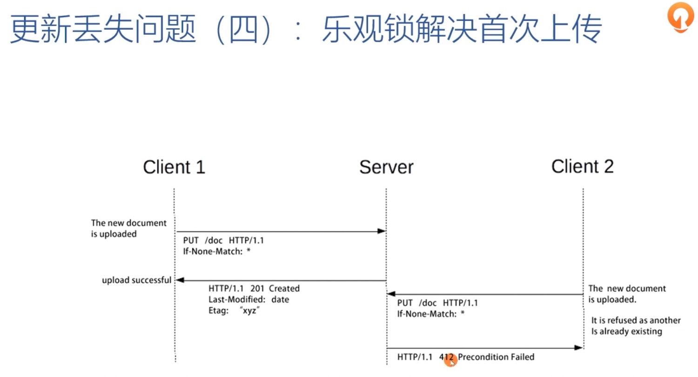

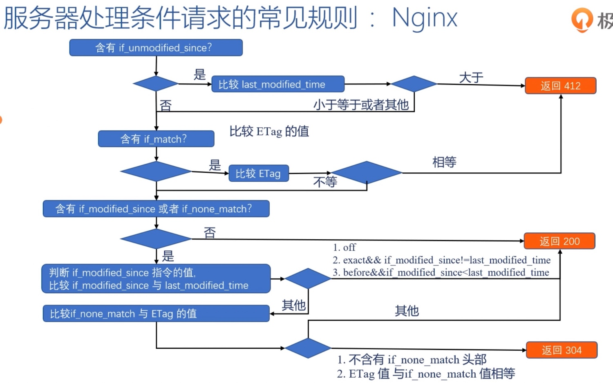

## 服务端
> 服务器标记资源有效期使用的头字段是 Cache-Control，里面的值 max-age=30 就是资源的有效时间，这里的 max-age 是生存时间，时间的计算起点是响应报文的创建时刻（即 Date 字段，也就是离开服务器的时刻），而不是客户端收到报文的时刻，也就是说包含了在链路传输过程中所有节点所停留的时间

> 除了 max-age，在响应报文里还可以用其他的属性来更精确地指示浏览器应该如何使用缓存：
> - no_store：不允许缓存，用于某些变化非常频繁的数据，例如秒杀页面
> - no_cache：表示的意思并不是不允许缓存，而是可以缓存，但在使用之前必须要去服务器验证是否过期，是否有最新的版本
> - must-revalidate：如果缓存不过期就可以继续使用，但过期了如果还想用就必须去服务器验证

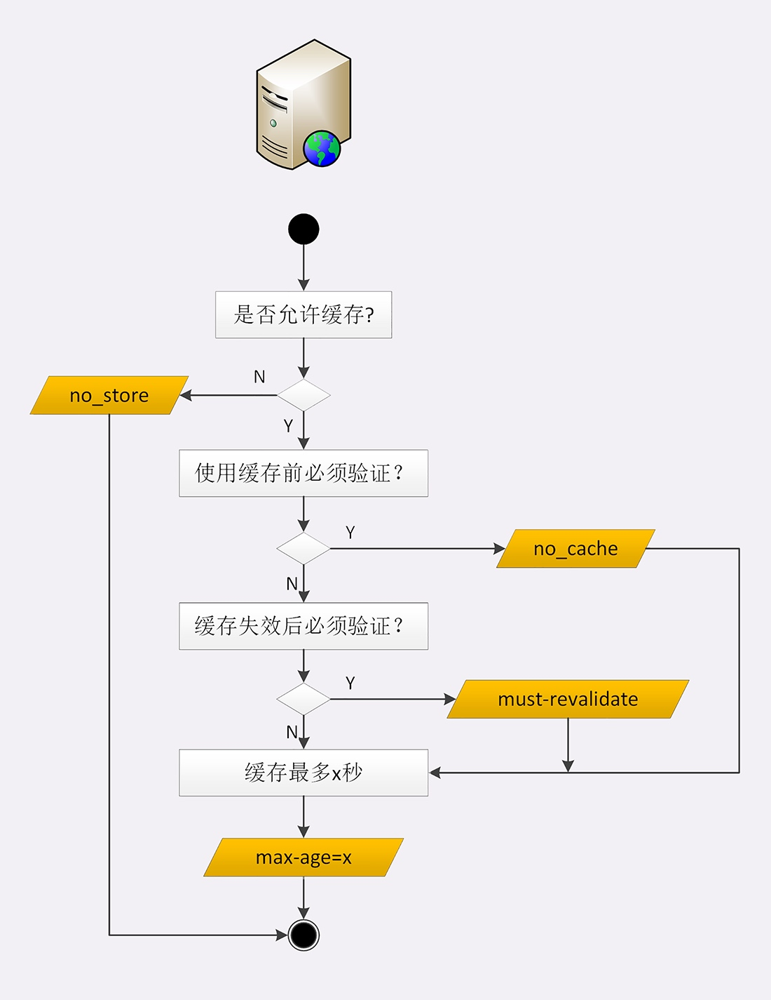

## 客户端
> 不止服务器可以发 Cache-Control 头，浏览器也可以发 Cache-Control。当刷新页面的时候，浏览器会在请求头里加一个 Cache-Control: max-age=0。所以浏览器就不会使用缓存，而是向服务器发请求。服务器看到 max-age=0，也就会用一个最新生成的报文回应浏览器

> 强制刷新则是发了一个 Cache-Control: no-cache，通常与 max-age=0 的效果是相同的

> 使用浏览器的前进、后退按钮，会显示 from disk cache，表示没有发送网络请求，而是读取的磁盘上的缓存

## 条件请求
> if-Modified-Since 和 If-None-Match 需要第一次的响应报文预先提供 Last-modified 和 ETag，然后第二次请求时就可以带上缓存里的原值，验证资源是否是最新的。如果资源没有变，服务器就回应一个 304 Not Modified，表示缓存依然有效，浏览器就可以更新一下有效期，然后继续使用缓存

> ETag 是资源的一个唯一标识，主要是用来解决修改时间无法准确区分文件变化的问题。比如，一个文件在一秒内修改了多次，但因为修改时间是秒级，所以这一秒内的新版本无法区分。再比如，一个文件定期更新，但有时会是同样的内容，实际上没有变化，用修改时间就会误以为发生了变化，传送给浏览器就会浪费带宽
